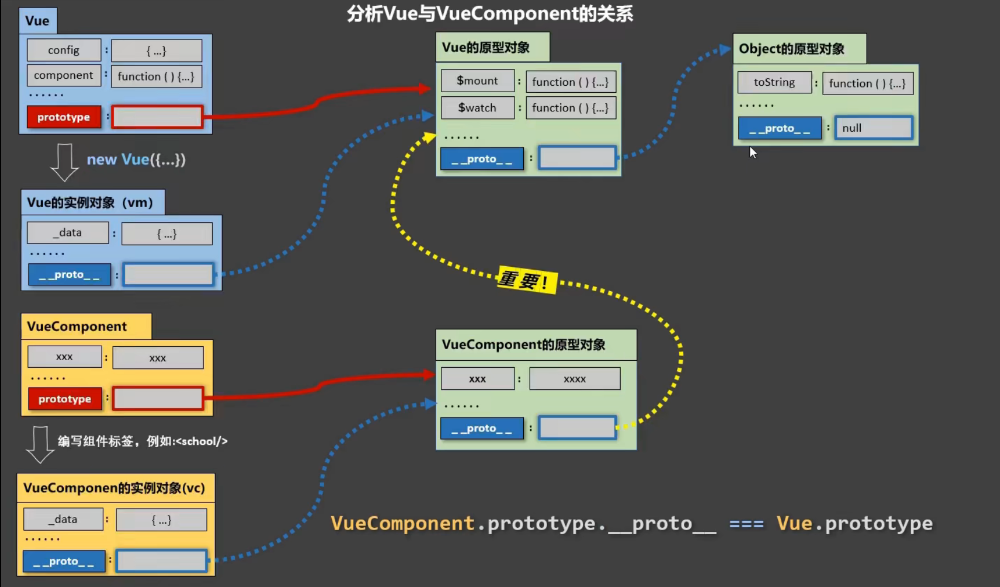

# VUE

 参考资料：

[vue2.x 官方教程](https://cn.vuejs.org/v2/guide/index.html)

[vue3.x 官方教程](https://v3.cn.vuejs.org/guide/installation.html)

[黑马程序员vue前端基础教程-4个小时带你快速入门vue](https://www.bilibili.com/video/BV12J411m7MG?from=search&seid=12214968412190924259&spm_id_from=333.337.0.0)

[尚硅谷Vue2.0+Vue3.0全套教程丨vuejs从入门到精通](https://www.bilibili.com/video/BV1Zy4y1K7SH?spm_id_from=333.1007.top_right_bar_window_view_later.content.click)

## 一、VUE 2.x

### （一）、VUE 基础

#### 1、介绍

-   js框架
-   简化DOM操作
-   响应是数据驱动


#### 2、第一个VUE程序

1、引入vue

```js
<!-- 开发环境版本，包含了有帮助的命令行警告 -->
<script src="https://cdn.jsdelivr.net/npm/vue@2/dist/vue.js"></script>

<!-- 生产环境版本，优化了尺寸和速度 -->
<script src="https://cdn.jsdelivr.net/npm/vue@2"></script>
```

2、编写程序

```html
<div id="app">
  {{ message }}
</div>
<script>
    var app = new Vue({
        el: '#app',
        data: {
            message: 'Hello Vue!'
        }
    })
</script>
```

#### 3、el:挂载点

-   可以使用id，类，元素标签等，选择与css选择器一样
-   作用范围是被选择的元素本身及其后代元素
-   可以在选中任意标签，不能是html和body

#### 4、data:数据对象

-   data可以存储json和数组
-   选取子元素使用 `.`，选取列表元素用 `[]`

```html
{{ school.name }}
{{ campus[0] }}
```

### （二）、本地应用

#### 1、vue指令

vue使用 `v-` 开头的标签表示指令

#### 2、内容绑定，事件绑定

##### 2.1、v-text

-   绑定内容使用 `v-text` 标签，可以设置标签中的内容

-   如果在标签中使用 `{{}}` 这种形式，则不会替换，会拼接起来。

-   也可以在指令中直接将字符串拼接。

`v-text="message + 'hello'"` `{{ message + 'hello' }}`

##### 2.2、v-html

-   设置innerHTML
-   如果有html结构会被解析成标签，功能可用
-   v-text不会把html渲染，只会显示文本

##### 2.3、v-on

-    使用方法 `v-on:click="function_name"`
-   也可以使用 `@click="function_name"`
-   方法定义在vue实例的 methods 中
-   获取标签中的值可以在方法中使用 `this.var_name` this指vue对象。

```vue
var app = new Vue({
    el:"#app",
    methods: {
        doId: function() {
            // 逻辑
        }
    }
})
```

##### 2.4、计数器（实例）

```html
<!DOCTYPE html>
<html lang="en">
<head>
    <meta charset="UTF-8">
    <meta http-equiv="X-UA-Compatible" content="IE=edge">
    <meta name="viewport" content="width=device-width, initial-scale=1.0">
    <title>Counter</title>
</head>
<body>
    <div id="app">
        <button @click="sub">
            -
        </button>
        <span>{{ num }}</span>
        <button @click="add">
            +
        </button>
    </div>
    <script src="https://cdn.jsdelivr.net/npm/vue@2/dist/vue.js"></script>
    <script>
        var app = new Vue({
            el: "#app",
            data: {
                num: 1
            },
            methods: {
                add: function() {
                    if (this.num < 10) {
                        this.num++;
                    }
                },
                sub: function() {
                    if (this.num > 0) {
                        this.num--;
                    }
                }
            }
        });
    </script>
</body>
</html>
```

#### 3、显示切换

##### 3.1、v-show

-   v-show可以控制元素的显示与隐藏

-   使用 `v-show="true"`，值可以设置true、false，也可以是一个布尔值，也可以是一个判断表达式
-   隐藏使用的方式是 `display: none`

##### 3.2、v-if

-   v-if的==功能和用法==和v-show一样
-   区别是v-if直接将元素标签从dom中移除

>   对于频繁切换的元素使用 v-show，因为加载dom浪费性能资源。

##### 3.3、v-bind

-   操纵标签的属性
-   使用方法 `v-bind:属性="值"`，可以省略 `v-bind`
-   值可以是拼接的字符串，也可以是三元表达式 `v-bind:class="isActive?'active':''"`
-   也可以使用对象的形式（推荐） `v-bind:class="{active:isActive}"`

##### 3.4、图片切换实例

```html
<!DOCTYPE html>
<html lang="en">
<head>
    <meta charset="UTF-8">
    <meta http-equiv="X-UA-Compatible" content="IE=edge">
    <meta name="viewport" content="width=device-width, initial-scale=1.0">
    <title>图片切换</title>
</head>
<body>
    <div id="imgToggle">
        <div>
            
            <a href="javascript:void(0);" v-show="index!=0" @click="prev">
                上一页
            </a>
            <a href="javascript:void(0);" v-show="index<imgArr.length-1" @click="next" >
                下一页
            </a>
        </div>
    </div>
    <script src="https://cdn.jsdelivr.net/npm/vue@2/dist/vue.js"></script>
    <script>
        var app = new Vue({
            el: "#imgToggle",
            data: {
                imgArr: [
                    "./img/202005091702.jpg",
                    "./img/202005091703.png",
                    "./img/202005091705.png",
                    "./img/pic39.jpg",
                    "./img/pic44.jpg"
                ],
                index: 0
            },
            methods: {
                prev: function() {
                    console.log("prev");
                    this.index--;
                },
                next: function() {
                    console.log("next");
                    this.index++;
                }
            }
        });
    </script>
</body>
</html>
```

#### 4、列表循环，表单元素绑定

##### 4.1、v-for

-   不仅可以遍历数组中的元素（包括对象），而且可以循环生成html元素中的内容。
-   基础语法 `v-for="(item, index) in arr"`，item和index分别代表数组中的元素和索引，只要格式正确，名字可以自定义，arr是定义在data中的数组名。
-   如果item是对象，需要使用`.`获取其中的数据。

```html
<div>
    <ul id="app">
        <li v-for="(item, index) in arr" :title="item">{{ index }} -> {{ item }}	</li>
    </ul>
</div>
<script>
    let app = new Vue({
        el: "#app",
        data: {
            arr: [ "A", "B", "C", "D" ]
        }
    });
</script>
```

如果需要把两个li标签中的内容都作为循环内容，可以使用 template标签将其包裹，在template中使用 v-for。

```html
<template v-for="item in items">
    <li>{{ item.name }}</li>
    <li>{{ item.age }}</li>
</template>
```

##### 4.2、v-on补充

-   v-on绑定的函数可以传入参数
-   v-on可以指定事件触发动作

```html
    <div id="app">
        <input type="button" value="click" v-on:click="sayHi(name)">
        <input type="text" v-on:keyup.enter="sayHi(name)">
    </div>
    <script>
        let app = new Vue({
            el: "#app",
            data: {
                name: "张三"
            },
            methods: {
                sayHi: function(yourName) {
                    alert("hello, " + yourName + "!");
                }
            }
        });
    </script>
```

>   更多指令参考：https://cn.vuejs.org/v2/api/#v-on

##### 4.3、v-model

-   设置表单内容
-   双向绑定：表单中的内容改变会引起data中数据的改变；data中数据的改变也会引起表单内容的改变。

```html
    <!-- 表单内容 双向绑定 -->
    <div id="app">
        <input type="button" value="click" @click="setMessage">
        <input type="text" v-model="message" @keyup.enter="showMessage">
        <h3>{{ message }}</h3>
    </div>

    <script>
        let app = new Vue({
            el: "#app",
            data: {
                message: "woshabi"
            },
            methods: {
                showMessage: function() {
                    alert(this.message);
                },
                setMessage: function() {
                    this.message = "woshadiao";
                }
            }
        });
    </script>
```

#### 5、计算属性和侦听器

Vue实例简称vm。

data中的属性是直接数据vm的，而计算属性不直接属于vm，而是需要通过调用函数返回一个值，如果不调用就不会显示。

通常data中的属性不是直接使用的，需要处理一下才能达到要求，在插值表达式中使用会让代码变得复杂，频繁复用也会很麻烦。因此，需要用到vue的计算属性。

##### 5.1、示例

```vue
<div id="demo">
    <p>{{ message }}</p>

    <h3>{{ upperMessage }}</h3>
</div>
<script>
    Vue.config.productionTip = false;
    let vm = new Vue({
        el: "#demo",
        data: {
            message: "hello, world!"
        },
        computed: {
            upperMessage: function() {
                return this.message.toUpperCase();
            }
        }
    });
</script>
```

在创建Vue实例时，添加一个computed属性，在里面定义一个函数名，得到一个返回值。在模板中使用函数名可以直接获取返回值。

##### 5.2、计算属性与方法

如果不使用计算属性，而是使用方法，在methods中定义一个作用相同的方法也可以达到相同的效果。

例如：

```
methods: {
	upperMessage: function() {
		return this.message.toUpperCase();
	}
}
```

使用方法需要在模板中使用括号，表明这是调用一个方法。`{{ upperMessage() }}`

**不同之处：**

计算属性使用缓存，当第一次调用计算属性时，他会执行里面的代码，然后他会把这个值存储到缓存，当下次调用时直接去找缓存。当计算属性的依赖（使用的变量）发生改变时，他会再次执行计算属性的代码，放到缓存，这样就不用担心数据不一致的问题。

##### 5.3、侦听属性

当侦听到某属性发生变化时，会执行其中的代码。这种方式也可以同步数据，但是很多时候会造成代码重复。更好的方式是使用计算属性。

```vue
watch: {
    firstName: function (val) {
        this.fullName = val + ' ' + this.lastName
    },
    lastName: function (val) {
        this.fullName = this.firstName + ' ' + val
    }
}
```

将上面的侦听属性改为计算属性：

```vue
computed: {
	fullName: function() {
		return this.firstName + ' ' + this.lastName;
	}
}
```

##### 5.4、getter/setter

计算属性默认只有getter属性，但是也可以设置setter属性。

```vue
computed: {
    fullName: {
        get: function() {
            return this.firstName + ' ' + this.lastName;
        },
        set: function(fullName) {
            let names = fullName.split(" ");
            this.firstName = names[0];
            this.lastName = names[1];
        }
    }
}
```

##### 5.5、侦听器

虽然计算属性在大多数情况下更合适，但有时也需要一个自定义的侦听器。这就是为什么 Vue 通过 `watch` 选项提供了一个更通用的方法，来响应数据的变化。当需要在数据变化时执行异步或开销较大的操作时，这个方式是最有用的。

侦听器使用 watch定义。里面包含监听的属性和执行响应的代码。

```vue
watch: {
    // 如果 `question` 发生改变，这个函数就会运行
    question: function (newQuestion, oldQuestion) {
        this.answer = 'Waiting for you to stop typing...';
        this.debouncedGetAnswer();
    }
},
```

在这个示例中，使用 `watch` 选项允许我们执行异步操作 (访问一个 API)，限制我们执行该操作的频率，并在我们得到最终结果前，设置中间状态。这些都是计算属性无法做到的。

#### 6、class与style绑定

##### 6.1、对象语法

需要动态渲染class样式时，可以使用一个对象来表示样式是否渲染。

对象使用 `{}` 包裹，key是class样式的名字，value为一个布尔值，为true时渲染class。

```vue
<div id="demo">
    <!-- 对象渲染 -->
    <p class="static" v-bind:class="{active: isActive}">hello, world!</p>
    <!-- 三元表达式渲染，不推荐 -->
    <p class="static" v-bind:class="isActive == true ? 'active' : ''">hello, world!</p>
</div>

<script>
    Vue.config.productionTip = false;
    let vm = new Vue({
        el: "#demo",
        data: {
            isActive: true
        }
    });
</script>
```

也可以将对象直接写在vue实例中。使用时，直接将classObject写在对应模板位置。

```vue
data: {
    classObject: {
        isActive: true
    }
}
```

##### 6.2、数组语法

1、简单数组

```vue
<div v-bind:class="[activeClass, errorClass]"></div>
```

这样会渲染两个值，分别时activeClass和errorClass在vue实例中定义的值。

2、数组中的三元表达式

数组中逗号间隔的表达式也可以是一个三元表达式。

```html
<div v-bind:class="[isActive ? activeClass : '', errorClass]"></div>
```

3、数组中的对象

```
<div v-bind:class="[{ active: isActive }, errorClass]"></div>
```

##### 6.3、用在组件上

使用组件时，也可以给组件定义class属性，这个属性会合并到组件模板的最外层元素上。

##### 6.4、style内联样式

使用内联样式和上面的对象语法和数组语法相同，不过是把css中的样式“对象化”。

```vue
<div v-bind:style="{ color: activeColor, fontSize: fontSize + 'px' }"></div>
```

##### 6.5、自动添加前缀

当 `v-bind:style` 使用需要添加浏览器引擎前缀的 CSS property 时，如 `transform`，Vue.js 会自动侦测并添加相应的前缀。

##### 6.6、多重值

```vue
<div :style="{ display: ['-webkit-box', '-ms-flexbox', 'flex'] }"></div>
```

这样写只会渲染数组中最后一个被浏览器支持的值。

#### 7、事件处理

##### 7.1、基本使用

使用v-on绑定一个事件，然后指定触发事件后执行的函数名既可。函数在vue实例中的methods中定义，具体参考 [2.3、v-on](#####2.3、v-on) 和 [4.2、v-on补充](#####4.2、v-on补充)。

##### 7.2、事件参数

如果需要将触发事件作为参数，可以在定义方法中使用 `event` 关键字作为形参，使用时，在html中使用 `$evnet` 作为参数传入方法。

##### 7.3、事件修饰符

#### 8、Vue的生命周期

从创建vue实例到vue实例销毁的过程。重要的是 mounted和beforeDestroy

-   初始化过程

1.   new Vue()

2.   Init Events and LifeCycle  初始化：生命周期、事件，但数据代理还未开始。

3.   ==beforeCreate== 此时还无法通过vm访问到data中的数据、methods中的方法。

4.   Init injections and reactivity 初始化：数据检测、数据代理

5.   ==created== 可以通过vm访问到data中的数据，methods中的方法。

6.   解析模板，生成虚拟DOM，页面中位显示解析的内容。具体包括以下几个步骤

     1.   判断是否有el挂载点，如果有判断是否有模板选项如果也有编译模板到render方法。
     2.   如果没有el挂载点，等待 `vm.$mounted(el)` 被调用，绑定挂载点，判断是否有template配置项，如果没有，编译挂载点内的outerHTML（包括div）作为模板。

     >   el挂载点是必须的，如果没有配置el，也没有通过方法绑定挂载点，vue初始化就直接结束了。

7.   ==beforeMount== 页面是还未经过vue编译的DOM结构，所有对DOM的操作都不奏效，（因为后面会用虚拟DOM替换掉未编译的内容。）

8.   create vm.$el and replace ‘el’ with it 将内存中的虚拟DOM转为真实DOM。

9.   ==mounted== 此时页面中呈现的是经过vue编译的DOM，对DOM的操作均有效，（尽量避免）。

     至此，初始化的工作完成，此时可以开启定时器，发送网络请求，订阅消息，绑定自定义事件。

-   数据更新过程

10.   ==beforeUpdate== 当代理数据发生变化时，进入更新流程，此时，数据是最新的，但是，vue还未将更新后的页面渲染上，页面上的数据是更新之前的。
11.   Virtual DOM re-render and patch 根据更新的数据生成虚拟DOM，然后与旧的虚拟DOM进行比较，最终完成页面更新。即完成了 Model -> View 的更新。
12.   ==updated== 更新完成。此时的数据和页面中的数据是一致的。

-   销毁过程

13.   ==beforeDestroy== 当 vm.$destroy() 被调用后，进入销毁流程，beforeDestroy是销毁之前的准备工作。此时，代理数据data，methods，指令还可用，但是对数据的更新不会触发更新流程。一般此时进行关闭定时器，取消订阅消息，解绑自定义事件等收尾工作。
14.   销毁监视，子组件和事件监听器
15.   ==Destroyed== 

```vue
new Vue(
    el: "#app",
    // 多行使用 ``，使用模板回完全替换绑定的容器（容器如果有属性会丢失，不建议使用）
    template: `
        <div>
            ...
        </div>
    `,
    data: {
        name: 'zhangsan'
    },
    // 配置生命周期各阶段的方法。
    beforeCreate() {
    },
    created() {
    },
    beforeMount() {
    },
    mounted() {
    },
    beforeUpdate() {
    },
    updated() {
    },
    beforeDestroy() {
    },
    destroyed() {
    }
);
```


### （三）、网络应用

#### 1、axios

axios 是一个强大的网络请求库。

##### 1.1、导入

-   本地导入
-   cdn

`<script src="https://unpkg.com/axios/dist/axios.min.js"></script>`

##### 1.2、get

```js
axios.get("url?key1=value1&key2=value2")
.then(function(response) {
    console.log(response);
}, function(err) {
    console.log(err);
});
```

-   get方法里面写请求链接和参数
-   then中第一个方法是请求成功后执行的方法
-   then中第二个方法是请求失败后执行的方法

##### 1.3、post

```js
axios.post("url", {
    key1: value1,
    key2:value2
})
.then(function(response) {
    console.log(response);
}, function(err) {
    console.log(err);
});
```

-   与get稍有不同
-   post一共有两个参数，第一个是请求链接，第二个是请求参数，用对象表示

#### 2、axios + vue

唯一一点要注意的是，当在回调函数中，vue的this已经改变，无法使用，需要预先将其存起来。

```js
let app = new Vue({
    el: "#app",
    data: {
        message: "zhangsan"
    },
    methods: {
        getMessage: function() {
            let that = this;
            axios.get(url)
            .then(function(response)){
                that.message = response.data;
            }, function(err) {
                console.log(err);
            });
        }
    }
});
```

### （四）、组件

我们可以把经常用的页面元素打包成一个组件，这样可以减少代码冗余，保持代码整洁。

通常，一个页面只有一个Vue实例，这个实例可以有很多个组件。

#### 1、注册组件

```html
<div id="components-demo">
    <test-component></test-component>
    <test-component></test-component>
    <test-component></test-component>
</div>

<script>
    <!-- 声明一个组件 ("组件名", {}) -->
    const Feature = Vue.component("test-component", {
        <!-- 数据 -->
        data: function () {
            return { count: 0 };
        },
        <!-- 模板 -->
        template:
            '<button v-on:click="count++;">点击{{ count }}次</button>',
    });
    <!-- 绑定元素，只有绑定元素里面才可以使用组件 -->
    let app = new Vue({
        el: "#components-demo"
    });
</script>
```

-   使用声明的组件名作为标签，使用组件。
-   组件之间相互独立，各自维护自己的变量。
-   组件可以被无限复用，它和Vue很多属性相同，不同的是没有el挂载点。
-   data只能使用函数形式，否则会报错。


##### 1.1、组件名

单个词组件名可以全部小写和首字母大写。

多个词组件名可以使用大驼峰（需要使用脚手架）或使用 `-` 间隔，无论使用那种方式，都需要在使用时与名字一致。

组件有一个name配置项，可以在开发者工具中显示这个名字。

##### 1.2、全局注册

```js
Vue.component("component-demo", {});

new Vue({
    el: "#app"
});
```

这种方式注册的组件在任意Vue实例中都可以使用。

##### 1.3、局部注册

```js
// 使用对象的方式定义组件
<div id="app">
    <component-a></component-a>
    <component-a></component-a>
    <component-a></component-a>
</div>
<div id="demo">
    <component-a></component-a>
</div>

<script>
    // 或者使用 Vue.extend({ /* ... */ });
    let component1 = {
        data: function() {
            return { count : 0 };
        },
        template: '<button v-on:click="count++;">点击{{ count }}次</button>'
    };

    let app = new Vue({
        el: "#app",
        components: {
            'component-a': component1
        }
    });

    let demo = new Vue({
        el: "#demo"
    });
</script>
```

##### 1.4、模板

模板最外层必须由一个元素包裹，否则会只显示第一个被完整包裹的内容。

#### 2、prop（外部变量）

##### 2.1、变量名大小写

因为html的属性是大小写不敏感的，所以在使用组件，给组件内变量赋值的时候，需要将变量名转换成对应的“短横线分隔形式”。

`camelCase => camel-case`

##### 2.2、变量类型

使用列表无法指定属性类型，使用对象可以。

```vue
props: {
    title: String,
    likes: Number,
    isPublished: Boolean,
    commentIds: Array,
    author: Object,
    callback: Function,
    contactsPromise: Promise // or any other constructor
}
```

类型可以是String number Boolean Array Object Function

##### 2.3、传递静态值或动态值

无论传入什么值，都需要使用v-bind指定。

如果传入一个对象，相当于传入一系列属性值，key为属性名，value为属性值。

```vue
<component-a v-bind="post"></component-a>

props: {
    post: {
        title: "hello",
        name: "aaa"
    }
}
```

##### 2.4、单项数据流

父组件的porp回更新到子组件，子组件的porp更新不会影响父组件。如果内部改变子组件的porp，会在控制台警告提示。

##### 2.5、prop数据验证

```vue
Vue.component('my-component', {
  props: {
    // 基础的类型检查 (`null` 和 `undefined` 会通过任何类型验证)
    propA: Number,
    // 多个可能的类型
    propB: [String, Number],
    // 必填的字符串
    propC: {
      type: String,
      required: true
    },
    // 带有默认值的数字
    propD: {
      type: Number,
      default: 100
    },
    // 带有默认值的对象
    propE: {
      type: Object,
      // 对象或数组默认值必须从一个工厂函数获取
      default: function () {
        return { message: 'hello' }
      }
    },
    // 自定义验证函数
    propF: {
      validator: function (value) {
        // 这个值必须匹配下列字符串中的一个
        return ['success', 'warning', 'danger'].indexOf(value) !== -1
      }
    }
  }
})
```


## 二、Vue2.x详细

### （一）、模板细节

#### 1、实例与模板

在js中声明的Vue对象叫作Vue实例，在html中写的标签。通过el绑定的叫作模板。实例和模板之间的对应关系为一对一，多模板对一实例，只有第一个模板会解析实例中的数据；多实例对应一模板会报错。

#### 2、表达式

##### 2.1、js表达式与js语句

表达式是能产生一个值的句子。，例：a、a + b、a == b，funtion()

语句是控制代码流程走向的句子。例：if() {}、for() {}

##### 2.2、表达式使用范围

在插值表达式中和指令中。例 `{{ name }}`、`v-band:src=“url”`

`{{}}` 叫作插值表达式。

#### 3、指令

##### 3.1、v-cloak

v-cloak是一个没有属性值的属性，vue一旦加载完毕，解析模板，就会把它删掉。

常用来掩盖还没有加载完成时的未解析的模板。

```
<style>
    [v-cloak] {
        dispaly: none;
    }
</style>

<h1 v-cloak>{{ name }}</h1>
```


#### 4、过滤器

对展示数据进行简单地格式化处理。然后再展示出来。

##### 4.1、注册过滤器

1、局部注册

```vue
new Vue({
    ...,
    filters: {
        timeFormater(value, pattern='YYYY-MM-DD HH:mm:ss') {
            return dayjs(value).format(pattern);
        },
        ...
    }
});
```

>   1、过滤器默认接收管道前的一个参数，也可以给过滤器添加参数，es6中可以给参数设置默认值。
>
>   2、返回的值会渲染到插值表达式中

2、全局注册

`Vue.filter(name, callback);`

```
Vue.filter('mySlice', function([...]) {
    return ...;
});
```

##### 4.2、使用过滤器

1.   `<h1>{{ time | timeFormater }}</h1>` （无参）
2.   `<h1>{{ time | timeFormater('YYYY/MM/DD') }}</h1>` （有参）
3.   `<h1>{{ time | timeFormater('YYYY/MM/DD') | mySlice }}</h1>` （嵌套）

>   1.   过滤器默认会传入管道前的参数，不用写
>   2.   其余参数可以像调用函数一样传入
>   3.   管道嵌套从左到右依次执行，后一个管道的参数是前一个管道的返回值。
>   4.   v-model指令不可以使用过滤器

#### 5、自定义指令

// TODO

### （二）组件

#### 1、组件嵌套

首先准备两个组件，一个为school，另一个为student，让school中包含student需要在school配置项中配置components，然后在school模板中加上student组件标签。使用是，只需要将school注册到vm中。

```
// 声明student组件
const student = Vue.extend({
    template: `
        <div>
            ...
        </div>
    `,
    data() {
    
    },
});

// 声明school组件
const school = Vue.extend({
	template: `
        <div>
            ...
            <student></student>
            ...
        </div>
	`,
	data() {
	
	},
	// 注册student组件（局部）
	components: {
        // 如果同名，可以简写
        student
	}
});

// 注册school组件（局部）
const vm = new Vue({
    el: "#root",
    data: {
    
    },
    components: {
        school
    }
});

// 使用组件
<div id="root">
    <school></school>
</div>
```

>   组件标签可以使用单闭合的形式 <student/> 但是，必须使用脚手架，否则后面的组件标签不会生效。
>
>   一般使用一个app组件管理下面的组件，vm只需要管理一个app组件既可。

#### 2、组件声明

声明组件的另一种方式

```vue
// 第一步： 声明一个组件
const school = Vue.extend({
    template: ``,
    data() {
        return {
            
        };
    }
});
// 第二步：注册组件
const vm = new Vue({
    el: "#root",
    components: {
        // 左边为将要使用的标签名，右边为组件变量
        school: school
    }
});
// 第三步：使用组件
<div id="root">
    <school></school>
</div>
```

#### 3、组件创建原理

创建组件时，Vue.extend() 会帮我们自动调用 VueComponent() 函数，它是一个构造函数，最终会将这个函数返回给组件，因此，组件的实质是一个函数。不同的组件是不同的函数，因为每次调用VueComponent时都会创建一个变量返回。

组件data，methods，watch，computed中的this是指组件实例，组件实例一般称为vc。vm管理着一些vc。

组件和vue的区别很小，只有el和data有区别。

#### 4、Vue内置关系

##### 4.1、补充知识：

显示原型对象：声明的构造函数都有一个显示原型对象（红色线），即Function.prototype。所有构造函数的显示原型对象都最终指向Object的原型对象，即Object.prototype，而它指向null。

隐式原型对象：任何对象，包括原型对象，都有一个隐式原型对象，它指向其构造函数的显示原型对象（蓝色线）。

使用构造方法定义的属性可以使用隐式原型对象访问到。一般会在构造函数中定义属性，使用构造函数的显示原型对象定义方法，也可以添加属性。（不能使用字面量的方式，即对象方式，会覆盖原来的构造函数）

隐式原型链：当调用对象中的属性时，如果定义的没有，会找到它的隐式原型对象，如果还没有，会继续一层一层地找，直到Object.prototype。

```
function Fn() {
    this.a = 1;
    this.b = 2;
};

Fn.prototype.c = function() {
    return this.a + this.b;
}

Fn.prototype = {
    c: function() {
        return this.a + this.b;// a和b是undefined，因此c是NaN
    }
}
```

##### 4.2、内置关系

Vue将组件实例的隐式原型对象的隐式原型对象指向了vue的原型对象。即`VueComponent.prototype.__proto__ === Vue.prototype`，也即`vc.__proto__.__proto__ === vm.__proto__`。

这样vc也可以访问vue中的方法和属性。



#### 5、单文件组件

##### 5.1、文件定义

扩展名 `.vue`

内容：

```
<template>
    <!-- 模板 html -->
    <div>
        
    </div>
</template>

<script>
    /* 脚本 js */
export default {
    name: 'School',
    data() {
        return {
        };
    },
    mounted() {
    },
    methods: {
    },
};
</script>

<style lang="" scoped>
    /* 样式 */
</style>
```

##### 5.2、模块暴露

如何将模板暴露出去供使用？三种方式。

1.   分别暴露 `export const school = Vue.extend({});`
2.   统一暴露 `export {school}`
3.   默认暴露 `export default school;`

>   一般使用上面的方式，默认暴露，只写配置项，再加上name配置。

##### 5.3、Vue脚手架

1.   安装vue `npm install -g @vue/cli`
2.   创建项目 `vue create vue_test`
3.   运行项目 `cd vue_test; npm run serve`

##### 5.4、项目结构

```
vue_test(/)
|
|-node_modules（文件夹，放的是vue项目使用的依赖）
|
|-public（放的是页签图表和html文件）
|    |- favicon.ico
|    |- index.html
|-src（资源文件夹）
|    |-assets（静态资源文件夹）
|    |-components（组件文件夹）
|    |- App.vue（所有组件的父组件）
|    |- main.js（程序的入口）
|- .gitignore（git忽略文件）
|- babel.config.js（babel配置文件）
|- package-lock.json（包版本控制文件）
|- package.json（打包配置文件，文件的版本等）
|- README.md readme
```

程序运行从main.js开始，main.js中导入了vue和App，创建了vue实例，绑定了public文件夹下的index.html中的元素。

App组件中定义了组件的模板并注册了子组件。

子组件定义自己的结构样式和功能。

>   1.   `<%= BASE_URL %>` 定义路由的根路径，它就是文件结构中public所在的目录。
>   2.   noscript标签在js可用的时候不会显示。
>   3.   babel是ES6转ES5的插件。ES6有一些新功能和函数。

##### 5.5、render

render是一个vue的配置项，是一个函数，它有一个参数，也是一个函数，这个函数可以将模板创建。

```
new Vue({
    el: "#root",
    render(createElement) {
        // 返回函数创建的结果，传入两个参数，一个是元素，一个是内容
        return createElement('h1', 'hello');
    }
});
```

一般使用箭头函数的方法将render简写。函数可以写成箭头形式的函数 `(h) => h(App)`，因为只有一个参数，可以将前一个括号省略。因为App是定义好的模板，是一个变量，可以只传入元素。

```
new Vue({
    el: "#root",
    render: h => h(App)
});
```

>   为什么要用render？
>
>   vue分为两个部份，一是vue核心，包含vue生命周期和各种方法，二是模板解析器，可以解析complate中的模板。
>
>   运行版本的vue不包含模板解析器，所以无法解析模板，所以使用render，也可以引入完整版的vue。
>
>   runtime的vue不包含模板解析器，所以更小，大概少1/3。

##### 5.6、脚手架配置文件

`vue.config.js` 可以配置运行vue的规则。与package.json同级。

#### 6、组件通讯

##### 6.1、ref元素属性

在vue中使用ref属性替代id，它可以完成ref的工作，而且能够获取vc实例。

`this.$refs.title` （`ref="title"`）

如果获取的元素组件，则会获取该组件的实例。

使用 `document.getElementBy..()` 获取的始终是DOM元素。

##### 6.2、props配置项

父组件项子组件中传入值==或者方法==，需要在子组件标签上用属性的方式传入，也可以使用v-bind指令传入。不同的是v-bind会将内容作为表达式执行，直接写会当作字符串。

子组件需要在组件定义时设置接受值的变量，即使用props配置项。

有三种接收方式。

1.   简单接收，不限定

`props: ['name', 'age']`

2.   限定类型

```
props: {
    name: String,
    age: Number
}
```

3.   详细限定

可以限定类型，是否为必须和默认值。

```
props: {
    name: {
        type: String,
        required: true
    },
    age: {
        type: Number,
        default: 18
    }
}
```

>   1.   props的优先级高于data
>
>   2.   props的变量是只读的，不建议直接改，可以使用data接收props
>
>         `data() {return {studentName : this.name};}`
>
>   3.   传参的变量名不能是vue保留关键字，例如key，ref
>
>   4.   父组件不仅可以将值传给子组件，而且可以传方法，这是很重要的子组件像父组件传数据的一种方式。也就是说，父组件定义好一个方法，这个方法可以修改父组件中的数据。然后传给子组件，子组件接收后，调用该方法，就相当于父组件调用了改方法。我愿称之为“呼儿将出换美酒”，父亲把酒壶给儿子去打酒。

##### 6.3、mixin混入

将组件中重复的代码抽取，复用。

编写一个js文件，里面的对象可以是vc中的所有配置项，然后将其暴露出去。在组件中引入，然后配置到mixin中。

>   mixin.js

```
// 注意暴露方式，影响引入方式
export const hello = {
    data() {
        return {
        
        };
    },
    methods: {
    
    },
    mounted() {
    
    }
}
```

>   Student.vue

```
// 引入
import {hello} from './mixin.js'

export default {
    ...,
    // 局部混入
    mixins: [hello, ...]
}
```

>   1.   mixin中可以配置很多东西，例如函数和生命周期钩子等
>   2.   如果data中的数据冲突，以组件中的为准
>   3.   如果生命周期钩子冲突，则都会执行，以mixin中的为先。

-   全局混入

在 `main.js` 中引入，然后全局混入

>   main.js

```
import {hello, ...} from './xxx.js'

Vue.mixin(hello)
Vue.mixin(...)
Vue.mixin(...)
Vue.mixin(...)
```

#### 7、插件

##### 7.1、定义插件

>   plugins.js

```
export default {
    install(Vue) {
        Vue.filter(...);
        Vue.directive(...);
        Vue.mixin(...);
    }
}
```

1.   可以在文件中定义插件，然后暴露
2.   插件是一个对象，里面包含install函数，函数有一个参数，指Vue的构造函数。
3.   插件可以定义全局的过滤器、自定义指令和混入。

##### 7.2、使用

>   main.js

```
// 引入插件
import plugins from './plugins.js'

// 应用插件
Vue.use(plugins)
```

#### 8、样式

##### 8.1、scoped

在vue的组件中定义的style样式会汇总在一起。如果有类名重复的样式，会按照引入的顺序，覆盖掉前面的。

当我们只想让样式在本组件中生效时，可以使用 `scoped` 属性修饰。

```
<style scoped>...</style>
```

一般在component中的组件会使用 `scoped`，App组件不用。

##### 8.2、lang

style还有一个属性 `lang` ，表示书写样式的语言/方式。默认值为css，还可以是 less。

less是另一种样式定义的方式，可以嵌套着写。

## Vue3.x


