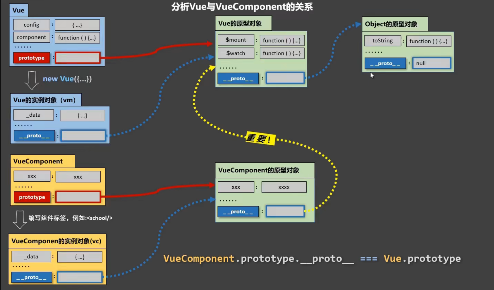

# VUE

 参考资料：

[vue2.x 官方教程](https://cn.vuejs.org/v2/guide/index.html)

[vue3.x 官方教程](https://v3.cn.vuejs.org/guide/installation.html)

[黑马程序员vue前端基础教程-4个小时带你快速入门vue](https://www.bilibili.com/video/BV12J411m7MG?from=search&seid=12214968412190924259&spm_id_from=333.337.0.0)

[尚硅谷Vue2.0+Vue3.0全套教程丨vuejs从入门到精通](https://www.bilibili.com/video/BV1Zy4y1K7SH?spm_id_from=333.1007.top_right_bar_window_view_later.content.click)

## 一、VUE 2.x

### （一）、VUE 基础

#### 1、介绍

-   js框架
-   简化DOM操作
-   响应是数据驱动


#### 2、第一个VUE程序

1、引入vue

```js
<!-- 开发环境版本，包含了有帮助的命令行警告 -->
<script src="https://cdn.jsdelivr.net/npm/vue@2/dist/vue.js"></script>

<!-- 生产环境版本，优化了尺寸和速度 -->
<script src="https://cdn.jsdelivr.net/npm/vue@2"></script>
```

2、编写程序

```html
<div id="app">
  {{ message }}
</div>
<script>
    var app = new Vue({
        el: '#app',
        data: {
            message: 'Hello Vue!'
        }
    })
</script>
```

#### 3、el:挂载点

-   可以使用id，类，元素标签等，选择与css选择器一样
-   作用范围是被选择的元素本身及其后代元素
-   可以在选中任意标签，不能是html和body

#### 4、data:数据对象

-   data可以存储json和数组
-   选取子元素使用 `.`，选取列表元素用 `[]`

```html
{{ school.name }}
{{ campus[0] }}
```

### （二）、本地应用

#### 1、vue指令

vue使用 `v-` 开头的标签表示指令

#### 2、内容绑定，事件绑定

##### 2.1、v-text

-   绑定内容使用 `v-text` 标签，可以设置标签中的内容

-   如果在标签中使用 `{{}}` 这种形式，则不会替换，会拼接起来。

-   也可以在指令中直接将字符串拼接。

`v-text="message + 'hello'"` `{{ message + 'hello' }}`

##### 2.2、v-html

-   设置innerHTML
-   如果有html结构会被解析成标签，功能可用
-   v-text不会把html渲染，只会显示文本

##### 2.3、v-on

-    使用方法 `v-on:click="function_name"`
-   也可以使用 `@click="function_name"`
-   方法定义在vue实例的 methods 中
-   获取标签中的值可以在方法中使用 `this.var_name` this指vue对象。

```vue
var app = new Vue({
    el:"#app",
    methods: {
        doId: function() {
            // 逻辑
        }
    }
})
```

##### 2.4、计数器（实例）

```html
<!DOCTYPE html>
<html lang="en">
<head>
    <meta charset="UTF-8">
    <meta http-equiv="X-UA-Compatible" content="IE=edge">
    <meta name="viewport" content="width=device-width, initial-scale=1.0">
    <title>Counter</title>
</head>
<body>
    <div id="app">
        <button @click="sub">
            -
        </button>
        <span>{{ num }}</span>
        <button @click="add">
            +
        </button>
    </div>
    <script src="https://cdn.jsdelivr.net/npm/vue@2/dist/vue.js"></script>
    <script>
        var app = new Vue({
            el: "#app",
            data: {
                num: 1
            },
            methods: {
                add: function() {
                    if (this.num < 10) {
                        this.num++;
                    }
                },
                sub: function() {
                    if (this.num > 0) {
                        this.num--;
                    }
                }
            }
        });
    </script>
</body>
</html>
```

#### 3、显示切换

##### 3.1、v-show

-   v-show可以控制元素的显示与隐藏

-   使用 `v-show="true"`，值可以设置true、false，也可以是一个布尔值，也可以是一个判断表达式
-   隐藏使用的方式是 `display: none`

##### 3.2、v-if

-   v-if的==功能和用法==和v-show一样
-   区别是v-if直接将元素标签从dom中移除

>   对于频繁切换的元素使用 v-show，因为加载dom浪费性能资源。

##### 3.3、v-bind

-   操纵标签的属性
-   使用方法 `v-bind:属性="值"`，可以省略 `v-bind`
-   值可以是拼接的字符串，也可以是三元表达式 `v-bind:class="isActive?'active':''"`
-   也可以使用对象的形式（推荐） `v-bind:class="{active:isActive}"`

##### 3.4、图片切换实例

```html
<!DOCTYPE html>
<html lang="en">
<head>
    <meta charset="UTF-8">
    <meta http-equiv="X-UA-Compatible" content="IE=edge">
    <meta name="viewport" content="width=device-width, initial-scale=1.0">
    <title>图片切换</title>
</head>
<body>
    <div id="imgToggle">
        <div>
            
            <a href="javascript:void(0);" v-show="index!=0" @click="prev">
                上一页
            </a>
            <a href="javascript:void(0);" v-show="index<imgArr.length-1" @click="next" >
                下一页
            </a>
        </div>
    </div>
    <script src="https://cdn.jsdelivr.net/npm/vue@2/dist/vue.js"></script>
    <script>
        var app = new Vue({
            el: "#imgToggle",
            data: {
                imgArr: [
                    "./img/202005091702.jpg",
                    "./img/202005091703.png",
                    "./img/202005091705.png",
                    "./img/pic39.jpg",
                    "./img/pic44.jpg"
                ],
                index: 0
            },
            methods: {
                prev: function() {
                    console.log("prev");
                    this.index--;
                },
                next: function() {
                    console.log("next");
                    this.index++;
                }
            }
        });
    </script>
</body>
</html>
```

#### 4、列表循环，表单元素绑定

##### 4.1、v-for

-   不仅可以遍历数组中的元素（包括对象），而且可以循环生成html元素中的内容。
-   基础语法 `v-for="(item, index) in arr"`，item和index分别代表数组中的元素和索引，只要格式正确，名字可以自定义，arr是定义在data中的数组名。
-   如果item是对象，需要使用`.`获取其中的数据。

```html
<div>
    <ul id="app">
        <li v-for="(item, index) in arr" :title="item">{{ index }} -> {{ item }}	</li>
    </ul>
</div>
<script>
    let app = new Vue({
        el: "#app",
        data: {
            arr: [ "A", "B", "C", "D" ]
        }
    });
</script>
```

如果需要把两个li标签中的内容都作为循环内容，可以使用 template标签将其包裹，在template中使用 v-for。

```html
<template v-for="item in items">
    <li>{{ item.name }}</li>
    <li>{{ item.age }}</li>
</template>
```

##### 4.2、v-on补充

-   v-on绑定的函数可以传入参数
-   v-on可以指定事件触发动作

```html
    <div id="app">
        <input type="button" value="click" v-on:click="sayHi(name)">
        <input type="text" v-on:keyup.enter="sayHi(name)">
    </div>
    <script>
        let app = new Vue({
            el: "#app",
            data: {
                name: "张三"
            },
            methods: {
                sayHi: function(yourName) {
                    alert("hello, " + yourName + "!");
                }
            }
        });
    </script>
```

>   更多指令参考：https://cn.vuejs.org/v2/api/#v-on

##### 4.3、v-model

-   设置表单内容
-   双向绑定：表单中的内容改变会引起data中数据的改变；data中数据的改变也会引起表单内容的改变。

```html
    <!-- 表单内容 双向绑定 -->
    <div id="app">
        <input type="button" value="click" @click="setMessage">
        <input type="text" v-model="message" @keyup.enter="showMessage">
        <h3>{{ message }}</h3>
    </div>

    <script>
        let app = new Vue({
            el: "#app",
            data: {
                message: "woshabi"
            },
            methods: {
                showMessage: function() {
                    alert(this.message);
                },
                setMessage: function() {
                    this.message = "woshadiao";
                }
            }
        });
    </script>
```

#### 5、计算属性和侦听器

Vue实例简称vm。

data中的属性是直接数据vm的，而计算属性不直接属于vm，而是需要通过调用函数返回一个值，如果不调用就不会显示。

通常data中的属性不是直接使用的，需要处理一下才能达到要求，在插值表达式中使用会让代码变得复杂，频繁复用也会很麻烦。因此，需要用到vue的计算属性。

##### 5.1、示例

```vue
<div id="demo">
    <p>{{ message }}</p>

    <h3>{{ upperMessage }}</h3>
</div>
<script>
    Vue.config.productionTip = false;
    let vm = new Vue({
        el: "#demo",
        data: {
            message: "hello, world!"
        },
        computed: {
            upperMessage: function() {
                return this.message.toUpperCase();
            }
        }
    });
</script>
```

在创建Vue实例时，添加一个computed属性，在里面定义一个函数名，得到一个返回值。在模板中使用函数名可以直接获取返回值。

##### 5.2、计算属性与方法

如果不使用计算属性，而是使用方法，在methods中定义一个作用相同的方法也可以达到相同的效果。

例如：

```
methods: {
	upperMessage: function() {
		return this.message.toUpperCase();
	}
}
```

使用方法需要在模板中使用括号，表明这是调用一个方法。`{{ upperMessage() }}`

**不同之处：**

计算属性使用缓存，当第一次调用计算属性时，他会执行里面的代码，然后他会把这个值存储到缓存，当下次调用时直接去找缓存。当计算属性的依赖（使用的变量）发生改变时，他会再次执行计算属性的代码，放到缓存，这样就不用担心数据不一致的问题。

##### 5.3、侦听属性

当侦听到某属性发生变化时，会执行其中的代码。这种方式也可以同步数据，但是很多时候会造成代码重复。更好的方式是使用计算属性。

```vue
watch: {
    firstName: function (val) {
        this.fullName = val + ' ' + this.lastName
    },
    lastName: function (val) {
        this.fullName = this.firstName + ' ' + val
    }
}
```

将上面的侦听属性改为计算属性：

```vue
computed: {
	fullName: function() {
		return this.firstName + ' ' + this.lastName;
	}
}
```

##### 5.4、getter/setter

计算属性默认只有getter属性，但是也可以设置setter属性。

```vue
computed: {
    fullName: {
        get: function() {
            return this.firstName + ' ' + this.lastName;
        },
        set: function(fullName) {
            let names = fullName.split(" ");
            this.firstName = names[0];
            this.lastName = names[1];
        }
    }
}
```

##### 5.5、侦听器

虽然计算属性在大多数情况下更合适，但有时也需要一个自定义的侦听器。这就是为什么 Vue 通过 `watch` 选项提供了一个更通用的方法，来响应数据的变化。当需要在数据变化时执行异步或开销较大的操作时，这个方式是最有用的。

侦听器使用 watch定义。里面包含监听的属性和执行响应的代码。

```vue
watch: {
    // 如果 `question` 发生改变，这个函数就会运行
    question: function (newQuestion, oldQuestion) {
        this.answer = 'Waiting for you to stop typing...';
        this.debouncedGetAnswer();
    }
},
```

在这个示例中，使用 `watch` 选项允许我们执行异步操作 (访问一个 API)，限制我们执行该操作的频率，并在我们得到最终结果前，设置中间状态。这些都是计算属性无法做到的。

#### 6、class与style绑定

##### 6.1、对象语法

需要动态渲染class样式时，可以使用一个对象来表示样式是否渲染。

对象使用 `{}` 包裹，key是class样式的名字，value为一个布尔值，为true时渲染class。

```vue
<div id="demo">
    <!-- 对象渲染 -->
    <p class="static" v-bind:class="{active: isActive}">hello, world!</p>
    <!-- 三元表达式渲染，不推荐 -->
    <p class="static" v-bind:class="isActive == true ? 'active' : ''">hello, world!</p>
</div>

<script>
    Vue.config.productionTip = false;
    let vm = new Vue({
        el: "#demo",
        data: {
            isActive: true
        }
    });
</script>
```

也可以将对象直接写在vue实例中。使用时，直接将classObject写在对应模板位置。

```vue
data: {
    classObject: {
        isActive: true
    }
}
```

##### 6.2、数组语法

1、简单数组

```vue
<div v-bind:class="[activeClass, errorClass]"></div>
```

这样会渲染两个值，分别时activeClass和errorClass在vue实例中定义的值。

2、数组中的三元表达式

数组中逗号间隔的表达式也可以是一个三元表达式。

```html
<div v-bind:class="[isActive ? activeClass : '', errorClass]"></div>
```

3、数组中的对象

```html
<div v-bind:class="[{ active: isActive }, errorClass]"></div>
```

##### 6.3、用在组件上

使用组件时，也可以给组件定义class属性，这个属性会合并到组件模板的最外层元素上。

##### 6.4、style内联样式

使用内联样式和上面的对象语法和数组语法相同，不过是把css中的样式“对象化”。

```vue
<div v-bind:style="{ color: activeColor, fontSize: fontSize + 'px' }"></div>
```

##### 6.5、自动添加前缀

当 `v-bind:style` 使用需要添加浏览器引擎前缀的 CSS property 时，如 `transform`，Vue.js 会自动侦测并添加相应的前缀。

##### 6.6、多重值

```vue
<div :style="{ display: ['-webkit-box', '-ms-flexbox', 'flex'] }"></div>
```

这样写只会渲染数组中最后一个被浏览器支持的值。

#### 7、事件处理

##### 7.1、基本使用

使用v-on绑定一个事件，然后指定触发事件后执行的函数名既可。函数在vue实例中的methods中定义，具体参考 [2.3、v-on](#####2.3、v-on) 和 [4.2、v-on补充](#####4.2、v-on补充)。

##### 7.2、事件参数

如果需要将触发事件作为参数，可以在定义方法中使用 `event` 关键字作为形参，使用时，在html中使用 `$evnet` 作为参数传入方法。

##### 7.3、事件修饰符

#### 8、Vue的生命周期

从创建vue实例到vue实例销毁的过程。重要的是 mounted和beforeDestroy

-   初始化过程

1.   new Vue()

2.   Init Events and LifeCycle  初始化：生命周期、事件，但数据代理还未开始。

3.   ==beforeCreate== 此时还无法通过vm访问到data中的数据、methods中的方法。

4.   Init injections and reactivity 初始化：数据检测、数据代理

5.   ==created== 可以通过vm访问到data中的数据，methods中的方法。

6.   解析模板，生成虚拟DOM，页面中位显示解析的内容。具体包括以下几个步骤

     1.   判断是否有el挂载点，如果有判断是否有模板选项如果也有编译模板到render方法。
     2.   如果没有el挂载点，等待 `vm.$mounted(el)` 被调用，绑定挂载点，判断是否有template配置项，如果没有，编译挂载点内的outerHTML（包括div）作为模板。

     >   el挂载点是必须的，如果没有配置el，也没有通过方法绑定挂载点，vue初始化就直接结束了。

7.   ==beforeMount== 页面是还未经过vue编译的DOM结构，所有对DOM的操作都不奏效，（因为后面会用虚拟DOM替换掉未编译的内容。）

8.   create vm.$el and replace ‘el’ with it 将内存中的虚拟DOM转为真实DOM。

9.   ==mounted== 此时页面中呈现的是经过vue编译的DOM，对DOM的操作均有效，（尽量避免）。

     至此，初始化的工作完成，此时可以开启定时器，发送网络请求，订阅消息，绑定自定义事件。

-   数据更新过程

10.   ==beforeUpdate== 当代理数据发生变化时，进入更新流程，此时，数据是最新的，但是，vue还未将更新后的页面渲染上，页面上的数据是更新之前的。
11.   Virtual DOM re-render and patch 根据更新的数据生成虚拟DOM，然后与旧的虚拟DOM进行比较，最终完成页面更新。即完成了 Model -> View 的更新。
12.   ==updated== 更新完成。此时的数据和页面中的数据是一致的。

-   销毁过程

13.   ==beforeDestroy== 当 vm.$destroy() 被调用后，进入销毁流程，beforeDestroy是销毁之前的准备工作。此时，代理数据data，methods，指令还可用，但是对数据的更新不会触发更新流程。一般此时进行关闭定时器，取消订阅消息，解绑自定义事件等收尾工作。
14.   销毁监视，子组件和事件监听器
15.   ==Destroyed== 

```vue
new Vue(
    el: "#app",
    // 多行使用 ``，使用模板回完全替换绑定的容器（容器如果有属性会丢失，不建议使用）
    template: `
        <div>
            ...
        </div>
    `,
    data: {
        name: 'zhangsan'
    },
    // 配置生命周期各阶段的方法。
    beforeCreate() {
    },
    created() {
    },
    beforeMount() {
    },
    mounted() {
    },
    beforeUpdate() {
    },
    updated() {
    },
    beforeDestroy() {
    },
    destroyed() {
    }
);
```


### （三）、网络应用

#### 1、axios

axios 是一个强大的网络请求库。

##### 1.1、导入

-   本地导入
-   cdn

`<script src="https://unpkg.com/axios/dist/axios.min.js"></script>`

##### 1.2、get

```js
axios.get("url?key1=value1&key2=value2")
.then(function(response) {
    console.log(response);
}, function(err) {
    console.log(err);
});
```

-   get方法里面写请求链接和参数
-   then中第一个方法是请求成功后执行的方法
-   then中第二个方法是请求失败后执行的方法

##### 1.3、post

```js
axios.post("url", {
    key1: value1,
    key2:value2
})
.then(function(response) {
    console.log(response);
}, function(err) {
    console.log(err);
});
```

-   与get稍有不同
-   post一共有两个参数，第一个是请求链接，第二个是请求参数，用对象表示

#### 2、axios + vue

唯一一点要注意的是，当在回调函数中，vue的this已经改变，无法使用，需要预先将其存起来。

```js
let app = new Vue({
    el: "#app",
    data: {
        message: "zhangsan"
    },
    methods: {
        getMessage: function() {
            let that = this;
            axios.get(url)
            .then(function(response)){
                that.message = response.data;
            }, function(err) {
                console.log(err);
            });
        }
    }
});
```

### （四）、组件

我们可以把经常用的页面元素打包成一个组件，这样可以减少代码冗余，保持代码整洁。

通常，一个页面只有一个Vue实例，这个实例可以有很多个组件。

#### 1、注册组件

```html
<div id="components-demo">
    <test-component></test-component>
    <test-component></test-component>
    <test-component></test-component>
</div>

<script>
    <!-- 声明一个组件 ("组件名", {}) -->
    const Feature = Vue.component("test-component", {
        <!-- 数据 -->
        data: function () {
            return { count: 0 };
        },
        <!-- 模板 -->
        template:
            '<button v-on:click="count++;">点击{{ count }}次</button>',
    });
    <!-- 绑定元素，只有绑定元素里面才可以使用组件 -->
    let app = new Vue({
        el: "#components-demo"
    });
</script>
```

-   使用声明的组件名作为标签，使用组件。
-   组件之间相互独立，各自维护自己的变量。
-   组件可以被无限复用，它和Vue很多属性相同，不同的是没有el挂载点。
-   data只能使用函数形式，否则会报错。


##### 1.1、组件名

单个词组件名可以全部小写和首字母大写。

多个词组件名可以使用大驼峰（需要使用脚手架）或使用 `-` 间隔，无论使用那种方式，都需要在使用时与名字一致。

组件有一个name配置项，可以在开发者工具中显示这个名字。

##### 1.2、全局注册

```js
Vue.component("component-demo", {});

new Vue({
    el: "#app"
});
```

这种方式注册的组件在任意Vue实例中都可以使用。

##### 1.3、局部注册

```js
// 使用对象的方式定义组件
<div id="app">
    <component-a></component-a>
    <component-a></component-a>
    <component-a></component-a>
</div>
<div id="demo">
    <component-a></component-a>
</div>

<script>
    // 或者使用 Vue.extend({ /* ... */ });
    let component1 = {
        data: function() {
            return { count : 0 };
        },
        template: '<button v-on:click="count++;">点击{{ count }}次</button>'
    };

    let app = new Vue({
        el: "#app",
        components: {
            'component-a': component1
        }
    });

    let demo = new Vue({
        el: "#demo"
    });
</script>
```

##### 1.4、模板

模板最外层必须由一个元素包裹，否则会只显示第一个被完整包裹的内容。

#### 2、prop（外部变量）

##### 2.1、变量名大小写

因为html的属性是大小写不敏感的，所以在使用组件，给组件内变量赋值的时候，需要将变量名转换成对应的“短横线分隔形式”。

`camelCase => camel-case`

##### 2.2、变量类型

使用列表无法指定属性类型，使用对象可以。

```vue
props: {
    title: String,
    likes: Number,
    isPublished: Boolean,
    commentIds: Array,
    author: Object,
    callback: Function,
    contactsPromise: Promise // or any other constructor
}
```

类型可以是String number Boolean Array Object Function

##### 2.3、传递静态值或动态值

无论传入什么值，都需要使用v-bind指定。

如果传入一个对象，相当于传入一系列属性值，key为属性名，value为属性值。

```vue
<component-a v-bind="post"></component-a>

props: {
    post: {
        title: "hello",
        name: "aaa"
    }
}
```

##### 2.4、单项数据流

父组件的porp回更新到子组件，子组件的porp更新不会影响父组件。如果内部改变子组件的porp，会在控制台警告提示。

##### 2.5、prop数据验证

```vue
Vue.component('my-component', {
  props: {
    // 基础的类型检查 (`null` 和 `undefined` 会通过任何类型验证)
    propA: Number,
    // 多个可能的类型
    propB: [String, Number],
    // 必填的字符串
    propC: {
      type: String,
      required: true
    },
    // 带有默认值的数字
    propD: {
      type: Number,
      default: 100
    },
    // 带有默认值的对象
    propE: {
      type: Object,
      // 对象或数组默认值必须从一个工厂函数获取
      default: function () {
        return { message: 'hello' }
      }
    },
    // 自定义验证函数
    propF: {
      validator: function (value) {
        // 这个值必须匹配下列字符串中的一个
        return ['success', 'warning', 'danger'].indexOf(value) !== -1
      }
    }
  }
})
```


## 二、Vue2.x详细

### （一）、模板细节

#### 1、实例与模板

在js中声明的Vue对象叫作Vue实例，在html中写的标签。通过el绑定的叫作模板。实例和模板之间的对应关系为一对一，多模板对一实例，只有第一个模板会解析实例中的数据；多实例对应一模板会报错。

#### 2、表达式

##### 2.1、js表达式与js语句

表达式是能产生一个值的句子。，例：a、a + b、a == b，funtion()

语句是控制代码流程走向的句子。例：if() {}、for() {}

##### 2.2、表达式使用范围

在插值表达式中和指令中。例 `{{ name }}`、`v-band:src=“url”`

`{{}}` 叫作插值表达式。

#### 3、指令

##### 3.1、v-cloak

v-cloak是一个没有属性值的属性，vue一旦加载完毕，解析模板，就会把它删掉。

常用来掩盖还没有加载完成时的未解析的模板。

```
<style>
    [v-cloak] {
        dispaly: none;
    }
</style>

<h1 v-cloak>{{ name }}</h1>
```


#### 4、过滤器

对展示数据进行简单地格式化处理。然后再展示出来。

##### 4.1、注册过滤器

1、局部注册

```vue
new Vue({
    ...,
    filters: {
        timeFormater(value, pattern='YYYY-MM-DD HH:mm:ss') {
            return dayjs(value).format(pattern);
        },
        ...
    }
});
```

>   1、过滤器默认接收管道前的一个参数，也可以给过滤器添加参数，es6中可以给参数设置默认值。
>
>   2、返回的值会渲染到插值表达式中

2、全局注册

`Vue.filter(name, callback);`

```
Vue.filter('mySlice', function([...]) {
    return ...;
});
```

##### 4.2、使用过滤器

1.   `<h1>{{ time | timeFormater }}</h1>` （无参）
2.   `<h1>{{ time | timeFormater('YYYY/MM/DD') }}</h1>` （有参）
3.   `<h1>{{ time | timeFormater('YYYY/MM/DD') | mySlice }}</h1>` （嵌套）

>   1.   过滤器默认会传入管道前的参数，不用写
>   2.   其余参数可以像调用函数一样传入
>   3.   管道嵌套从左到右依次执行，后一个管道的参数是前一个管道的返回值。
>   4.   v-model指令不可以使用过滤器

#### 5、自定义指令

// TODO

### （二）组件

#### 1、组件嵌套

首先准备两个组件，一个为school，另一个为student，让school中包含student需要在school配置项中配置components，然后在school模板中加上student组件标签。使用时，只需要将school注册到vm中。

```
// 声明student组件
const student = Vue.extend({
    template: `
        <div>
            ...
        </div>
    `,
    data() {
    
    },
});

// 声明school组件
const school = Vue.extend({
	template: `
        <div>
            ...
            <student></student>
            ...
        </div>
	`,
	data() {
	
	},
	// 注册student组件（局部）
	components: {
        // 如果同名，可以简写
        student
	}
});

// 注册school组件（局部）
const vm = new Vue({
    el: "#root",
    data: {
    
    },
    components: {
        school
    }
});

// 使用组件
<div id="root">
    <school></school>
</div>
```

>   组件标签可以使用单闭合的形式 <student/> 但是，必须使用脚手架，否则后面的组件标签不会生效。
>
>   一般使用一个app组件管理下面的组件，vm只需要管理一个app组件既可。

#### 2、组件声明

声明组件的另一种方式

```vue
// 第一步： 声明一个组件
const school = Vue.extend({
    template: ``,
    data() {
        return {
            
        };
    }
});
// 第二步：注册组件
const vm = new Vue({
    el: "#root",
    components: {
        // 左边为将要使用的标签名，右边为组件变量
        school: school
    }
});
// 第三步：使用组件
<div id="root">
    <school></school>
</div>
```

#### 3、组件创建原理

创建组件时，Vue.extend() 会帮我们自动调用 VueComponent() 函数，它是一个构造函数，最终会将这个函数返回给组件，因此，组件的实质是一个函数。不同的组件是不同的函数，因为每次调用VueComponent时都会创建一个变量返回。

组件data，methods，watch，computed中的this是指组件实例，组件实例一般称为vc。vm管理着一些vc。

组件和vue的区别很小，只有el和data有区别。

#### 4、Vue内置关系

##### 4.1、补充知识：

显示原型对象：声明的构造函数都有一个显示原型对象（红色线），即Function.prototype。所有构造函数的显示原型对象都最终指向Object的原型对象，即Object.prototype，而它指向null。

隐式原型对象：任何对象，包括原型对象，都有一个隐式原型对象，它指向其构造函数的显示原型对象（蓝色线）。

使用构造方法定义的属性可以使用隐式原型对象访问到。一般会在构造函数中定义属性，使用构造函数的显示原型对象定义方法，也可以添加属性。（不能使用字面量的方式，即对象方式，会覆盖原来的构造函数）

隐式原型链：当调用对象中的属性时，如果定义的没有，会找到它的隐式原型对象，如果还没有，会继续一层一层地找，直到Object.prototype。

```
function Fn() {
    this.a = 1;
    this.b = 2;
};

Fn.prototype.c = function() {
    return this.a + this.b;
}

Fn.prototype = {
    c: function() {
        return this.a + this.b;// a和b是undefined，因此c是NaN
    }
}
```

##### 4.2、内置关系

Vue将组件实例的隐式原型对象的隐式原型对象指向了vue的原型对象。即`VueComponent.prototype.__proto__ === Vue.prototype`，也即`vc.__proto__.__proto__ === vm.__proto__`。

这样vc也可以访问vue中的方法和属性。



#### 5、单文件组件

##### 5.1、文件定义

扩展名 `.vue`

内容：

```
<template>
    <!-- 模板 html -->
    <div>
        
    </div>
</template>

<script>
    /* 脚本 js */
export default {
    name: 'School',
    data() {
        return {
        };
    },
    mounted() {
    },
    methods: {
    },
};
</script>

<style lang="" scoped>
    /* 样式 */
</style>
```

##### 5.2、模块暴露

如何将模板暴露出去供使用？三种方式。

1.   分别暴露 `export const school = Vue.extend({});`
2.   统一暴露 `export {school}`
3.   默认暴露 `export default school;`

>   一般使用上面的方式，默认暴露，只写配置项，再加上name配置。

##### 5.3、Vue脚手架

1.   安装vue-cli `npm install -g @vue/cli`
2.   创建项目 `vue create vue_test`
3.   运行项目 `cd vue_test; npm run serve`

##### 5.4、项目结构

```
vue_test(/)
|
|-node_modules（文件夹，放的是vue项目使用的依赖）
|
|-public（放的是页签图表和html文件）
|    |- favicon.ico
|    |- index.html
|-src（资源文件夹）
|    |-assets（静态资源文件夹）
|    |-components（组件文件夹）
|    |- App.vue（所有组件的父组件）
|    |- main.js（程序的入口）
|- .gitignore（git忽略文件）
|- babel.config.js（babel配置文件）
|- package-lock.json（包版本控制文件）
|- package.json（打包配置文件，文件的版本等）
|- README.md readme
```

程序运行从main.js开始，main.js中导入了vue和App，创建了vue实例，绑定了public文件夹下的index.html中的元素。

App组件中定义了组件的模板并注册了子组件。

子组件定义自己的结构样式和功能。

>   1.   `<%= BASE_URL %>` 定义路由的根路径，它就是文件结构中public所在的目录。
>   2.   noscript标签在js可用的时候不会显示。
>   3.   babel是ES6转ES5的插件。ES6有一些新功能和函数。

##### 5.5、render

render是一个vue的配置项，是一个函数，它有一个参数，也是一个函数，这个函数可以将模板创建。

```
new Vue({
    el: "#root",
    render(createElement) {
        // 返回函数创建的结果，传入两个参数，一个是元素，一个是内容
        return createElement('h1', 'hello');
    }
});
```

一般使用箭头函数的方法将render简写。函数可以写成箭头形式的函数 `(h) => h(App)`，因为只有一个参数，可以将前一个括号省略。因为App是定义好的模板，是一个变量，可以只传入元素。

```
new Vue({
    el: "#root",
    render: h => h(App)
});
```

>   为什么要用render？
>
>   vue分为两个部份，一是vue核心，包含vue生命周期和各种方法，二是模板解析器，可以解析complate中的模板。
>
>   运行版本的vue不包含模板解析器，所以无法解析模板，所以使用render，也可以引入完整版的vue。
>
>   runtime的vue不包含模板解析器，所以更小，大概少1/3。

##### 5.6、脚手架配置文件

`vue.config.js` 可以配置运行vue的规则。与package.json同级。

#### 6、组件通讯

##### 6.1、ref元素属性

在vue中使用ref属性替代id，它可以完成id的工作，而且能够获取vc实例。

`this.$refs.title` （`ref="title"`）

如果获取的元素组件，则会获取该组件的实例。

使用 `document.getElementBy..()` 获取的始终是DOM元素。

##### 6.2、props配置项

父组件向子组件中传入值==或者方法==，需要在子组件标签上用属性的方式传入，也可以使用v-bind指令传入。不同的是v-bind会将内容作为表达式执行，直接写会当作字符串。

子组件需要在组件定义时设置接受值的变量，即使用props配置项。

有三种接收方式。

1.   简单接收，不限定

`props: ['name', 'age']`

2.   限定类型

```
props: {
    name: String,
    age: Number
}
```

3.   详细限定

可以限定类型，是否为必须和默认值。

```
props: {
    name: {
        type: String,
        required: true
    },
    age: {
        type: Number,
        default: 18
    }
}
```

>   1.   props的优先级高于data
>
>   2.   props的变量是只读的，不建议直接改，可以使用data接收props
>
>         `data() {return {studentName : this.name};}`
>
>   3.   传参的变量名不能是vue保留关键字，例如key，ref
>
>   4.   父组件不仅可以将值传给子组件，而且可以传方法，这是很重要的子组件向父组件传数据的一种方式。也就是说，父组件定义好一个方法，这个方法可以修改父组件中的数据。然后传给子组件，子组件接收后，调用该方法，就相当于父组件调用了该方法。我愿称之为“呼儿将出换美酒”，父亲把酒壶给儿子去打酒。

##### 6.3、mixin混入

将组件中重复的代码抽取，复用。

编写一个js文件，里面的对象可以是vc中的所有配置项，然后将其暴露出去。在组件中引入，然后配置到mixin中。

>   mixin.js

```
// 注意暴露方式，影响引入方式
export const hello = {
    data() {
        return {
        
        };
    },
    methods: {
    
    },
    mounted() {
    
    }
}
```

>   Student.vue

```
// 引入
import {hello} from './mixin.js'

export default {
    ...,
    // 局部混入
    mixins: [hello, ...]
}
```

>   1.   mixin中可以配置很多东西，例如函数和生命周期钩子等
>   2.   如果data中的数据冲突，以组件中的为准
>   3.   如果生命周期钩子冲突，则都会执行，以mixin中的为先。

-   全局混入

在 `main.js` 中引入，然后全局混入

>   main.js

```
import {hello, ...} from './xxx.js'

Vue.mixin(hello)
Vue.mixin(...)
Vue.mixin(...)
Vue.mixin(...)
```

#### 7、插件

##### 7.1、定义插件

>   plugins.js

```
export default {
    install(Vue) {
        Vue.filter(...);
        Vue.directive(...);
        Vue.mixin(...);
    }
}
```

1.   可以在文件中定义插件，然后暴露
2.   插件是一个对象，里面包含install函数，函数有一个参数，指Vue的构造函数。
3.   插件可以定义全局的过滤器、自定义指令和混入。

##### 7.2、使用

>   main.js

```
// 引入插件
import plugins from './plugins.js'

// 应用插件
Vue.use(plugins)
```

#### 8、样式

##### 8.1、scoped

在vue的组件中定义的style样式会汇总在一起。如果有类名重复的样式，会按照引入的顺序，覆盖掉前面的。

当我们只想让样式在本组件中生效时，可以使用 `scoped` 属性修饰。

```
<style scoped>...</style>
```

一般在component中的组件会使用 `scoped`，App组件不用。

##### 8.2、lang

style还有一个属性 `lang` ，表示书写样式的语言/方式。默认值为css，还可以是 less。

less是另一种样式定义的方式，可以嵌套着写。

#### 9、自定义事件

##### 9.1、事件名

要触发事件，必须与绑定的事件名字完全一致，Vue不会帮你自动转换为小驼峰。所以Vue官方推荐你**始终使用 kebab-case 的事件名**。

##### 9.2、绑定事件

绑定自定义事件同样使用v-on，事件名自定义，还需要定义一个触发后调用的方法。

>   父组件中给子组件（VC）绑定自定义事件

```vue
<Student v-on:demo="getStudentName"></Student>

export default {
  name: 'App',
  components: {
    School,
    Student
  },
  methods: {
    // 触发事件后执行的函数
    getStudentName() {
      console.log("demo has been emited.");
    }
  }
}
```

>   子组件触发事件

```vue
<button @click="sendStudentName">click</button>

export default {
    data() {
        return {
            studentName: "111",
            age: 18
        };
    },
    methods: {
        sendStudentName() {
            this.$emit("demo");
        }
    }
}
```

##### 9.3、通过ref绑定事件

给子组件绑定一个ref，这样通过父组件就可以获取到子组件的VC，然后就可以使用VC触发事件。

>   ref绑定一个事件

```vue
<Student ref="student"></Student>

export default {
  name: 'App',
  components: {
    School,
    Student
  },
  methods: {
    getStudentName() {
      console.log("demo has been emited.");
    }
  },
  mounted() {
    this.$refs.student.$on("demo", this.getStudentName);
  }
}
```

通过这种方式绑定的事件更加灵活，可以设置一个定时器，一段时间后绑定事件。

两种方式都可以使用事件修饰符，类似触发一次等。

**不定个数传参** ： `sendStudentName(name, ...params)`

##### 9.4、解绑事件 $off

1.   解绑一个事件 `this.$off('demo')`
2.   解绑多个事件 `this.$off(['dmeo1', 'demo2'])`
3.   解绑所有事件 `this.$off()`

##### 9.5、事件总结

1、使用ref给组件绑定自定义事件时，如果直接在$on 中定义一个普通的回调函数，里面的this是指触发事件的组件。

```
mounted() {
    // 这个this指的是父组件
    this.$refs.student.$on("demo", function() {
        // 这个this是指子组件，触发demo事件的是student组件实例
        console.log(this);
    });
}

mounted() {
    // 这个this指的是父组件
    this.$refs.student.$on("demo", () => {
        // 这个this也是指父组件，因为箭头函数没有this，向外找，找到了父组件。
        // 但是不建议使用，容易忘记，建议写在methods中。
        console.log(this);
    });
}
```

2、给组件绑定原生的事件时，vue认为它是自定义事件，例如click，并不会由点击事件触发，而需要 `$emit$` 触发。

解决办法是 使用 `native` 修饰符，说明这个事件是本地的原生事件。

```html
<!-- 不会触发点击事件 -->
<Student @click="demo"></Student>

<!-- 原生点击事件 -->
<Student @click.native="demo"></Student>
```

因为当组件实例知道它是本地原生事件时，就会把它交给组件的最外层元素。所以vue才要求组件必须由一个元素包裹。

##### 9.6、全局事件总线

思路：定义一个所有组件都能访问到的组件，子组件在这个组件上绑定自定义事件，并定义回调函数，另一个组件再触发这个组件的自定义事件。由于回调函数在给组件绑定事件的组件身上，所以回调传入的参数最终能到该组件身上。

这个特殊的组件具备特殊的资质：所有组件可见、能够调用 `$on, $off, $emit` 等方法。

因此最合适的就是Vue的原型对象，`VueComponent.prototype.__proto__ === Vue.prototype` 也就是这条线。当组件实例在自身找不到属性时，就会顺着隐式原型链找到 `Vue.prototype` 中的属性。

那么如何让`Vue.prototype` 中的属性能够调用`$on, $off, $emit` 等方法呢？能调用这些方法的由Vue的原型对象，以及vm和vc。所以把事件总线定义为一个vm或者vc是合适的。

最好的安装全局事件总线的时机就是Vue原型创建之前，将vm定义为全局事件总线。

```vue
new Vue({
    render: h => h(App),
    // 安装全局事件总线
    , beforeCreate() {
        Vue.prototype.$bus = this
    }
}).$mount("#app");
```

当项目变得比较大时，事件名容易冲突，最好写一个配置文件说明已经使用的名字。src/config/constance

##### 9.7、消息订阅与发布

消息订阅与发布也可以实现任意组件间的通讯。想获取数据的组件订阅一个消息，需要提供一个消息名（可以理解为频道）和一个回调函数；发布消息的组件发送数据到指定的消息名（频道）。例如，你关注了一个up，订阅了他的频道，他一发布视频你就可以观看；这个up发布视频在他这个频道。

消息订阅与发布依赖一个js库，叫pubsub-js，安装命令 `npm i pubsub-js`。

```js
// 引入pubsub，pubsub是一个对象
import pubsub from 'pubsub.js'

// 订阅方订阅一个消息
pubsub.subscribe("hello", function(messageName, data) {
    console.log("收到一个订阅消息：", messageName, data);
});

>> 收到一个订阅消息：hello 你好

// 发布方发布一个消息
pubsub.publish("hello", "你好");
```

订阅消息的回调函数由两个参数，第一个是订阅消息的消息名，第二个才是收到的数据。

>   同样，在pubsub的回调函数中，this不再是vue的this，是undefined。解决办法是使用methods中定义的函数或者使用箭头函数。

在组件销毁时，最好将订阅的消息取消订阅。他与解绑自定义事件有所不同，与定时器类似，每订阅一个消息就会产生一个订阅id，需要使用这个id才能取消订阅。这个id需要放在this身上才能被后面销毁是访问到。

```vue
mounted() {
    this.pubId = pubsub.subscribe("hello", function(messageName, data) {
        console.log("收到一个订阅消息：", messageName, data);
    });
}, beforeDestroy() {
    // 使用unsubscribe取消订阅
    pubsub.unsubscribe(this.pubId);
}
```

##### 9.8、nextTick

当下一次页面渲染完毕后，在执行回调里的内容。

在方法中，可能会对页面进行多次修改，vue不会在每次修改后就重新渲染页面，而是等到全部执行完毕后再渲染，那么一些需要重新渲染后的操作就无法完成，所以，这个函数就是解决这个问题的。

```vue
demo() {
    ...
    this.$nextTick(function() {
        ...
    });
}
```

#### 10、插槽

##### 10.1、默认插槽

vue的组件标签内可以写一些内容，放到组件实例中，但是直接写vue不知道将这些内容放到哪里，所以不会渲染。要想实现这个功能，需要在组件内定义一个插槽，供父组件往里面插入东西。

```vue
<Category>
    <h1>
        hello world!
    </h1>
    <slot>默认值，没有插入东西的时候显示</slot>
</Category>

<!-- 父组件 -->
<Category>
    test
</Category>
```

插入内容的样式可以在父组件中定义，也可以在子组件中定义，最终都会生效，但过程不同。定义在父组件中，内容带着样式插入插槽；定义在子组件中，内容插入插槽后才应用样式。

##### 10.2、具名插槽

一个组件中可以定义多个插槽，但是必须给每个插槽定义一个name属性。使用组件插入插槽时，必须给插入的内容一个slot属性。

```vue
<!-- 子组件 -->
<Category>
    <h1>
        hello world!
    </h1>
    
    <slot name="slot1">default content slot1</slot>
    <slot name="slot2">default content slot2</slot>
</Category>

<!-- 父组件 -->
<Category>
    <!-- 插入slot1 -->
    <h2 slot="slot1">content1</h2>
    <!-- 插入slot2 -->
    <h2 slot="slot2">content2</h2>
    <!-- 插入slot2 -->
    <h2 slot="slot2">content3</h2>
</Category>
```

1.   必须指定slot属性，确定插入位置。
2.   同一个插槽可以追加内容
3.   只插入定义了slot属性的标签，标签外不插入
4.   多个内容可以使用一个div包裹再插入。

5.   使用template标签包裹插入内容，最终效果比div少一层外壳。
6.   使用template可以使用指令插入。`<template v-slot:slot1>content</template>`

##### 10.3、作用域插槽

使用作用域插槽可以让同样的数据具有不同的渲染效果。

1.   首先定义一个默认的插槽，可以实现基本的功能。
2.   子组件将数据给插槽，让父组件可以使用这些数据。

```vue
<!-- 子组件 -->
<Category>
    <h1>hello world!</h1>
    
    <!-- 将数据绑定给插槽。可以携带多个，最终包装成一个对象 -->
    <slot :games="games">default content slot1</slot>
</Category>
```

3.   父组件使用组件，用一个变量接收数据。 `<Category scope="demo"></Category>`
4.   在组件标签中使用该数据。

```vue
<Category scope="demo">
    <p v-for="(item, index) in demo.games" :key="index">{{ item }}</p>
</Category>
```

>   1.   数据是来自子组件，使用数据是在父组件。
>   2.   需要给插槽绑定数据，父组件接收数据才能使用，具体怎么用就是父组件决定的了。
>   3.   父组件接收数据也可以使用 `slot-scope="demo"`，二者等价。

### （三）过渡与动画

使用Vue的Translation标签包裹要实现动画的元素，Vue会在适当的时机自动执行动画。

#### 1、动画

使用动画效果实现元素的显示与隐藏。

1.   首先，定义一个动画，定义元素完全展现和完全消失的情况。

```css
@keyframes show-hide {
  from {
    transform: translateX(-100%);
  }
  to {
    transform: translateX(0);
  }
}
```

2.   定义进入和离开的样式，类名有要求，默认为 `v-enter-active` 和 `v-leave-active`。

```css
  .v-enter-active {
    animation: show-hide 1s linear;
  }

  .v-leave-active {
    animation: show-hide 1s reverse;
  }
```

3、定义HTML结构。

```html
<div id="app">
    <!-- 定义一个按钮，切换显示和隐藏 -->
    <button @click="isShow = !isShow">show / hide</button>
    <!-- 用 transition 标签包裹需要应用动画的内容 -->
    <transition name="title">
      <!-- 用 v-show 决定是否显示 -->
      <h1 v-show="isShow" class="first-title">hello world!</h1>
    </transition>
</div>
```

至此，一个可以切换的动画就完成了。

>   1.   我们只需要关注动画内容即可，动画会在合适的时机自动加上。
>   2.   类名的格式必须要符合Vue的要求，才会生效。
>   3.   transition可以添加name属性来区别不同的元素动画，例如 `name="hello"`，那么如果要动画生效，类名必须是 `hello-enteractive/hello-leave-active`。如果不写name。默认是`v-enter-active` 和 `v-leave-active`
>   5.   如果要属性在页面刚开始就执行动画，需要在`transition`加上`appear`属性。

#### 2、多元素动画

```html
<button @click="isShow = !isShow">show / hide</button>
<transition-group name="title" appear>
    <h1 v-show="isShow" key="1" class="first-title">hello world!</h1>
    <h2 v-show="!isShow" key="2" class="first-title">你好，世界！</h2>
</transition-group>
```

如果同一个transition中的不同元素要使用同一个动画，必须使用 `transition-group` 标签，并且给每个元素加上`key`属性。

#### 3、过渡

一个过渡执行的全部过程由三部份组成，分别是起点、过程和终点，Vue动画效果会在合适的时机把写好的过渡样式加到元素的类上，但是由于起点只有一瞬间，vue只需要知道起点的位置，所以我们观察不到。

只要定义这三个过程的样式和过渡，就可以实现动画。

```css
  // 进入的起点、离开的终点
  .v-enter, .v-leave-to {
    transform: translateX(-100%);
  }

  // 进入的过程、离开的过程
  .v-enter-active, .v-leave-active {
    transition: 0.5s linear;
  }

  // 进入的终点、离开的起点
  .v-enter-to, .v-leave {
    transform: translateX(0);
  }
```

#### 4、第三方动画

推荐一个第三方动画库，animate.css。

1.   首先需要安装这个动画库，`npm install animate.css --save`。
2.   然后在使用的组件中引入，`import 'animate.css'`。
3.   在transition标签的name属性赋值为animate\_\_animated animate\_\_bounce，`name="animate__animated animate__bounce"`。
4.   最后给transition添加进入和离开动画属性。

```html
<transition
    appear
    name="animate__animated animate__bounce"
    enter-active-class="animate__flipInX"
    leave-active-class="animate__flipOutX"
>
    
</transition>
```

### （四）代理配置

#### 1、请求方法

前端发送ajax请求有四种方式：

1.   xhr（XMLHttpRequest）是原生的，自带的请求方式。
2.   JQuery是对xhr的封装，同时大部份代码是对DOM元素操作的封装。只有20%封装了请求。
3.   axios也是对xhr的封装，但是比较纯粹，不包含其他东西，体积比较小，开发中经常用到。
4.   fetch是浏览器自带的，与xhr同级，开发中也能用到，但是比较少。

综合来讲，axios是开发中常用的，也比较好用的开发库，vue开发者也推荐使用axios。

#### 2、跨域访问问题

什么是跨域？浏览器在访问请求时，需要保证协议、域名、端口一致。任何一个不一致都会导致跨域访问问题。出现这个问题不是服务器不发送请求，也不是浏览器收不到数据，而是浏览器发现这三个信息不同，就不把数据给你。

如何解决？有两种方式。

一是使用服务器端配置，允许跨域访问，这个时候跨域请求的时候，在返回的数据头中加上特殊的数据，告诉浏览器可以给用户，浏览器才会给用户。这是真正意义上的解决了跨域访问，但是，这样所有的服务器都能访问到这个服务器。

二是使用代理。代理也有两种方式，一是服务器端代理，二是前端代理。

服务器端代理可以使用nginx，nginx监听一个端口的请求，收到请求后将请求发送给服务器，这个请求不属于http，不受跨域访问限制，收到数据后再发送给浏览器。

第二个是使用vue-cli，让它帮我们转发请求，也是同样的原理。

#### 3、vue-cli配置代理

具体配置信息可以参考官网的教程。进入vue首页后，一次点击 生态系统 vue-cli ，进入页面后点击配置参考，找到devServe.proxy

>   vue.config.js

```js
module.exports = {
    devServer: {
        proxy: 'http://localhost:4000'
    }
}
```

`vue.config.js` 是一个可选的配置文件，如果项目的 (和 `package.json` 同级的) 根目录中存在这个文件，那么它会被 `@vue/cli-service` 自动加载。这个配置文件用来配置vue项目的全局设置，修改后需要重新启动vue项目才会生效。

配置了代理之后，当前端再发送请求的时候，会先在本地请求数据，如果没有，则交给代理，代理会将请求转发给配置好的代理服务器。

缺点：

1.   如果本地有请求重名的文件，则不会走代理，直接找到这个文件，也就是不能控制能否走代理。
2.   只能配置一个代理

#### 4、配置多项代理

使用上面的配置还可以配置多个代理，并且对每个代理都有详细的配置。

>   vue.config.js

```js
module.exports = {
    devServer: {
        proxy: {
            // 前缀，符合前缀的走代理
            "/demo" : {
                // 代理的目标
                target: "http:localhost:4000",
                // 对访问的路由进行重写，key是匹配的正则，value是替换的值
                // 下面这个意思是将 /demo 开头的部份替换为 ""
                pathRewrite: { "^/demo" : "" }, 
                ws: true, // 是否支持WebScoket, 不配置默认也有，为true
                changeOrigin: true // 是否告诉服务器真实地址，不配置默认也有，为true，这样服务器就不知道真实端口号
            },
            "/test" : {
                
            }
        }
    }
}
```

注意：

1.   ws 和 changeOrigin 是不配置，默认也有的。
2.   如果不对链接进行重写，代理访问的时候就是原来的链接

#### 5、vue-resource

vue-resource是vue1.0常用的请求发送的库，由于版本更新，这个库用的很少了，而且vue官方也推荐使用axios。

简单了解一下：

vue-resource的方法与axios一模一样，用法页一样，可以直接将axios换成this.$http。但是这个\$http不是一直有的，它是一个插件需要引入，使用。

1.   安装。`npm i vue-resource`
2.   引入。`import vueResource from 'vue-resource'`
3.   使用插件。`Vue.use(vueResource)`

4.   发送请求。

```vue
this.$http.get("url", {...params}).then(
    response => {
        
    },
    error => {
        
    }
);
```


### （五）Vuex

#### 1、介绍

Vuex 是一个专为 Vue.js 应用程序开发的**状态管理模式 + 库**。它采用集中式存储管理应用的所有组件的状态，并以相应的规则保证状态以一种可预测的方式发生变化。

也就是说Vuex是统一管理组件数据的插件。对于要频繁将数据共享给其他组件的情况，Vuex非常方便，好用。Vuex最大的特点就是**集中式、共享**。

#### 2、核心概念

下面是Vuex的原理图。Vuex使用单一状态树，即用一个对象包含所有层级状态，所以每一个Vuex都包含一个store对象，通过store获取所有东西。下图中并未体现。

其次，就是三个重要的部份，Actions、Mutations、State。

Actions可以对命令进行处理或者仅仅是commit给Mutations。从图中也可以看到，Actions有可能会和Backend交互。

Mutations是执行数据操作的，通过DevTools可以获取Mutations的状态。

State是存储数据的，Mutaitons修改数据时需要获取到它，State发生变化后，会触发Vue重新渲染页面。

**这三个都是对象**，可以通过 `store.` 获取。

形象一点说，store就是一个餐厅，Vue Components就是顾客，Actions是服务员，Mutations是后厨，State是菜。顾客进入餐厅可以对服务员点菜，服务员可以将点单交给后厨，也可以告诉顾客没有这个菜。顾客也可以直接告诉后厨吃什么，即commit可以是VueComponents直接调用，下面没有体现。后厨拿着原料做好菜交给顾客。


#### 3、搭建Vuex环境

1.   安装 Vuex。`npm i vuex@3`
2.   具体使用

```js
// 引入 Vue、Vuex、App组件
import Vue from 'vue';
import Vuex from 'vuex';
import App from './App'

// 必须在创建store之前应用Vuex插件
Vue.use(Vuex);

// 创建store实例
const store = new Vuex.Store({
    actions: {
        
    },
    mutations: {
        
    },
    state : {
        
    }
});

new Vue({
    el: "#app",
    render: h => h(App),
    // == store : store，将store放到vm身上。
    store
});
```

>   注意：
>
>   1.   vue2必须使用Vuex3，Vue3必须使用Vuex4，版本对应上。
>   2.   创建store实例之前必须将Vuex插件应用上。

#### 4、目录结构

官方推荐的目录结构是这样的，将store中的各项分别存储。如果文件夹引入不写文件名，只写到文件夹，会找这个文件夹下的index.js。

```
├── index.html
├── main.js
├── api
│   └── ... # 抽取出API请求
├── components
│   ├── App.vue
│   └── ...
└── store
    ├── index.js          # 我们组装模块并导出 store 的地方
    ├── actions.js        # 根级别的 action
    ├── mutations.js      # 根级别的 mutation
    └── modules
        ├── cart.js       # 购物车模块
        └── products.js   # 产品模块
```

#### 5、实现Vuex案例

将Vuex按照上面的任意一种方式应用后，每个vc通过this都可以访问到store，为了迎合Vue的设计，需要加上 `$`。

1.   首先，将数据定义在state中。
2.   定义纯粹的数据操作在mutations中，和methods中相同，不过建议大写。
3.   定义业务逻辑代码在actions中，比如说判断，Ajax请求等。
4.   组件中去dispatch actions中的行为，并传入参数。`this.$store.dispatch("plus", 1);` 这个 `plus` 就是定义在actions中的行为，是一个函数，两个参数，`plus(context, value)` 第一个就是actions 的上下文，包含用户可能用到的方法、数据，第二个参数是传进来的参数。mutations中的`PLUS(state, value)` 第一个参数就是数据定义state，第二个就是commit传入的值。
5.   组件中也可以跳过actions，直接触发commit操作state中的数据。`this.$store.commit("PLUS", 2);`

>   注意：Mutations中只关注如何操作数据，不关注执行操作的条件，执行条件由actions判断。

#### 6、计数器案例

>   src/store/index.js

```js
// 引入Vue和Vuex
import Vue from 'vue';
import Vuex from 'vuex';

// 应用Vuex插件
Vue.use(Vuex);

// 默认暴露
export default new Vuex.Store({
    // 定义行为
    actions: {
        /* context : 小的store，可能用到的上下文数据和方法
         * value : 传入的参数
         */
        plusOdd(context, value) {
            if (context.state.sum % 2) {
                context.commit("PLUS", value);
            }
        },
        plusLater(context, value) {
            setTimeout(() => {
                context.commit("PLUS", value);
            }, 500);
        }
    },
    // 定义对数据的操作
    mutations: {
        /**
         * @param {*} state 共享的数据state
         * @param {*} value commit的参数
         */
        PLUS(state, value) {
            // console.log(state, value);
            state.sum += value;
        },
        REDUCE(state, value) {
            state.sum -= value;
        }
    },
    // 定义共享数据
    state: {
        sum: 0
    }
});
```

>   main.js

```js
import Vue from 'vue'
import App from './App.vue'
// 引入store
import store from './store'

Vue.config.productionTip = false

new Vue({
  render: h => h(App),
  // 放到vm身上
  store
}).$mount('#app')
```

>   src/components/Counter.vue

```vue
<template>
  <div>
      <h1>当前求和为：{{ this.$store.state.sum }}</h1>
      <select v-model.number="num">
          <option value="1">1</option>
          <option value="2">2</option>
          <option value="3">3</option>
      </select>
      <button @click="increment">+</button>
      <button @click="decrement">-</button>
      <button @click="incrementOdd">和为偶数不加</button>
      <button @click="incrementLater">有延迟的加</button>
  </div>
</template>

<script>
export default {
    name : "Counter",
    data() {
        return {
            num : 1
        };
    },
    methods: {
        increment() {
            // 直接触发commit，传入对数据的操作和参数
            this.$store.commit("PLUS", this.num);
        },
        decrement() {
            this.$store.commit("REDUCE", this.num);
        },
        incrementOdd() {
            // 调用dispatch，传入行为和参数
            this.$store.dispatch("plusOdd", this.num);
        },
        incrementLater() {
            this.$store.dispatch("plusLater", this.num);
        }
    },
    mounted() {
        // console.log(this);
    }

}
</script>

<style>
    button {
        margin: 0px 10px;
    }
</style>
```

#### 7、getters

当state中的数据需要经过加工再使用时，可以使用getters。使用方法与计算属性 computed 类似，可以传入一个参数，就是state。

```js
getters() {
    bigSum(state) {
        return state.sum * 10;        
    }
}
// 使用
this.$store.getters.bigSum;
```

#### 8、mapState、mapGetters

要使用Vuex中的属性需要写 `this.$store.state.sum` ，每次都要写一堆。借助计算属性可以在模板中简化代码，但是写计算属性有很麻烦了。Vuex考虑到这点，给了一个可以生成计算属性的方法，可以很方便地生成大量计算属性（仅限state）。

```
// 1. 首先从 Vuex 中引入mapState方法
import mapState from 'vuex';

// 2.生成计算属性。
computed: {
    ...mapState({ sum : 'sum', school : 'school' }),
}
```

注意：

1.   mapState 需要传入一个对象，key是需要的计算属性的名字，value是state中的属性名。
2.   mapState 返回值是一个对象，key是计算属性的名字，就是上面的key，value就是生成的方法。
3.   直接写 `mapState()` 写到computed中，相当于将对象写到computed中，这样是错误的。利用ES6的特性，在mapState前加 `...` 可以将返回值的内容合并到 `computed` 中。

计算属性名和state中的数据名一样，可以使用简写形式，再进一步，使用列表也可以。

```
computed: {
    ...mapState([ 'sum', 'school' ]),
}
```

同理，getters也有这种方法，也有两种形式。

```vue
import { mapState, mapGetters } from 'vuex';

computed: {
    ...mapGetters({ sum : 'sum', school : 'school' }),
    ...mapGetters([ 'sum', 'school' ]),
}
```

#### 9、mapActions、mapMutaions

mapMutations可以帮助我们自动生成调用commit的方法。用法和mapState类似。

```js
import { mapState, mapGetters, mapActions, mapMutations } from 'vuex';

methods : {
    // 对象写法
    ...mapMutations({ increment: "PLUS", reduce : "REDUCE" }),
    // 数组写法
    ...mapMutations([ "PLUS", "REDUCE " ]),
}
```

但是生成的方法和我们亲自写的方法不是一样的，它是这样的，他有一个形参，用于传入一个参数。而html中直接写方法名是可以传参的，传入的是event，即触发的事件，这样就会出错。所以，调用时应该带一个参数。

```js
methods : {
    increment(value) {
        this.$store.commit("PLUS", value);
    }
}
```

使用自动生成的方法：

```html
<button @click="increment(num)">+</button>
```

注意：

1.   生成的方法是带参数的，需要带参使用。
2.   使用数组写法，操作名要和methods方法名一致。

同理，`mapActions`也是一样的用法，生成调用 `dispatch` 的方法。

#### 10、模块化

为了后期方便维护代码，建议把不同业务的代码分别存储，封装成一个个的模块， 每一个模块就是一个小的store，包含数据的定义和操作。

```js
// 计数相关的模块
const countAbout = {
    state: {},
    mutations: {},
    actions: {},
    getters: {};
}
// 人员管理相关的模块
const personAbout = {
    state: {},
    mutations: {},
    actions: {},
    getters: {};
}

// 在vuex中引入模块
export default new Vuex.Store({
    modules: {
        countAbout,
        personAbout
    }
});
```

这些模块最后可以按照上方的目录结构拆分成不同的文件。

拆分成不同模块后，store里就没有模块中定义的属性和操作了，只有定义的模块，`$store.countAbout, $store.personAbout` ，这时， 块名才行。

第一种方法：不修改mapState等方法，使用 `countAbout.sum` 获取数据，

第二种方法，使用命名空间（namespace），需要在模块中允许使用namespace，然后mapState等方法就可以使用模块的名字自动生成方法。

>   src/store/index.js

```js
const countAbout = {
    // 开启命名空间
    namespace: true,
    state: {},
    mutations: {},
    actions: {},
    getters: {};
}
```

>   src/components/Counter.vue

```js
import { mapState, mapGetters, mapActions, mapMutations } from 'vuex';

export defalut Vue.extend({
    ...,
    computed: {
        // 使用命名空间创建计算属性。同样可以使用对象或数组
        ...mapState('counterAbout', [ 'sum', 'school', 'subject' ]),
        ...mapGetters('counterAbout', [ 'bigSum' ]),
    },
    methods: {
        // 使用命名空间创建调用dispath的方法，使用数组
        ...mapActions('counterAbout', [ 'plusLater', 'plusOdd' ]),
        // 使用命名空间创建调用commit的方法，使用对象
        ...mapMutations('counterAbout', { increment: 'PLUS', reduce: 'REDUCE' })
    }
});
```

### （六）路由

#### 1、概念

路由（route）：通过路径找到某些东西就是路由，路径是key，那个要找的东西就是value。

路由器（router）：就是管理路由的。

在前端中，这个value是指一个组件（components）；在后端，它指的是一个方法（function）。

#### 2、使用路由

1.   安装路由插件。`npm i vue-router@3`。和vuex一样，vue2要使用vue-router3，vue3要使用vue-router4。
2.   配置路由一般呢，路由配置在一个单独的文件夹，与vuex类似。
     1.   创建 `src/router/index.js`
     2.   引入vue-router。`import VueRouter from 'vue-router'`
     3.   使用插件。`Vue.use(VueRouter)`
     4.   创建一个router并暴露出去。

>   src/router/index.js

```js
import Vue from 'vue';// 引入vue
import VueRouter from 'vue-router'; // 引入vue-router
import Home from '../components/Home'; // 引入组件 Home
import About from '../components/About'; // 引入组件 About

// 这里可以不先引用，在main.js中引入也可以，因为VueRouter创建实例不需要使用插件
Vue.use(VueRouter);

export default new VueRouter({
    routes: [
        {
            path: '/home',
            component: Home
        },
        {
            path: '/about',
            component: About
        }
    ]
});
```

3.   注册路由

>   main.js

```js
import Vue from 'vue';
import App from './App';
import router from './router'                                                                                       

new Vue({
    render: h => h(App),
    router
}).$mount("#app");
```

4.   在页面中定义跳转的按钮或者链接

```html
<!-- 使用 router-link 标签的 to 属性指定路径 -->
<!-- router-link 会被解析成 a 标签 -->
<router-link to="/home">home</router-link>
<router-link to="/about">about</router-link>
```

5.   定义插入组件的位置。

```html
<!-- 使用 router-view 定义接收组件的位置 -->
<router-view></router-view>
```

这个时候，一个简单的路由就设置完成了。点击跳转，页面不会刷新，但是搜索栏的地址和内容会随点击的链接变化。

>   给router-link一个 active-class属性，属性值是选中的样式，再点击按钮就会改变相应的样式。

#### 3、细节问题

##### 3.1、路由组件

路由组件是配置路由中使用的组件，一般组件是在父组件中引入，注册，使用的组件。一般将这两种组件分别存储，路由组件放在pages中，一般组件放在components中，这两个文件夹同级。

##### 3.2、\$route和\$router

路由组件挂载完毕时，它比一般组件多了两个属性，一个是 `$route`，另一个是 `$router`。

`$route` 是每个组件都不一样的，是配置路由中的其中一个，经过加工后的自己的路由信息。

`$router` 是所有组件都一样的，整个应用只有这一个，是配置的所有的路由器。

##### 3.3、路由组件挂载

路由组件被调用时挂载在页面上，当消失时组件被销毁。

#### 4、多级路由（套娃）

在路由组件中再写一个组件路由。

1.   还是先定义路由组件 `News` `Message`
2.   然后配置路由，使用children关键字配置子路由。

```js
export default new VueRouter({
    routes: [
        {
            path: '/home',
            component: Home,
            children: [
                {
                    path: 'news',
                    component: News
                },
                {
                    path: 'message',
                    component: Message
                }
            ]
        },
        {
            path: '/about',
            component: About
        }
    ]
});
```

3.   定义跳转组件的链接和接收组件的位置。

```html
<router-link to="/home/news" active-class="active">news</router-link>
<router-link to="/home/message" active-class="active">message</router-link>

<router-view></router-view>
```

>   注意点：
>
>   1.   配置子路由路径时，不要再写 `/`，vue会自动加上。
>   2.   在写访问链接时要写全。

#### 5、query参数

跳转路由的时候还可以携带参数，有两种方法。

第一种就是常规的get请求方式，在路由后面加上 `?`。

第二种方式就是使用对象。

```html
<router-link to="/home/news?id=001" active-class="active">news</router-link>

<!-- to 前面加上一个 :, to 的值是对象，有 path 和 query -->
<router-link :to="{
        path: '/home/news',
        query : {
            id : '001',
            name: 'tom'
        }
    }" 
    active-class="active"
>
    news
</router-link>
```

**接收参数**

子组件如何接收传入的参数呢？使用vc的 `$route` 属性。

`$route.query.id` `$route.query.name`

#### 6、路由命名

路由还可以配置一个名字，也是一种跳转方式。在路由非常长的时候使用很方面，路由短的时候很鸡肋。

1.   配置路由的名字。

```js
export default new VueRouter({
    routes: [
        {
            name: 'home',
            path: '/home',
            component: Home
        }
    ]
});
```

2.   跳转时使用名字。

```html
<router-link :to="{ name: 'home' }" active-class="active">news</router-link>
```

>   注意：
>
>   1.   使用名字跳转必须加冒号。`:to="{}"`
>   2.   必须使用对象。`:to="{ name: 'home' }"`

再长的路由也可以用一个简短的名字替代。

#### 7、params

路由可以用另一种方式携带参数，就是params。`/home/message/detail/001/tom`，后面两个是参数。

##### 7.1、路由字符串

第一种方式，使用路由字符串。

1.   首先，在路由配置里使用占位符给参数占位。`:id` 给参数占位

```js
export default new VueRouter({
    routes: [
        {
            name: 'home',
            path: '/home/message/detail/:id/:name',
            component: Home
        }
    ]
});
```

2.   使用字符串路由访问

```html
<router-link to="/home/message/detail/:001/:tom" active-class="active">news</router-link>

<router-link :to="`/home/message/detail/${item.id}/${item.name}`" active-class="active">news</router-link>
```

一旦在 `to` 前使用前面使用 `:` ，就意味着双引号里面的是js代码，为了在字符串中插入数据，需要使用模板字符串 <code>``</code> ，里面的变量使用 <code>${}</code> 插入。

##### 7.2、对象访问

第二种方式，使用对象。同样需要在路由中配置占位参数。

```
<router-link :to="{
        path: 'home',
        params : {
            id : '001',
            name: 'tom'
        }
    }" 
    active-class="active"
>
    news
</router-link>
```

注意：

1.   必须使用名字访问
2.   参数改为 `params`

##### 7.3、获取params

子组件中使用 `$route.params.id` 获取。

#### 8、props

上面说使用params传参数，通过`$route.params.id`可以获取传入的参数，但是要写这么多很麻烦，而且参数很多的时候会有很多代码。props配置就可以解决这个问题，让组件收到参数就像接收一个props一样方便。

props有三种定义方式，每一种都有不同的用法。

##### 8.1、对象定义方法

```
export default new VueRouter({
    routes: [
        {
            name: 'home',
            path: '/home/message/detail/:id/:name',
            component: Home,
            // 定义props为一个对象，当访问路由的时候，vue就会将这个参数传给Home组件，放到props中。
            props: {
                a: 1,
                b: 'hello'
            }
        }
    ]
});
```

##### 8.2、接收参数

无论哪一种定义方法，都需要组件使用props接收参数，格式都是一样的，和普通props一样。

```js
exprot default Vue.extend({
    name: 'Home',
    props: [ 'a', 'b' ],
});
```

##### 8.3、布尔值定义方法

定义props为一个布尔值，那么当访问路由的时候，vue就会把传入的**params参数**全部放到组件的props中。

```js
export default new VueRouter({
    routes: [
        {
            name: 'home',
            path: '/home/message/detail/:id/:name',
            component: Home,
            // 定义props为一个布尔值
            props: true
        }
    ]
});
```

##### 8.4、函数定义方法

将props定义为一个函数，vue会自动帮我们调用这个函数。这个函数只有一个参数，就是 `$store` ，返回为一个对象，就是要传入组件的数据对象。

```js
export default new VueRouter({
    routes: [
        {
            name: 'home',
            path: '/home/message/detail',
            component: Home,
            // 定义props为一个函数
            props(route) {
                return {
                    id: route.query.id,
                    name: route.query.tom
                };
            }
        }
    ]
});
```

使用这种方式不仅可以将params中的数据传入组件，**还可以传query中的数据**。

#### 9、router-link的replace属性

##### 9.1、历史记录存储方式

1.   浏览器的历史存储方式，默认是栈的形式，每当在同一个页面点击一个链接，浏览器就会把路由push到浏览记录栈中，当前页面指向栈顶。当我们点击回退的时候，当前页面就会指向前一个。

2.   另一种存储方式就是replace，浏览器会将当前记录替换掉前一条记录。

##### 9.2、设置历史记录模式

1.   默认的 `router-link` 标签就是push模式。
2.   改为replace模式只需要给 `router-link` 标签添加一个 `replace` 属性。

```html
<router-link relpace to="">home</router-link>
```

##### 9.3、编程式路由导航

借助vue-router的`$router` ，可以对当前页面所指路由进行任意的跳转。

###### 9.3.1、push

使用函数的方式跳转路由。使用方式和在router-link中使用对象一模一样。

```js
export default new Vue.extend({
    methods: {
        sendMessage(value) {
            this.$router.push({
                path: '/home/message/detail',
                query: {
                    id: value.id,
                    name: value.name
                }
            });
        }
    }
});
```

###### 9.3.2、replace

与上面类似，使用replace方式跳转路由。

```js
export default new Vue.extend({
    methods: {
        sendMessage(value) {
            this.$router.replace({
                path: '/home/message/detail',
                query: {
                    id: value.id,
                    name: value.name
                }
            });
        }
    }
});
```

###### 9.3.3、back

从当前页面后退一步，与浏览器的作用一样。

```js
this.$router.back()
```

###### 9.3.4、forward

从当前页面前进一步，也是和浏览器作用一样。

```js
this.$router.forward()
```

###### 9.3.5、go

从当前页面跳转任意步。

```
this.$router.go(2);
this.$router.go(-3);
```

如果传入的是正数，则向前跳转相应的步数，如果是负数，则向前跳转相应的步数。

#### 10、缓存路由

正常使用路由组件，当该组件不展示的时候，vue会将这个组件销毁。如果我们不想让它销毁，例如表单组件，切走后用户输入的就全部消失了，所以要保留着。可以使用一个 `keep-alive` 组件将展示标签包裹着，这样就不会销毁了。

```html
<keep-alive>
    <router-review></router-review>
</keep-alive>
```

另外，`keep-alive` 还有一个属性，可以只保留指定的组件。下面是只保留 `News` 组件，默认全部保留。

```html
<keep-alive include="News">
    <router-review></router-review>
</keep-alive>
```

保留多个组件使用数组传入，`include` 前面需要使用那个 `:`

```html
<keep-alive :include="[ 'News', 'Message' ]">
    <router-review></router-review>
</keep-alive>
```

#### 11、生命周期钩子

路由独有的生命周期钩子，`activated` 和 `deactivated` ，分别是组件展示（激活）的时候执行和组件不展示（失活）的时候执行。

至此，vue的八个生命周期钩子全部完毕。

```js
export default new Vue.extend({
    name: 'News',
    activated() {
        
    },
    deactivated() {
        
    }
});
```

#### 12、路由守卫

##### 12.1、全局前置路由守卫

路由守卫就是一个拦截器，路由跳转的时候满足条件的放行，不满足条件的用户可以定义行为。全局就是对所有路由跳转都起作用，前置就是路由跳转之前拦截。

配置路由守卫需要在创建路由器之后设置。

```js
import Vue from 'vue';// 引入vue
import VueRouter from 'vue-router'; // 引入vue-router
import Home from '../components/Home'; // 引入组件 Home
import About from '../components/About'; // 引入组件 About

// 这里可以不先引用，在main.js中引入也可以，因为VueRouter创建实例不需要使用插件
Vue.use(VueRouter);

const router = new VueRouter({
    routes: [
        {
            path: '/home',
            component: Home
        },
        {
            path: '/about',
            component: About
        }
    ]
});

// beforeEach 会拦截所有路由跳转在跳转之前，所以是全局前置
// 需要传入一个回调函数，有三个参数
/*
 * to 要跳转的路由（route）
 * from 从哪里来（route）
 * next 一个函数，跳转到 to 所指路由。
 */
router.beforeEach( (to, from, next) => {
    // 不做任何行为，放行
    next();
});

export default router;
```

##### 12.2、meta

每一个路由生成都会带有 `meta` 对象，是专门用来放用户定义的数据的，例如放每个路由对应页签上的标题，还可以放是否需要校验，这样就不需要写一长串判断语句。

```js
const router = new VueRouter({
    routes: [
        {
            path: '/home',
            component: Home,
            // 定义标题和是否需要校验
            meta: { title: '主页', isAuth: false }
        },
        {
            path: '/about',
            component: About,
            meta: { title: '关于', isAuth: true }
        }
    ]
});
```

这样就很方便地标记了是否需要校验。

```js
router.beforeEach( (to, from, next) => {
    if (to.meta.isAuth) {
        ...
    }
});
```

##### 12.3、全局后置路由守卫

这个路由守卫一般不做校验工作，因为这个时候路由已经跳转完毕了。它主要负责路由跳转之后的完善工作，例如上面的修改页签标题，这个时候是最合适的。由于已经跳转完毕，不需要跳转，所以就没有了跳转函数的参数，也不需要控制跳转。

```js
router.afterEach( (to, from) => {
    // 修改页签标题
    doucument.title = to.meta.title || 'Home';
});
```

全局前置路由守卫和全局后置路由守卫**在页面刚进入时都会调用**。 

##### 12.4、独享路由守卫

配置给某一个路由的守卫，只对当前路由生效，只有前置路由守卫。

```js
const router = new VueRouter({
    routes: [
        {
            path: '/home',
            component: Home,
            // 定义标题和是否需要校验
            meta: { title: '主页', isAuth: false },,
            beforeEnter(to, from, next) {
                if (to.meta.isAuth) {
                    ...
                }
            }
        },
        {
            path: '/about',
            component: About,
            meta: { title: '关于', isAuth: true }
        }
    ]
});
```

既然配置了独享路由守卫，就说明需要进行校验，就不需要写 `isAuth` 和判断了。

##### 12.5、组件路由守卫

定义在组件内的路由守卫，`beforeRouteEnter` 和 `beforeRouteLeave` ，分别在通过路由进入组件之前，离开组件之前调用。

```js
export default new Vue.extend({
    name: 'Home',
    beforeRouteEnter(to, from, next) {
        // 进入该组件，不做任何行为
        next();
    },
    beforeRouteLeave(to, from, next) {
        // 离开改组件前，不做任何行为
        next();
    }
});
```

这个组件也是有三个参数，`to/from/next` ，和全局前置路由守卫的回调函数参数一样。

注意：**必须是通过路由进入该组件**才会触发这个路由守卫，直接在html中生成实例是不会触发的。

#### 13、工作模式

vue有两种工作模式，默认为 `hash`，就是路由中带 `#` 的，在访问时，`#` 后面的就是hash值，它不会被发送给服务器，只是本地处理。还有另一种工作模式，就是 `history`，不带 `#` ，更好看。

开启history模式

```js
const router = new VueRouter({
    // 工作模式为 history
    mode: 'history',
    routes: [
        {
            path: '/about',
            component: About,
            meta: { title: '关于', isAuth: true }
        }
    ]
});
```

hash模式：

1.   不好看
2.   若通过第三方收集App分享链接，若校验严格，则会被标记不合法。
3.   兼容性较好

history模式：

1.   好看
2.   兼容性较差，ie8以下不支持，（去他妈的ie）
3.   刷新会出现 404 错误，需要后端设置。

#### 14、组件库

##### 14.1、全局引入

使用ElementUI

1.   安装。`npm i element-ui`
2.   引入组件库。`import ElementUI from 'element-ui';`
3.   引入样式库。`import 'element-ui/lib/theme-chalk/index.css'; `
4.   使用插件。`Vue.use(ElementUI);`
5.   接下来就可以在组件中使用ElementUI的组件库了。

##### 14.2、按需引入

全部引入会导致js文件特别大，忍不了，使用按需引入，需要先安装一个库。

1.   安装 babel。`npm install babel-plugin-component -D`
2.   修改babel配置。

>   babel.config.js

```js
module.exports = {
    presets: [
        '@vue/cli-plugin-babel/preset',
        ["@babel/preset-env", { "modules": false }]
    ],
    "plugins": [
        [
            "component",
            {
                "libraryName": "element-ui",
                "styleLibraryName": "theme-chalk"
            }
        ]
    ]
}
```

3.   按需引入。`import { Button, Select } from 'element-ui;'`
4.   应用插件。`Vue.component(Button.name, Button);` 或 `Vue.use(Button)`
5.   现在就可以使用element组件库了。

注意：

1.   组件库不需要引入样式库了，安装的插件会自动将所需的样式打包。
2.   `Button.name` 就是button组件使用时的标签名`el-button`。
3.   组件名就是标签名去掉 `el-` ，然后转换为大驼峰。


