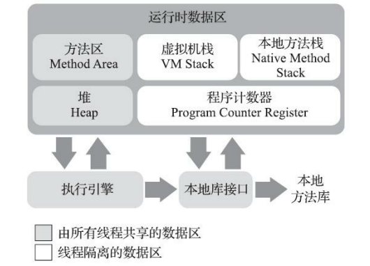
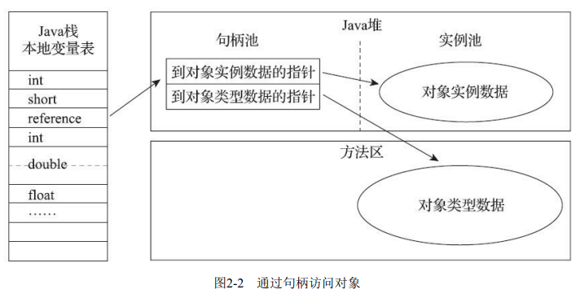
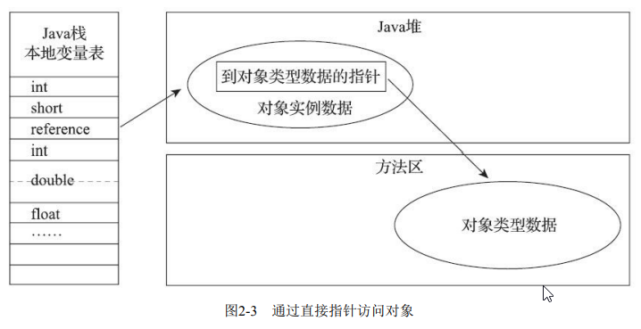
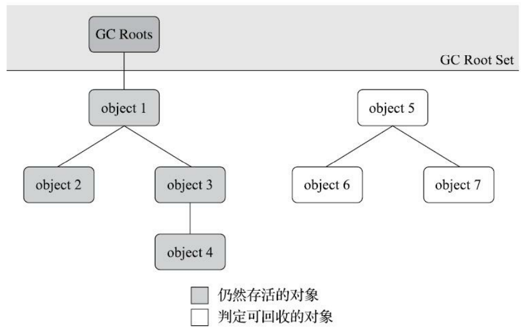

# 深入理解Java虚拟机

## 第一部分 走近Java

### 第一章 走近Java

## 第二部分 自动内存管理

### 第二章 Java内存区域与内存溢出异常

#### 2.1 概述

#### 2.2 运行时数据区域

Java虚拟机在执行Java程序的过程中会把它所管理的内存划分为若干个不同的数据区域。



##### 2.2.1 程序技术器

程序计数器（Program Counter Register）是一块较小的控件，它可以看作是当前线程所执行的字节码的行号指示器。

**它是程序流程控制的指示器，分支、循环、跳转、异常处理、线程恢复等基础功能豆需要依赖这个计数器来完成。**

Java虚拟机的多线程是通过线程轮流切换、分配处理器执行时间的方式来实现的。为了线程切换后能恢复到正确的执行位置，**每条线程都有一个独立的程序计数器，各条线程之间计数器互不影响，独立存储，我们称这类内存区域为“线程私有”的内存。**

##### 2.2.2 Java虚拟机栈

Java虚拟机栈（Java Virtual Machine Stack）也是线程私有的，它的声明周期与线程相同。

虚拟机栈描述的是方法执行的线程内存模型：**每个方法被执行的时候，Java虚拟机都会同步创建一个栈帧（Stack Frame）用于存储局部变量表、操作数栈，动态链接、方法出口等信息。**

每一个方法被调用直至执行完毕的过程，就对应着一个栈帧在虚拟机栈中从入栈到出栈的过程。

局部变量表存放了编译期可知的各种Java虚拟机基本数据类型（boolean、byte、char、short、int、float、long、double）、对象引用（reference类型，执行对象的指针或者代表对象的句柄或其他）和retureAddress类型（指向一条字节码指令的地址）。

这些数据类型在局部变量表中的存储空间一局部变量槽（Slot）来表示，其中64位的long和double会占用两个槽其余只占一个。

局部变量表所需的内存空间在编译期间完成分配，当进入一个方法时，这个方法需要在栈帧中分配多大局部变量空间是完全确定的，在运行期间不会改变局部变量表的大小。

>   这里的大小指槽的数量，而如何实现槽的大小（32bits/64bits）由具体的虚拟机自行决定。

如果线程请求的栈深度大于虚拟机所允许的深度，将抛出StackOverflowError异常，如果Java虚拟机栈容量可以动态扩展，当栈扩展是无法申请到足够的内存会抛出OutOfMemoryError异常。

>   HotSpot虚拟机的栈容量不可以动态扩展，以前的Classic虚拟机可以。

##### 2.2.3 本地方法栈

本地方法栈（Native Method Stacks）与虚拟机栈所发挥的作用是非常相似的，其区别只是虚拟机栈为虚拟机执行Java方法（也就是字节码）服务，而本地方法栈则是为虚拟机使用到的本地（Native）方法服务。

>   HotSpot虚拟机直接将虚拟机栈和本地方法栈合二为一。

##### 2.2.4 Java堆

对于Java应用程序来说，Java堆（Java Heap）是虚拟机所管理的内存中最大的一块。**Java堆是被所有线程共享的一块内存区域，在虚拟机启动时创建。**此内存区域的唯一目的就是存放对象实例，Java 世界里“几乎”所有的对象实例都在这里分配内存。在《Java虚拟机规范》中对Java堆的描述是：“所有 的对象实例以及数组都应当在堆上分配[1]”，而这里笔者写的“几乎”是指从实现角度来看，随着Java语 言的发展，现在已经能看到些许迹象表明日后可能出现值类型的支持，即使只考虑现在，由于即时编 译技术的进步，尤其是逃逸分析技术的日渐强大，栈上分配、标量替换[2]优化手段已经导致一些微妙 的变化悄然发生，所以说**Java对象实例都分配在堆上也渐渐变得不是那么绝对了。**

Java堆是垃圾收集器管理的内存区域，因此一些资料中把它称为“GC堆”。如果从分配内存的角度看，所有线程共享的Java堆中可以划分出多个线程私有的分配缓冲区，以提升对象分配的效率。

根据《Java虚拟机规范》的规定，**Java堆可以处于物理上不连续的内存空间，但在逻辑上它应该被视为连续的。**对于大对象（典型的如数组对象），对数虚拟机实现出于简单、存储高效的考虑，很可能要求连续的内存空间。

Java堆可以 被实现固定大小的，也可以是可扩展的，不过主流的Java虚拟机都是按照可扩展来实现的（通过参数-Xmx和-Xms设定）

##### 2.2.5 方法区

方法区（Method Area）与Java堆一样，是各个线程共享的内存区域，它用于存储已被虚拟机加载的类型信息、常量、静态变量、即时编译器编译后的代码缓存数据。

HotSpot虚拟机设计团队选择把垃圾收集器的分代设计扩展至方法区，或者说使用永久代来实现方法区。这样使得HotSpot的垃圾收集器能够像管理Java堆一样管理这部分内存，省去专门为方法区编写内存管理代码的工作。这种设计导致了Java应用更容易御道内存溢出的问题（永久代有 -XX:MaxPermSize的上限，即使不设置也有默认大小）。

考虑到HotSpot未来的发展，在JDK 6的 时候HotSpot开发团队就有放弃永久代，逐步改为采用本地内存（Native Memory）来实现方法区的计 划了[1]，到了JDK 7的HotSpot，已经把原本放在永久代的字符串常量池、静态变量等移出，而到了 **JDK 8，终于完全废弃了永久代的概念，改用与JRockit、J9一样在本地内存中实现的元空间（Metaspace）来代替，把JDK 7中永久代还剩余的内容（主要是类型信息）全部移到元空间中。**

《Java虚拟机规范》对方法区的约束是非常宽松的，除了和Java堆一样不需要连续的内存和可以选择固定大小或者可扩展外，甚至还可以选择不实现垃圾收集。相对而言，垃圾收集行为在这个区域的确是比较少出现的，但并非数据进入了方法区就如永久代的名字一样“永久”存在了。这区域的内存回 收目标主要是针对常量池的回收和对类型的卸载，一般来说这个区域的回收效果比较难令人满意，尤其是类型的卸载，条件相当苛刻，但是这部分区域的回收有时又确实是必要的。以前Sun公司的Bug列 表中，曾出现过的若干个严重的Bug就是由于低版本的HotSpot虚拟机对此区域未完全回收而导致内存 泄漏。 

根据《Java虚拟机规范》的规定，如果方法区无法满足新的内存分配需求时，将抛出 OutOfMemoryError异常。

##### 2.2.6 运行时常量池

运行时常量池（Runtime Constant Pool）是方法区的一部分。class文件中除了有类的版本、字段、方法、接口等描述信息外，还有一项信息是**常量池表（Constant Pool Table），用与存放编译期生成的各种字面量与符号引用，这部分内容将在类加载后存放到方法区的运行时常量池中。**

一般来说，除了保存Class文件中描述的符号引用外，还会把由符号引用的翻译出来的直接引用也存储在运行时常量池中。

运行时常量池相对于Class文件常量池的另外一个重要特征是具备动态性，Java语言并不要求常量 一定只有编译期才能产生，也就是说，并非预置入Class文件中常量池的内容才能进入方法区运行时常 量池，**运行期间也可以将新的常量放入池中，这种特性被开发人员利用得比较多的便是String类的 intern()方法。**

既然运行时常量池是方法区的一部分，自然受到方法区内存的限制，当常量池无法再申请到内存 时会抛出OutOfMemoryError异常。

##### 2.2.7 直接内存

直接内存（Direct Memory）并不是虚拟机运行时数据区的一部分，也不是《Java虚拟机规范》中定义的内存区域。但是这部分内存也被频繁使用，而且也可能导致OutOfMemoryError异常出现。

在JDK 1.4中新加入了NIO（New Input/Output）类，引入了一种基于通道（Channel）与缓冲区 （Buffer）的I/O方式，**它可以使用Native函数库直接分配堆外内存，然后通过一个存储在Java堆里面的 DirectByteBuffer对象作为这块内存的引用进行操作。**这样能在一些场景中显著提高性能，因为避免了 在Java堆和Native堆中来回复制数据。

 显然，本机直接内存的分配不会受到Java堆大小的限制，但是，既然是内存，则肯定还是**会受到本机总内存（包括物理内存、SWAP分区或者分页文件）大小以及处理器寻址空间的限制**，一般服务 器管理员配置虚拟机参数时，会根据实际内存去设置-Xmx等参数信息，但经常忽略掉直接内存，使得 各个内存区域总和大于物理内存限制（包括物理的和操作系统级的限制），从而导致动态扩展时出现 OutOfMemoryError异常。

#### 2.3 HotSpot虚拟机探秘

##### 2.3.1 对象的创建

>   类加载 => 分配内存 => 初始化零值 => 对象设置 => 对象初始化 `<init>()`

当虚拟机遇到一条字节码new指令时，首先将去检查这个指令的参数是否能在常量池中定为到一个类的符号引用，并且检查这个符号引用代表的类是否已被加载、解析和初始化过。如果没有，那必须先执行相应的**类加载过程**。

在类加载通过后，为对象分配内存。对象所需内存的大小在类加载完毕后便可完全确定，为对象分配空间的任务实际上便等同于把一块确定大小的内存快从Java堆中划分出来。

假设Java堆中内存是绝对规整的，所有被使用过的内存都被放在一 边，空闲的内存被放在另一边，中间放着一个指针作为分界点的指示器，那所分配内存就仅仅是把那 个指针向空闲空间方向挪动一段与对象大小相等的距离，这种分配方式称为**“指针碰撞”（Bump The Pointer）**。但如果Java堆中的内存并不是规整的，已被使用的内存和空闲的内存相互交错在一起，那 就没有办法简单地进行指针碰撞了，虚拟机就必须维护一个列表，记录上哪些内存块是可用的，在分 配的时候从列表中找到一块足够大的空间划分给对象实例，并更新列表上的记录，这种分配方式称 为**“空闲列表”（Free List）**。

选择哪种分配方式由Java堆是否规整决定，而Java堆是否规整又由所采用的垃圾收集器是否带有空间压缩整理（compact）的能力决定。

对象创建在虚拟机中是非常频繁的行为，即使仅仅修改一个指针所指向的位置，在并发情况下也并不是线程安全的。解决这个问题由两种可选方案：**一是堆分配内存空间的动作进行同步处理——实际上虚拟机是采用CAS配上失败重试的方式保证更新操作的原子性：另外一种是把内存分配的动作按照线程划分在不同的空间之中进行，即每个线程在Java堆中预先分配一小块内存，称为本地线程分配缓冲（Thread Local Allocation Buffer，TLAB），哪个线程要分配内存，就在哪个线程的本地缓冲区中分配，只有本地缓冲区用完了，分配新的缓冲区时才需要同步锁定。**虚拟机是否使用TLAB，可以通过 -XX:+/-UseTLAB 参数来设定。

>   关于CAS：https://juejin.cn/post/6844904166452641805

内存分配完成之后，虚拟机必须将分配到内存空间（但不包括对象头）都**初始化为零值**，如果使用了TLAB的话，这一项也可以提前至TLAB分配时顺便进行。**对象的实例字段可以不赋初始值就可以直接使用，但是是数据类型对应的零值。**

接下来Java虚拟机还要对对象进行必要的设置，例如这个对象是哪个类的实例，如何才能找到类的元数据信息、对象的哈希码（实际上对象的哈希码会延后到真正调用Object::hashCode()方法时才计算）、堆ixangGC分代年龄等信息。这些信息存放在对象的**对象头（Object Header）**之中。根据虚拟 机当前运行状态的不同，如是否启用偏向锁等，对象头会有不同的设置方式。

**在上面工作都完成之后，从虚拟机的视角来看，一个新的对象已经产生了。但是从Java程序的视 角看来，对象创建才刚刚开始**——构造函数，即Class文件中的`<init>()`方法还没有执行，所有的字段都 为默认的零值，对象需要的其他资源和状态信息也还没有按照预定的意图构造好。一般来说（由字节 码流中new指令后面是否跟随**invokespecial指令所决定**，Java编译器会在遇到new关键字的地方同时生成 这两条字节码指令，但如果直接通过其他方式产生的则不一定如此），new指令之后会接着执行 `<init>()`方法，按照程序员的意愿对对象进行初始化，这样一个真正可用的对象才算完全被构造出来。

>   jdk12-06222165c35f\src\hotspot\share\interpreter\bytecodeInterpreter.cpp line 2142

```c++
		if (!constants->tag_at(index).is_unresolved_klass()) {
		// Make sure klass is initialized and doesn't have a finalizer
          Klass* entry = constants->resolved_klass_at(index);
          InstanceKlass* ik = InstanceKlass::cast(entry);
          if (ik->is_initialized() && ik->can_be_fastpath_allocated() ) {
            size_t obj_size = ik->size_helper();
            oop result = NULL;
            // If the TLAB isn't pre-zeroed then we'll have to do it
            bool need_zero = !ZeroTLAB;
            if (UseTLAB) {
              result = (oop) THREAD->tlab().allocate(obj_size);
            }
            // Disable non-TLAB-based fast-path, because profiling requires that all
            // allocations go through InterpreterRuntime::_new() if THREAD->tlab().allocate
            // returns NULL.
#ifndef CC_INTERP_PROFILE
            if (result == NULL) {
              need_zero = true;
              // Try allocate in shared eden
            retry:
              HeapWord* compare_to = *Universe::heap()->top_addr();
              HeapWord* new_top = compare_to + obj_size;
              if (new_top <= *Universe::heap()->end_addr()) {
                if (Atomic::cmpxchg(new_top, Universe::heap()->top_addr(), compare_to) != compare_to) {
                  goto retry;
                }
                result = (oop) compare_to;
              }
            }
#endif
            if (result != NULL) {
              // Initialize object (if nonzero size and need) and then the header
              if (need_zero ) {
                HeapWord* to_zero = (HeapWord*) result + sizeof(oopDesc) / oopSize;
                obj_size -= sizeof(oopDesc) / oopSize;
                if (obj_size > 0 ) {
                  memset(to_zero, 0, obj_size * HeapWordSize);
                }
              }
              if (UseBiasedLocking) {
                result->set_mark(ik->prototype_header());
              } else {
                result->set_mark(markOopDesc::prototype());
              }
              result->set_klass_gap(0);
              result->set_klass(ik);
              // Must prevent reordering of stores for object initialization
              // with stores that publish the new object.
              OrderAccess::storestore();
              SET_STACK_OBJECT(result, 0);
              UPDATE_PC_AND_TOS_AND_CONTINUE(3, 1);
            }
          }
        }
```

##### 2.3.2 对象的内存布局

在HotSpot虚拟机里，对象在堆内存中的存储布局可以划分为三个部分：对象头（Header）、实例数据（Instance Data）和对齐填充（Padding）。

HotSpot虚拟机对象的对象头部包括两类信息。第一类是用于**存储对象自身的运行时数据**，如哈希码（HashCode）、GC分代年龄、锁状态标志、线程持有的锁、偏向线程ID、偏向时间戳等，这部分数据的长度在32位和64位的虚拟机（未开启压指针）中分别为32个比特和64个比特，官方称它为“Mark Word”。

对象头的另外一部分是**类型指针**，即对象指向它的类型元数据的指针，Java虚拟机通过这个指针来确定对象是哪个类的实例。此外，**如果对象是一个Java数组，那在对象头中还必须有一块用于记录数组长度的数据**，但是如果数组的长度是不确定的，将无法通过元数据中的 信息推断出数组的大小。

>   jdk12-06222165c35f\src\hotspot\share\oops\markOop.hpp line 35 HotSpot虚拟机

```c++
// Bit-format of an object header (most significant first, big endian layout below):
//
//  32 bits:
//  --------
//             hash:25 ------------>| age:4    biased_lock:1 lock:2 (normal object)
//             JavaThread*:23 epoch:2 age:4    biased_lock:1 lock:2 (biased object)
//             size:32 ------------------------------------------>| (CMS free block)
//             PromotedObject*:29 ---------->| promo_bits:3 ----->| (CMS promoted object)
//
//  64 bits:
//  --------
//  unused:25 hash:31 -->| unused:1   age:4    biased_lock:1 lock:2 (normal object)
//  JavaThread*:54 epoch:2 unused:1   age:4    biased_lock:1 lock:2 (biased object)
//  PromotedObject*:61 --------------------->| promo_bits:3 ----->| (CMS promoted object)
//  size:64 ----------------------------------------------------->| (CMS free block)
//
//  unused:25 hash:31 -->| cms_free:1 age:4    biased_lock:1 lock:2 (COOPs && normal object)
//  JavaThread*:54 epoch:2 cms_free:1 age:4    biased_lock:1 lock:2 (COOPs && biased object)
//  narrowOop:32 unused:24 cms_free:1 unused:4 promo_bits:3 ----->| (COOPs && CMS promoted object)
//  unused:21 size:35 -->| cms_free:1 unused:7 ------------------>| (COOPs && CMS free block)
```

接下来的**实例数据部分是对象真正存储的有效信息，即我们在程序代码里所定义的各种类型的字段内容**，无论是从父类继承下来的，还是在子类中定义的字段都必须记录起来。这部分的存储顺序会受到虚拟机分配策略参数（-XX:FieldsAllocationStyle）和字段在Java源码中定义顺序的影响。HotSpot虚拟机默认的分配顺序为longs/doubles、ints、shorts、chars、bytes/booleans、oops（Ordinary Object Pointers，OOPs），相同宽度的字段总是被分配到一起存放，在满足这个前提条件的情况下在父类中定义的变量会出现在子类之前。如果HotSpot虚拟机的 +XX:CompactFields 参数值为true（默认就为true），那子类之中较窄的变量也允许插入服了变量的空隙之中，以节省出一点点空间。

对象的第三部分是对齐填充，**这并不是必然存在的，也没有特别的含义，它仅仅是起到占位符的作用**。因为HotSpot虚拟机的自动内存管理系统要求对象其实地址必须是8字节的整数倍。

##### 2.3.3 对象的访问定位

Java程序会通过栈上的reference数据来操作堆上的具体对象。《Java虚拟机规范》里面只规定了它是一个指向对象的引用，并没有定义这个引用如何实现。主流的访问方式主要有使用句柄和直接指针两种：

句柄：Java堆中将可能划分出一块内存来作为句柄池，reference中存储的就是对象的句柄地址，而**句柄中包含了对象实例数据与类型数据各自具体的地址信息**。

直接指针：Java堆中对象的内存布局就必须考虑如何放置访问类型数据的相关信息，**reference中存储的直接就是对象地址**，如果只是访问对象本身的话，就不需要多一次间接访问的开销。

句柄优势：reference存储的是**稳定句柄地址**，在对象被移动（垃圾收集时移动对象是非常普遍的行为）时只会改变句柄中的实例数据指针，而reference本身并不需要被修改。

直接指针优势：**速度更快，节省了一次指针定位的时间开销**，由于对象访 问在Java中非常频繁，因此这类开销积少成多也是一项极为可观的执行成本。

HotSpot虚拟机**主要**使用第二种方式进行对象访问。





#### 2.4 实战：OutOfMemoryError异常

《Java虚拟机规范》的规定里，除了程序计数器外，虚拟机内存的其他几个运行区域都有发生OutOfMemoryError异常的可能。

##### 2.4.1 Java堆溢出

Java堆用于存储对象实例，我们只要不断地创建对象，并且保证GC Roots到对象之间有可达路径来避免垃圾回收机制清除这些对象，那么随着对象数量的增加，总容量触及最大堆的容量限制后就会产生内存溢出异常。

```java
/**
 * 测试Java堆内存溢出
 * -Xms20m -Xmx20m 堆参数
 * VM Args: -Xms20m -Xmx20m -XX:+HeapDumpOnOutOfMemoryError
 */

import java.util.ArrayList;
import java.util.List;

public class HeapOOM {
    static class OOMObject {

    }

    public static void main(String[] args) {
        List<OOMObject> list = new ArrayList<OOMObject>();
        while (true) {
            list.add(new OOMObject());
        }
    }
}
```

编写好程序后，添加参数运行。

```bash
javac HeapOOM.java
java HeapOOM -Xms20m -Xmx20m -XX:+HeapDumpOnOutOfMemoryError
```

##### 2.4.2 虚拟机栈和本地方法栈

在Java每执行一个方法，就会在虚拟机栈中创建一个栈帧，栈中还存放着局部变量表。因此想要出现StackOverflowError有两种方法实现，一是不断执行方法，二是创建大量局部变量。

由于**HotSpot虚拟机中并不区分虚拟机栈和本地方法栈**，因此对于HotSpot来说，-Xoss参数（设置 本地方法栈大小）虽然存在，但实际上是没有任何效果的，栈容量只能由-Xss参数来设定。

关于虚拟 机栈和本地方法栈，在《Java虚拟机规范》中描述了两种异常：

1）如果线程请求的栈深度大于虚拟机所允许的最大深度，将抛出StackOverflowError异常。

2）如果虚拟机的栈内存允许动态扩展，当扩展栈容量无法申请到足够的内存时，将抛出OutOfMemoryError异常。 

《Java虚拟机规范》明确允许Java虚拟机实现自行选择是否支持栈的动态扩展，而**HotSpot虚拟机的选择是不支持扩展**，所以除非在创建线程申请内存时就因无法获得足够内存而出现 OutOfMemoryError异常，否则在线程运行时是不会因为扩展而导致内存溢出的，只会因为栈容量无法 容纳新的栈帧而导致StackOverflowError异常。

第一种测试：

```java
/**
 * 测试java栈溢出（虚拟机栈和本地方法栈）
 * Java虚拟机栈（Java Virtual Machine Stack），早期也叫Java栈。
 * 每个线程在创建时都会创建一个虚拟机栈，其内部保存一个个的栈帧（Stack Frame），对应着一次次的Java方法调用。
 * 主管Java程序的运行，它保存方法的局部变量(8种基本数据类型、对象的引用地址)、部分结果，并参与方法的调用和返回。
 * Java VM Stack StackOverflowError
 * VM Args: -Xss256k
 * windows 64bits 环境下，栈容量不能小于180k。Linux 228k
 */

public class JavaVMStackSOF {
    // 栈长度
    private int stackLength = 1;

    public void stackLeak() {
        stackLength++;
        stackLeak();
    }

    public static void main(String[] args) throws Throwable {
        JavaVMStackSOF oom = new JavaVMStackSOF();

        try {
            oom.stackLeak();
        } catch (Throwable e) {
            System.out.println("stack length : " + oom.stackLength);
            throw e;
        }
    }
}
```

第二种测试：

```java
/**
 * @author zzm
 */
public class JavaVMStackSOF2 {
    private static int stackLength = 0;

    public static void test() {
        long unused1, unused2, unused3, unused4, unused5, unused6, unused7, unused8, unused9, unused10, unused11,
                unused12, unused13, unused14, unused15, unused16, unused17, unused18, unused19, unused20, unused21,
                unused22, unused23, unused24, unused25, unused26, unused27, unused28, unused29, unused30, unused31,
                unused32, unused33, unused34, unused35, unused36, unused37, unused38, unused39, unused40, unused41,
                unused42, unused43, unused44, unused45, unused46, unused47, unused48, unused49, unused50, unused51,
                unused52, unused53, unused54, unused55, unused56, unused57, unused58, unused59, unused60, unused61,
                unused62, unused63, unused64, unused65, unused66, unused67, unused68, unused69, unused70, unused71,
                unused72, unused73, unused74, unused75, unused76, unused77, unused78, unused79, unused80, unused81,
                unused82, unused83, unused84, unused85, unused86, unused87, unused88, unused89, unused90, unused91,
                unused92, unused93, unused94, unused95, unused96, unused97, unused98, unused99, unused100;
        stackLength++;
        test();
        unused1 = unused2 = unused3 = unused4 = unused5 = unused6 = unused7 = unused8 = unused9 = unused10 = unused11 = unused12 = unused13 = unused14 = unused15 = unused16 = unused17 = unused18 = unused19 = unused20 = unused21 = unused22 = unused23 = unused24 = unused25 = unused26 = unused27 = unused28 = unused29 = unused30 = unused31 = unused32 = unused33 = unused34 = unused35 = unused36 = unused37 = unused38 = unused39 = unused40 = unused41 = unused42 = unused43 = unused44 = unused45 = unused46 = unused47 = unused48 = unused49 = unused50 = unused51 = unused52 = unused53 = unused54 = unused55 = unused56 = unused57 = unused58 = unused59 = unused60 = unused61 = unused62 = unused63 = unused64 = unused65 = unused66 = unused67 = unused68 = unused69 = unused70 = unused71 = unused72 = unused73 = unused74 = unused75 = unused76 = unused77 = unused78 = unused79 = unused80 = unused81 = unused82 = unused83 = unused84 = unused85 = unused86 = unused87 = unused88 = unused89 = unused90 = unused91 = unused92 = unused93 = unused94 = unused95 = unused96 = unused97 = unused98 = unused99 = unused100 = 0;
    }

    public static void main(String[] args) {
        try {
            test();
        } catch (Error e) {
            System.out.println("stack length:" + stackLength);
            throw e;
        }
    }
}

```

实验结果表明：无论是由于栈帧太大还是虚拟机栈容量太小，当新的栈帧内存无法分配的时候，HotSpot虚拟机抛出的都是StackOverflowError异常。

不断创建线程导致内存溢出异常。

>   由于在 Windows平台的虚拟机中，**Java的线程是映射到操作系统的内核线程上，无限制地创建线程会对操 作系统带来很大压力**，上述代码执行时有很高的风险，可能会由于创建线程数量过多而导致操作系统 假死。

```java
/**
 * 创建线程导致内存溢出异常，（windows上不要尝试，会导致系统假死）
 * VM Args : -Xss2M
 */
public class JavaVMStackOOM {
    private void dontStop() {
        while (true) {

        }
    }

    public void stackLeakByThread() {
        while (true) {
            Thread thread = new Thread(new Runnable(){

                @Override
                public void run() {
                    dontStop();
                }

            });

            thread.start();
        }
    }

    public static void main(String[] args) {
        JavaVMStackOOM oom = new JavaVMStackOOM();
        oom.stackLeakByThread();
    }
}
```

##### 2.4.3 方法区和运行时常量池溢出

`String::intern()`是一个本地方法，它的作用是如果字符串常量池中已经包含一个等于此String对象的 字符串，则返回代表池中这个字符串的String对象的引用；否则，会将此String对象包含的字符串添加 到常量池中，并且返回此String对象的引用。

JDK6或之前的虚拟机把运行时常量池放在永久代，可以通过限制永久代的大小（`-XX:PermSize 和 -XX:MaxPermSize`），间接限制运行时常量池的大小。自JDK7开始，字符串常量值被移至Java堆中

在JDK 6中，`intern()`方法会把首次遇到的字符串实例复制到永久代的字符串常量池 中存储，返回的也是永久代里面这个字符串实例的引用，而由StringBuilder创建的字符串对象实例在 Java堆上。

而JDK 7（以及部分其他虚拟机，例如JRockit）的intern()方法实现就不需要再拷贝字符串的实例 到永久代了，既然字符串常量池已经移到Java堆中，那**只需要在常量池里记录一下首次出现的实例引 用即可**，因此intern()返回的引用和由StringBuilder创建的那个字符串实例就是同一个。

方法区的主要职责是用于存放类型的相关信息，如类 名、访问修饰符、常量池、字段描述、方法描述等。对于这部分区域的测试，基本的思路是运行时产 生大量的类去填满方法区，直到溢出为止。

当前的很多主流框架，**如Spring、Hibernate对类进行增强时，都会使用到 CGLib这类字节码技术**，当增强的类越多，就需要越大的方法区以保证动态生成的新类型可以载入内 存。另外，很多运行于Java虚拟机上的动态语言（例如Groovy等）通常都会持续创建新类型来支撑语言的动态性。

方法区溢出也是一种常见的内存溢出异常，一个类如果要被垃圾收集器回收，要达成的条件是比 较苛刻的。**在经常运行时生成大量动态类的应用场景里，就应该特别关注这些类的回收状况**。这类场 景除了之前提到的程序使用了CGLib字节码增强和动态语言外，常见的还有：**大量JSP或动态产生JSP 文件的应用（JSP第一次运行时需要编译为Java类）、基于OSGi的应用（即使是同一个类文件，被不同 的加载器加载也会视为不同的类）等。**

-XX：MaxMetaspaceSize：设置**元空间最大值，默认是-1，即不限制**，或者说只受限于本地内存 大小。

-XX：MetaspaceSize：指定**元空间的初始空间大小，以字节为单位，达到该值就会触发垃圾收集** 进行类型卸载，同时收集器会对该值进行调整：如果释放了大量的空间，就适当降低该值；如果释放 了很少的空间，那么在不超过-XX：MaxMetaspaceSize（如果设置了的话）的情况下，适当提高该 值。

-XX：MinMetaspaceFreeRatio：作用是在**垃圾收集之后控制最小的元空间剩余容量的百分比**，可 减少因为元空间不足导致的垃圾收集的频率。类似的还有-XX：Max-MetaspaceFreeRatio，用于控制最 大的元空间剩余容量的百分比。

##### 2.4.4 本机直接内存溢出

直接内存（Direct Memory）的容量大小可通过`-XX:MaxDirectMemorySize`参数来指定，如果不去指定，则默认与Java堆最大值（由`-Xmx`指定）一致。

由直接内存导致的内存溢出，一个明显的特征是在Heap Dump文件中不会看见有什么明显的异常 情况，如果读者发现内存溢出之后产生的Dump文件很小，而程序中又直接或间接使用了 DirectMemory（典型的间接使用就是NIO），那就可以考虑重点检查一下直接内存方面的原因了。

### 第三章 垃圾收集器与内存分配策略

#### 3.1 概述

垃圾收集（Garbage Collection, GC）。Lisp是第一门开始使用内存动态分配和垃圾收集技术的语言。

Java内存运行时区域的各个部分，其中**程序计数器、虚拟机栈、本地方法栈3个区域随线程而生，随线程而灭**，栈 中的栈帧随着方法的进入和退出而有条不紊地执行着出栈和入栈操作。每一个栈帧中分配多少内存基 本上是在类结构确定下来时就已知的（尽管在运行期会由即时编译器进行一些优化，但在基于概念模 型的讨论里，大体上可以认为是编译期可知的），因此**这几个区域的内存分配和回收都具备确定性**， 在这几个区域内就不需要过多考虑如何回收的问题，**当方法结束或者线程结束时，内存自然就跟随着 回收了。**

Java堆和方法区这两个区域则有着很显著的不确定性，垃圾收集器所关注的正是这部分内存改如何管理。

#### 3.2 对象已死？

“死去”即不可能再被任何途径使用的对象，垃圾收集器就是要确定这些对象。

##### 3.2.1 引用计数算法

技术算法：在对象中添加一个引用计数器，即每当有一个地方引用它时，计数器值就加一；当引用失效时，计数器值就减一；任何时刻计数器为零的对象就是不可能再被使用的。

优势：原理简单，判定效率高。

案例：微软COM（Component Object Model）技术、ActionScript3的FlashPlayer、Python和Squirrel。但Java并没有使用这种算法。

缺点：当两个对象相互引用时，他们的计数器永不为零。`objA.instance = objB; objB.instance = objA`

##### 3.2.2 可达性分析算法

使用可达性分析算法的来判对象是否存活的语言有Java、C#、Lisp。

基本思路：通过一系列称为“GC Roots”的根对象作为起始节点集，从这些节点开始，根据引用关系向下搜索，搜索过程走过的路径称为“引用链”（Reference Chain），如果某个对象到GC Roots间没有任何引用链相连。或者用图论的话来说就是从GC Roots到这个对象不可达时，则证明此对象时不可能再被使用的。



在Java技术体系里面，固定可作为GC Roots的对象包括以下几种：

-   在虚拟机栈（栈帧中的本地变量表）中引用的对象，譬如各个线程被调用的方法堆栈中使用到的 参数、局部变量、临时变量等。
-   在方法区中类静态属性引用的对象，譬如Java类的引用类型静态变量。
-   在方法区中常量引用的对象，譬如字符串常量池（String Table）里的引用。
-   在本地方法栈中JNI（即通常所说的Native方法）引用的对象。
-   Java虚拟机内部的引用，如基本数据类型对应的Class对象，一些常驻的异常对象（比如 NullPointExcepiton、OutOfMemoryError）等，还有系统类加载器。
-   所有被同步锁（synchronized关键字）持有的对象。
-   反映Java虚拟机内部情况的JMXBean、JVMTI中注册的回调、本地代码缓存等。

除了这些固定的GC Roots集合以外，根据用户所选用的垃圾收集器以及当前回收的内存区域不 同，还可以有其他对象“临时性”地加入，共同构成完整GC Roots集合。

##### 3.2.3 再谈引用

JDK1.2之前：如果reference类型的数据中存储的数值代表的是另外一块内存的起始地址，就称该reference是代表某块内存、某个对象的引用。

JDK1.2版之后，将引用概念扩充：强引用（Strongly Reference）、软引用（Soft Reference）、弱引用（Weak Reference）、虚引用（Phantom Reference）。这4中引用强度依次减弱。

-   强引用是最传统的“引用”的定义，是指在程序代码之中普遍存在的引用赋值，即类似“Object obj=new Object()”这种引用关系。无论任何情况下，**只要强引用关系还存在，垃圾收集器就永远不会回收掉被引用的对象。**
-   软引用是用来描述一些还有用，但非必须的对象。只被软引用关联着的对象，**在系统将要发生内存溢出异常前，会把这些对象列进回收范围之中进行第二次回收，如果这次回收还没有足够的内存， 才会抛出内存溢出异常。**在JDK 1.2版之后提供了SoftReference类来实现软引用。
-   弱引用也是用来描述那些非必须对象，但是它的强度比软引用更弱一些，被弱引用关联的对象只能生存到下一次垃圾收集发生为止。**当垃圾收集器开始工作，无论当前内存是否足够，都会回收掉只被弱引用关联的对象。**在JDK 1.2版之后提供了WeakReference类来实现弱引用。
-   虚引用也称为“幽灵引用”或者“幻影引用”，它是最弱的一种引用关系。一个对象是否有虚引用的存在，完全不会对其生存时间构成影响，也无法通过虚引用来取得一个对象实例。**为一个对象设置虚引用关联的唯一目的只是为了能在这个对象被收集器回收时收到一个系统通知。**在JDK 1.2版之后提供 了PhantomReference类来实现虚引用。

##### 3.2.4 生存还是死亡？

即使在可达性分析算法中判定为不可达的对象，也不是“非死不可”的，这时候它们暂时还处于“缓刑”阶段，要真正宣告一个对象死亡，至少要经历两次标记过程：如果对象在进行可达性分析后发现没 有与GC Roots相连接的引用链，那它将会被第一次标记，随后进行一次筛选，筛选的条件是此对象是否有必要执行`finalize()`方法。假如对象没有覆盖`finalize()`方法，或者`finalize()`方法已经被虚拟机调用 过，那么虚拟机将这两种情况都视为“没有必要执行”。

如果这个对象被判定为确有必要执行`finalize()`方法，那么该对象将会被放置在一个名为F-Queue的 队列之中，并在稍后由一条由虚拟机自动建立的、低调度优先级的Finalizer线程去执行它们的finalize() 方法。这里所说的“执行”是指虚拟机会触发这个方法开始运行，但并不承诺一定会等待它运行结束。 这样做的原因是，如果某个对象的finalize()方法执行缓慢，或者更极端地发生了死循环，将很可能导 致F-Queue队列中的其他对象永久处于等待，甚至导致整个内存回收子系统的崩溃。finalize()方法是对 象逃脱死亡命运的最后一次机会，稍后收集器将对F-Queue中的对象进行第二次小规模的标记，如果对 象要在finalize()中成功拯救自己——只要重新与引用链上的任何一个对象建立关联即可，譬如把自己 （this关键字）赋值给某个类变量或者对象的成员变量，那在第二次标记时它将被移出“即将回收”的集 合；如果对象这时候还没有逃脱，那基本上它就真的要被回收了。

>   FinalizeEscapeGC.java

```java
public class FinalizeEscapeGC {
    public static FinalizeEscapeGC SAVE_HOOK = null;

    public void isAlive() {
        System.out.println("yes, i am still alive :)");
    }

    @Override
    protected void finalize() throws Throwable {
        super.finalize();
        System.out.println("finalize method executed!");
        FinalizeEscapeGC.SAVE_HOOK = this;
    }

    public static void main(String[] args) throws InterruptedException {
        SAVE_HOOK = new FinalizeEscapeGC();

        // 对象第一次成功拯救自己
        SAVE_HOOK = null;
        System.gc();
        // 因为Finalizer方法优先级很低，暂停0.5秒，以等待它
        Thread.sleep(500);
        if (SAVE_HOOK != null) {
            SAVE_HOOK.isAlive();
        } else {
            System.out.println("no, i am dead :(");
        }

        // 下面这段代码与上面完全相同，但是这次自救却失败了
        SAVE_HOOK = null;
        System.gc();
        // 因为Finalizer方法优先级很低，暂停0.5秒，以等待它
        Thread.sleep(500);          
        if (SAVE_HOOK != null) {
            SAVE_HOOK.isAlive();
        } else {
            System.out.println("no, i am dead :(");
        }
    }
}
```

##### 3.2.5 回收方法区

方法区垃圾收集 的“性价比”通常也是比较低的：在Java堆中，尤其是在新生代中，对常规应用进行一次垃圾收集通常 可以回收70%至99%的内存空间，相比之下，方法区回收囿于苛刻的判定条件，其区域垃圾收集的回 收成果往往远低于此。

方法区的垃圾收集主要回收两部分内容：**废弃的常量和不再使用的类型**。回收废弃常量与回收 Java堆中的对象非常类似。常量池中其他类（接 口）、方法、字段的符号引用也与此类似。

判定一个常量是否“废弃”还是相对简单，而要判定一个类型是否属于“不再被使用的类”的条件就 比较苛刻了。需要同时满足下面三个条件：

-   该类所有的实例都已经被回收，也就是Java堆中不存在该类及其任何派生子类的实例。
-   加载该类的类加载器已经被回收，这个条件除非是经过精心设计的可替换类加载器的场景，如 OSGi、JSP的重加载等，否则通常是很难达成的。
-   该类对应的java.lang.Class对象没有在任何地方被引用，无法在任何地方通过反射访问该类的方 法。

Java虚拟机被允许对满足上述三个条件的无用类进行回收，这里说的**仅仅是“被允许”，而并不是 和对象一样，没有引用了就必然会回收**。关于是否要对类型进行回收，HotSpot虚拟机提供了Xnoclassgc参数进行控制，还可以使用-verbose：class以及-XX：+TraceClass-Loading、-XX： +TraceClassUnLoading查看类加载和卸载信息，其中-verbose：class和-XX：+TraceClassLoading可以在 Product版的虚拟机中使用，-XX：+TraceClassUnLoading参数需要FastDebug版[1]的虚拟机支持。

在大量使用反射、动态代理、CGLib等字节码框架，动态生成JSP以及OSGi这类频繁自定义类加载 器的场景中，通常都需要Java虚拟机具备类型卸载的能力，以保证不会对方法区造成过大的内存压 力。

#### 3.3 垃圾收集算法

