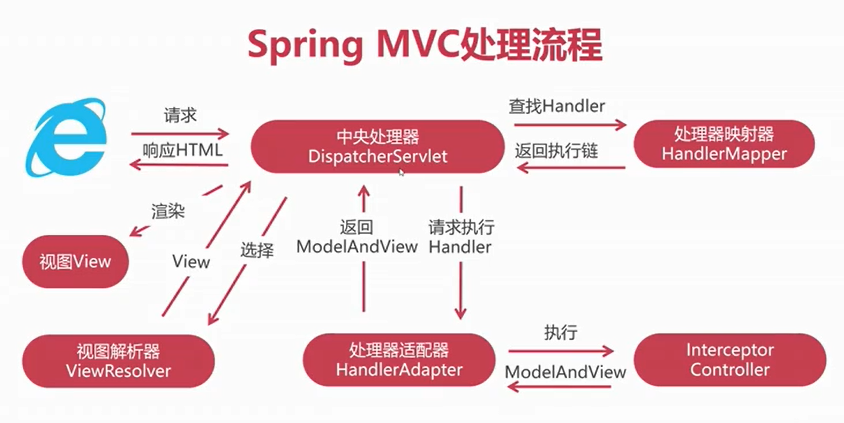
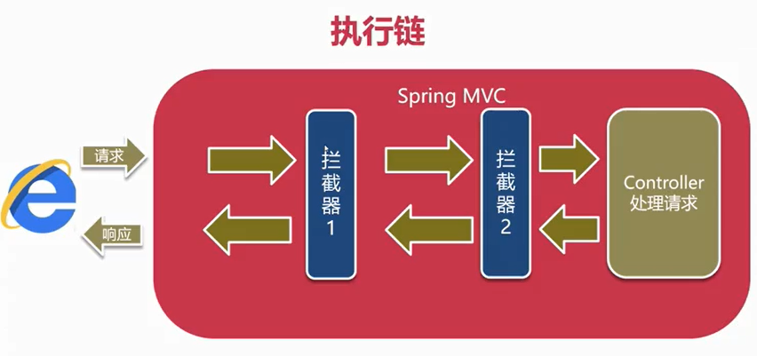

## spring MVC

### 1、Spring MVC入门

#### 1.1、介绍

##### 1.1.1、MVC

MVC是一种架构模式。

MVC三个字母分别代表 Module（bean，dao）, View（jsp）, Controller（servlet）。module 就是从数据库的返回结果实体化的实体类对象，view 是前端代码，是展示给用户的视图，controller 是控制不同的数据显示在不同的视图上。

MVC 模式结合了 Servlet 和 JSP 的优点，既方便对数据进行操作，也方便编写前端代码。

##### 1.1.2、Spring MVC

-   Spring MVC是一种轻量级的MVC Web框架。

-   核心是开发Controller，处理请求，返回响应
-   基于Spring IoC容器。

#### 1.2、环境配置

#####  1.2.1、web项目配置

###### 1、首先Maven新建项目

###### 2、设置为web项目

1.  file -> project settings -> facets-> + -> web -> OK
2.  修改web.xml保存目录 `src/main/webapp/WEB-INF/web.xml`
3.  修改前端页面保存目录 `src/main/webapp`
4.  设置根路径 `/`

###### 3、设置Artifacts

exploded：直接运行目录

archive：打成war包运行

###### 4、配置运行环境

先配置模板 （templates）

Add configuration -> Templates -> Tomcat Server(local) -> 配置tomcat路径 

然后添加运行环境

Add configuration -> + -> Tomcat Server + Deployment -> +

修改更新项目不重启

##### 1.2.2、依赖配置

1 、导入Maven依赖

>   新版本会导致json序列化返回响应失败，不要使用 5.3.9

```xml
    <!-- 阿里镜像 -->
<repositories>
    <repository>
        <id>aliyun</id>
        <name>aliyun</name>
        <url>https://maven.aliyun.com/repository/public</url>
    </repository>
</repositories>

<dependencies>
    <dependency>
        <groupId>org.springframework</groupId>
        <artifactId>spring-webmvc</artifactId>
        <version>5.2.6.RELEASE</version>
    </dependency>
</dependencies>
```

2、web.xml配置

```xml
<?xml version="1.0" encoding="UTF-8"?>
<web-app xmlns="http://xmlns.jcp.org/xml/ns/javaee"
         xmlns:xsi="http://www.w3.org/2001/XMLSchema-instance"
         xsi:schemaLocation="http://xmlns.jcp.org/xml/ns/javaee http://xmlns.jcp.org/xml/ns/javaee/web-app_4_0.xsd"
         version="4.0">
    
    <servlet>
        <servlet-name>springmvc</servlet-name>
        <!-- 一个过滤器，对符合条件的请求都使用这个类处理 -->
        <servlet-class>org.springframework.web.servlet.DispatcherServlet</servlet-class>

        <!-- applicationContext.xml 位置，初始化IoC容器 -->
        <init-param>
            <param-name>contextConfigLocation</param-name>
            <param-value>classpath:applicationContext.xml</param-value>
        </init-param>

        <!-- 在服务启动时就加载IoC容器 -->
        <load-on-startup>0</load-on-startup>
    </servlet>
    <servlet-mapping>
        <servlet-name>springmvc</servlet-name>
        <!-- 对所有请求使用过滤器 -->
        <url-pattern>/</url-pattern>
    </servlet-mapping>
</web-app>
```

3、applicationContext.xml

```xml
<beans xmlns="http://www.springframework.org/schema/beans"
       xmlns:context="http://www.springframework.org/schema/context"
       xmlns:mvc="http://www.springframework.org/schema/mvc"
       xmlns:xsi="http://www.w3.org/2001/XMLSchema-instance"
       xsi:schemaLocation="
        http://www.springframework.org/schema/beans
        http://www.springframework.org/schema/beans/spring-beans-3.0.xsd
        http://www.springframework.org/schema/context
        http://www.springframework.org/schema/context/spring-context-3.0.xsd
        http://www.springframework.org/schema/mvc
        http://www.springframework.org/schema/mvc/spring-mvc-3.0.xsd">

    <!-- 使用注解开发controller，自动扫描带有注解的bean -->
    <!--
        @Repository
        @Service
        @Controller
        @Component
    -->
    <context:component-scan base-package="com.demo.controller" />

    <!-- 使用注解开发MVC -->
    <mvc:annotation-driven />

    <!-- 过滤静态资源，提高运行效率 -->
    <mvc:default-servlet-handler/>

</beans>
```

##### 1.2.3、简单请求响应

```java
/** 初始化IoC容器注解 */
@Controller
public class TestController {
    /** 请求地址映射，用此方法处理该请求 */
    @GetMapping("/test")
    /** 返回到页面Body中 */
    @ResponseBody
    public String test() {
        return "Success";
    }
}
```

#### 1.3、处理请求

##### 1.3.1、URL Mapping

###### 1、get

@GetMapping 处理get请求

###### 2、post

@PostMapping：处理post请求，如果使用get请求，则会报错 405

###### 3、RequestMapping

@RequestMapping：处理get和post请求

1.  如果写在类上面，则访问这个类每个请求都要加上这个前缀。例如

类上写@RequestMapping(“/um”)，方法上写@GetMapping(“/g”)，则访问请求应该是 /um/g

2.  如果写在方法上，可以处理get和post请求
3.  如果要区分请求方法，可以使用 @RequestMapping(value=“/g”, method=RequestMethod.GET)

##### 1.3.2、实体对象请求参数

###### 1、方法参数接受数据

保证html表单的name属性名和参数名相同。前端发送的请求可以自动进行类型转换。

```java
/** 初始化IoC容器注解 */
@Controller
@RequestMapping("/um")
public class TestController {
    /** 请求地址映射，用此方法处理该请求 */
    @PostMapping("/p")
    /** 返回到页面Body中 */
    @ResponseBody
    public String post(String username, String password) {
        System.out.println(username + "->" + password);
        return "登录成功";
    }
    /*---------------------------*/
    @getMapping("/g")
    @ResponseBody
    // 对应参数名，@RequestParam
    public String get(@RequestParam("manager_name") String managerName) {
        System.out.println(managerName);
        return "get";
    }
}
```

###### 2、实体类

实体类的属性必须和表单name属性名相同。

```java
    @PostMapping("/p1")
    @ResponseBody
    public String postMapping(User user) {
        System.out.println(user.getUsername() + "->" + user.getPassword());
        return "登录成功";
    }
```

>   如果同时把User和String username作为参数，则都会传入参数。

##### 1.3.3、表单复合数据

###### 1、uri相对路径，绝对路径

在url表单请求中书写相对路径，是相对当前地址的

###### 2、使用数组接收

```java
    @PostMapping("/apply")
    @ResponseBody
    public String apply(String name, Integer[] purpose) {
        System.out.println(name);
        for(Integer p:purpose) {
            System.out.println(purpose);
        }
        return "提交成功";
    }
```

为接收值设置默认值。

```java
    @PostMapping("/apply")
    @ResponseBody
    public String apply(@RequestParam(value = "n", defaultValue = "ANON")String name, Integer[] purpose) {
        System.out.println(name);
        for(Integer p:purpose) {
            System.out.println(purpose);
        }
        return "提交成功";
    }
```

>   ANON 是空的意思

###### 3、使用集合接收

必须使用 @RequestParam

```java
    @PostMapping("/apply")
    @ResponseBody
    public String apply(String name,@RequestParam List<Integer> purpose) {
        System.out.println(name);
        for(Integer p:purpose) {
            System.out.println(purpose);
        }
        return "提交成功";
    }
```

>   使用Map接收数据的缺陷：
>
>   对于列表（符合）的数据，只会存储第一项

###### 4、关联对象赋值

对于关联对象，使用 ==对象.属性== 对name命名。

```html
<form action="./apply" method="post">
    <input name="user.name" />
</form>
```

###### 5、日期类型转换

1、直接转换

直接使用Date类型接收会发生类型转换异常，需要在==参数前==添加格式注解。

@DateTimeFormat(pattern = “yyyy-MM-dd”)

如果在对象中引用日期对象，同样需要在bean类中添加注解。

2、使用日期转换类

```java
// 实现Converter接口
public class MyDateConverter implements Converter<String, Date> {
    // 必须实现convert方法
    public Date convert(String s) {
        SimpleDateFormat sdf = new SimpleDateFormat("yyyy-MM-dd");
        try {
            Date d = sdf.parse(s);
            return d;
        } catch(ParseException e) {
            return null;
        }
    }
}
```

除此之外，还需要在 applicationContext.xml 中配置。

```xml
<!--  -->
<context:annotation-driven conversion-service="conversionService"/>

<!-- 启用转换服务 -->
<bean id="convertService" class="org.springframework.format.support.FormattingConversionServiceFactoryBean">
    <property name="converters">
        <set>
            <bean class="com.demo.convert.MyDateConverter" />
        </set>
    </property>
</bean>
```

如果两者都配置了，就以小范围的为准，即注解。

如果有多种标准，（在类型转换类中）使用判断语句对输入的字符串进行判断，然后确定使用那种格式。

##### 1.3.4、编码问题

Tomcat8.0之前默认字符集ISO-8859-1，不支持中文，解决办法就是转换为UTF-8

###### 1、get请求编码

修改tomcat默认配置，server.xml，添加<Connector> 标签属性 `URIEncoding="UTF-8"`

>   tomcat 8.0之后，默认字符编码是UTF-8，所以不添加也可以。

###### 2、post请求编码

配置过滤器，对所有的请求进行重新编码。

web.xml

```xml
<!-- 使用spring CharacterEncodingFilter 类对字符处理 -->
<filter>
    <filter-name>characterEncodingFilter</filter-name>
    <filter-class>org.springframework.web.filter.CharacterEncodingFilter</filter-class>
    <init-param>
        <param-name>encoding</param-name>
        <param-value>UTF-8</param-value>
    </init-param>
</filter>
<filter-mapping>
    <filter-name>characterEncodingFilter</filter-name>
    <!-- 对所有请求处理 -->
    <url-pattern>/*</url-pattern>
</filter-mapping>
```

###### 3、响应编码

修改applicationContext.xml

```xml
<mvc:annotation-driven conversion-service="convertService" >
    <mvc:message-converters>
        <bean class="org.springframework.http.converter.StringHttpMessageConverter">
            <property name="supportedMediaTypes">
                <list>
                    <!-- 实质是调用 response.setContentType("text/html;charset=utf-8") -->
                    <value>text/html;charset=utf-8</value>
                </list>
            </property>
        </bean>
    </mvc:message-converters>
</mvc:annotation-driven>
```

##### 1.3.5、响应结果

###### 1、ResponseBody

ResponseBody不涉及视图，编码受StringHttpMessageConverter影响。

###### 2、ModelAndView

```java
    /**
     * 响应视图绑定数据
     * @param userId 请求参数
     * @return 返回模型视图
     */
    @GetMapping("/view")
    public ModelAndView showView(Integer userId) {
        ModelAndView mav = new ModelAndView("/view.jsp");
        User user;
        if (userId == 1) {
            user = new User("tom", "123");
        } else if(userId == 2) {
            user = new User("jerry", "password");
        } else{
            user = new User("hello", "word");
        }
        mav.addObject("u", user);
        return mav;
    }
```

##### 1.3.6、ModelAndView

mav.addObject()

-   默认属性放在请求中
-   默认使用请求转发（forward）
-   重定向`new ModelAndView(“redirect:/index.jsp”)` 重定向是另一个请求。

new ModelAndView(“redirect:/index.jsp”)的另一种写法

```java
ModelAndView mav = new ModelAndView();
mav.setViewName("redirect:/view.jsp");
```

ModelMap

```java
@GetMapping("/view")
public String showView1(Integer userId, ModelMap modelMap) {
    // 视图
    String view = "/view.jsp";
    User user;
    if (userId == 1) {
        user = new User("tom", "123");
    } else if(userId == 2) {
        user = new User("jerry", "password");
    } else{
        user = new User("hello", "word");
    }
    // 绑定数据
    modelMap.addAttribute("u", user);
    return view;
}
```

>   如果添加@ResponseBody，则返回的是文件路径字符串

##### 1.3.7、Freemarker

启用Freemarker模板引擎

导入依赖

```xml
<!-- https://mvnrepository.com/artifact/org.freemarker/freemarker -->
<dependency>
    <groupId>org.freemarker</groupId>
    <artifactId>freemarker</artifactId>
    <version>2.3.31</version>
</dependency>
<dependency>
    <groupId>org.springframework</groupId>
    <artifactId>spring-context-support</artifactId>
    <version>5.2.6.RELEASE</version>
</dependency>
```

配置

applicationContext.xml

```xml
<bean id="ViewResolver" class="org.springframework.web.servlet.view.freemarker.FreeMarkerViewResolver">
    <property name="contentType" value="text/html;charset=utf-8"></property>
    <property name="suffix" value=".ftl"></property>
</bean>

<bean id="freemarkerConfig" class="org.springframework.web.servlet.view.freemarker.FreeMarkerConfigurer">
    <property name="templateLoaderPath" value="/WEB-INF/ftl"></property>
    <property name="freemarkerSettings">
        <props>
            <!-- 产生结果的时候使用的字符集 -->
            <prop key="defaultEncoding">UTF-8</prop>
        </props>
    </property>
</bean>
```

添加FreemarkerController类

```java
@Controller
@RequestMapping("/fm")
public class FreemarkerController {
    @GetMapping("/test")
    public ModelAndView testFreemarker() {
        // 这里的 / 不是指网页根路径，而是设置的ftl的根目录，访问的是test.ftl
        ModelAndView mav = new ModelAndView("/test");
        User user = new User();
        user.setUsername("tom");
        mav.addObject("u", user);
        return mav;
    }
}
```

添加test.ftl文件

```tex
<h1>${u.username}</h1>
```

添加依赖到lib（Edit Configuration）

### 2、RESTful风格开发

以往的MVC开发模式是使用控制器将数据和视图绑定，返回给前端的是html，这种模式要求前端必须支持浏览器才能正常使用。现在网络设备多元化，有各种手机应用和小程序，这种模式已经不再适合了。

#### 2.1、介绍

###### 1、REST

REST（理念）：表现层状态转换

RESTful（开发规则）：只返回数据，不包含数据展现的东西。如何展现数据由客户端负责。

前后端只需要约定url和数据格式即可，这种模式叫做前后端分离。

###### 2、开发规范

-   URL作为用户交互入口
-   明确的语义规范（GET | POST | PUT | DELETE）
-   只返回数据（JSON | XML）

###### 3、命名要求

1.  必须有语义
2.  必须使用名词
3.  扁平化，不超两级
4.  区分单复数

正确示范：

`GET /articles?au=1`

#### 2.2、第一个REST应用

##### 2.2.1、返回数据

新建项目和上面的MVC一样，唯一的不同是返回数据的格式。

```java
@Controller
@RequestMapping("/restful")
public class TestRestful {
    @GetMapping("/message")
    @ResponseBody
    public String doGetRequest() {
        return "{\"message\":\"成功响应\"}";
    }
}
```

##### 2.2.2、Ajax请求响应

###### 1、发送Ajax请求

```html
<!DOCTYPE html>
<html lang="en">
<head>
    <meta charset="UTF-8">
    <title>restful</title>
    <script src="./js/jquery-3.6.0.js"></script>
    <script>
        $(function() {
            $("#inBtn").click(function() {
                $.ajax({
                    url: "/restful/message",
                    type: "get",
                    dataType: "json",
                    success:function (json) {
                        $("#messageTitle").text(json.message);
                    }
                })
            })
        })
    </script>
</head>
<body>
    <input id="inBtn" type="submit">
    <h3 id="messageTitle"></h3>
</body>
</html>
```

###### 2、处理乱码

```xml
<!-- applicationContext.xml -->
<!-- 处理json数据乱码问题 -->
<value>application/json;charset=utf-8</value>
```

>   请求方式不同可以有相同的请求url

#### 2.3、注解与路径变量

###### 1、RestController

在类上添加@RestController就可以不用在方法上写@ResponseBody

###### 2、路径变量

```java
// 可以处理 /message/100 类似的请求
@PostMapping("/message/{rid}")
public String doPostRequest(@PathVariable("rid") Integer requestId) {
    return "{\"message\":\"post请求\"}";
}
```

#### 2.4、非简单请求

1.  简单请求：GET 、POST
2.  非简单请求：PUT 、DELETE、扩展标准请求

>   区别就是非简单请求在正式请求之前有个预检请求，确认后才是正式请求。

springMVC最初是不支持非简单请求的，经过后来发展，添加了非简单请求功能。

```xml
<!-- web.xml -->
<!-- 对所有请求表单内容过滤，支持非简单请求 -->
<filter>
    <filter-name>formContentFilter</filter-name>
    <filter-class>org.springframework.web.filter.FormContentFilter</filter-class>
</filter>
<filter-mapping>
    <filter-name>formContentFilter</filter-name>
    <url-pattern>/*</url-pattern>
</filter-mapping>
```

#### 2.5、JSON序列化

导入apache jsckson依赖，程序会自动将返回对象转化为字符串。发送到前端后，前端会自动将数据转换为js对象。

1、导入依赖

```xml
<!-- JOSN序列化 -->
<dependency>
    <groupId>com.fasterxml.jackson.core</groupId>
    <artifactId>jackson-core</artifactId>
    <version>2.12.4</version>
    <type>bundle</type>
</dependency>
<dependency>
    <groupId>com.fasterxml.jackson.core</groupId>
    <artifactId>jackson-databind</artifactId>
    <version>2.12.4</version>
    <type>bundle</type>
</dependency>
<dependency>
    <groupId>com.fasterxml.jackson.core</groupId>
    <artifactId>jackson-annotations</artifactId>
    <version>2.12.4</version>
    <type>bundle</type>
</dependency>
```

2、返回对象

```java
@GetMapping("/users")
public List<User> getAllUsers() {
    List list = new ArrayList<User>();
    // TODO 添加对象到list
    return list;
}
```

3、处理时间

如果不对时间进行格式处理，它默认是输出时间戳。指定格式后，它会按照伦敦格林尼治天文台为时区输出时间，所以还要再配置时区。

在声明时间对象的上面添加注解。

```java
@JsonFormat(pattern="yyyy-MM-dd hh:mm:ss", timezone="GMT+8")
private Date birth;
```

#### 2.6、浏览器跨域访问

##### 2.6.1、浏览器同源策略

处于安全考虑，同源策略不允许一个域访问另外一个域的数据，虽然请求能够发送，并且能够获取数据，单数这些数据不会被使用。但是有时候我们需要其他网站的数据为我们的网站服务。

协议、域名、端口只要有一个不同就视为不同源。

只有浏览器有同源策略。

##### 2.6.2、允许的标签

这三项可以访问其他域

1.  img
2.  script
3.  link

##### 2.6.3、CORS跨域访问

-   CORS是一种机制，通知浏览器访问其他域。
-   URL响应头包含Access-Control-*知名请求允许跨域。

###### 1、方法一：

`@CrossOrigin`注解

```java
// 在类上添加注解 允许以下地址向这个Controller发送请求
// * 为所有
@CrossOrigin(origin = {"http://localhost:8080/"}, maxAge = 3600)
```

>   maxAge：存储预检请求，时间为3600秒，在这段时间内就不用发送预检请求，减小了服务器压力。

###### 2、方法二：

`<mvc:cors>`对跨域访问进行全局配置

```xml
<mvc:cors>
    <mvc:mapping path="/restful/**"
                 allowed-origins="url1, url2"
                 max-age="3600"></mvc:mapping>
</mvc:cors>
```

### 3、拦截器（Interceptor）

-   类似过滤器（Filter），对URL请求进行前置/后置过滤。

-   作用相似，实现方式不同
-   底层是==基于AOP==实现

##### 3.1、Interceptor

开发流程：

1、添加依赖

```xml
servlet-api scope:provided

```

2、实现按HandlerInterceptor接口

```java
//
public class MyInterceptor implements HandlerInterceptor {
    /*
    1 preHandle
    2 postHandle
    3 afterCompletion
    */
}
```

3、配置过滤地址

```xml
<mvc:interceptors>
    <mvc:interceptor>
        <mvc:mapping path=""/>
        <bean class="" />
    </mvc:interceptor>
</mvc:interceptors>
```

过滤静态资源

```xml
<!-- 把所有静态资源放入这个目录中，然后排除它 -->
<mvc:exclude-mapping path="/resources" />

<!-- 或者只允许指定uri的请求通过 -->
<mvc:mapping path="/restful" />
```

多个过滤器执行顺序。

前置处理按照配置顺序，后置处理按照相反顺序。

```tex
---->[拦截器1] ------------> [拦截器2] ------> []

<----[拦截器1] <------------ [拦截器2] <------ []
```

##### 3.2、流量拦截器

收集用户的设备信息和访问时间等信息，收集用户的基础信息。

开启日志

1、导入依赖

```xml
<dependency>
    <groupId>ch.qos.logback</groupId>
    <artifactId>logback-classic</artifactId>
    <version>1.2.3</version>
</dependency>
```

2、创建日志配置文件

logback.xml

```xml
<?xml version="1.0" encoding="UTF-8" ?>
<configuration>
    <!-- appender: 追加器，在哪里输出日志 name: 起个名字 class: 类名 -->
    <appender name="console" class="ch.qos.logback.core.ConsoleAppender">
        <!-- 编码 -->
        <encoder>
            <!-- pattern: 日志输出格式 使用%引用变量 -->
            <pattern>
                [%thread] %d{HH:mm:ss.SSS} %-5level %logger{36} - %msg%n
            </pattern>
        </encoder>
    </appender>

    <appender id="accessHistoryLog" class="ch.qos.logback.core.rolling.RollingFileAppender">
        <rollingPolicy class="ch.qos.logback.core.rolling.TimeBasedRollingPolicy">
            <!-- 存储位置 -->
            <fileNamePattern>e:/logs/history-%d.log</fileNamePattern>
        </rollingPolicy>
        <!-- 编码 -->
        <encoder>
            <!-- pattern: 日志输出格式 使用%引用变量 -->
            <pattern>
                [%thread] %d{HH:mm:ss.SSS} %-5level %logger{36} - %msg%n
            </pattern>
        </encoder>
    </appender>
    <!-- 日志输出的最低级别 -->
    <root level="debug">
        <appender-ref ref="console"></appender-ref>
    </root>

    <logger name="com.demo.interceptor.AccessHistoryInterceptor"
        level="INFO" additivity="false">
        <appender-ref ref="accessHistoryLog"/>
    </logger>
</configuration>
```

3、指定使用日志的拦截器

```java
package com.demo.interceptor;

import org.slf4j.Logger;
import org.slf4j.LoggerFactory;
import org.springframework.web.servlet.HandlerInterceptor;
import org.springframework.web.servlet.ModelAndView;

import javax.servlet.http.HttpServletRequest;
import javax.servlet.http.HttpServletResponse;

/**
 * @ClassName: AccessHistoryInterceptor
 * @Description: TODO: add description
 * @Author: zhuaowei
 * @Date: 2021/8/15 11:06
 * @Version: 1.0
 **/
public class AccessHistoryInterceptor implements HandlerInterceptor {
    Logger logger = LoggerFactory.getLogger(AccessHistoryInterceptor.class);

    @Override
    public boolean preHandle(HttpServletRequest request, HttpServletResponse response, Object handler) throws Exception {
        StringBuffer log = new StringBuffer();
        log.append(request.getRemoteAddr());
        log.append("|");
        log.append(request.getRequestURI());
        log.append("|");
        log.append(request.getHeader("user-agent"));
        logger.info(log.toString());
        return true;
    }
}
```

4、添加拦截器

```xml
<!-- applicationContext.xml -->
<mvc:interceptors>
    <mvc:interceptor>
        <mvc:mapping path=""/>
        <bean class="com.demo.interceptor.AccessHistoryInterceptor" />
    </mvc:interceptor>
</mvc:interceptors>
```

4、MVC处理流程





## 2、SSM整合

### 2.1、整合三阶段

#### 2.1.1 、spring spring MVC环境配置

###### 1、spring-webmvc依赖

新建项目，设置web的配置及目录，配置运行环境，添加依赖

1.  spring-webmvc
2.  freemarker
3.  jackson

添加到lib

###### 2、配置DispatcherServlet

配置web.xml初始化配置，加载applicationContext.xml

配置applicationContext.xml，添加schema

###### 3、启用springMVC注解

扫描包下的文件

启用注解

过滤静态资源

###### 4、配置请求响应字符集

配置web.xml，设置请求字符集

配置applicationContext.xml，配置响应编码

###### 5、配置freemarker模板引擎

配置freemarker模板路径

设置freemarker编码

###### 6、配置JSON序列化组件

#### 2.1.2、spring与MyBatis整合配置

1、MyBatis-spring依赖，不需要自己创建类。

```xml
<!-- 整合mybatis  -->
<dependency>
    <groupId>org.springframework</groupId>
    <artifactId>spring-jdbc</artifactId>
    <version>5.2.6.RELEASE</version>
</dependency>
<dependency>
    <groupId>org.mybatis</groupId>
    <artifactId>mybatis</artifactId>
    <version>3.5.7</version>
</dependency>
<!-- mybatis spring 整合包 -->
<dependency>
    <groupId>org.mybatis</groupId>
    <artifactId>mybatis-spring</artifactId>
    <version>2.0.3</version>
</dependency>
<dependency>
    <groupId>mysql</groupId>
    <artifactId>mysql-connector-java</artifactId>
    <version>5.1.34</version>
</dependency>
<!-- 阿里数据库连接池管理包 -->
<dependency>
    <groupId>com.alibaba</groupId>
    <artifactId>druid</artifactId>
    <version>1.2.6</version>
</dependency>
```

2、配置数据源和连接池(applicationContext.xml)

```xml
<!-- jdbc mybatis -->
<!-- remote@hello52D112358 -->
<bean id="dataSource" class="com.alibaba.druid.pool.DruidDataSource">
    <property name="driverClassName" value="com.mysql.jdbc.Driver" />
    <property name="url" value="jdbc:mysql://localhost:3306/bookstore?useSSL=false&amp;useUnicode=true&amp;characterEncoding=UTF-8" />
    <property name="username" value="hello52d" />
    <property name="password" value="remote@hello52D112358" />
    <property name="initialSize" value="5"/>
    <property name="maxActive" value="20"/>
</bean>
```

3、配置SqlSessionFactory(applicationContext.xml)

```xml
<!-- 创建SessionFactory -->
<bean id="sessionFacotry" class="org.mybatis.spring.SqlSessionFactoryBean">
    <!-- 数据源 -->
    <property name="dataSource" ref="dataSource"/>
    <!-- mapper文件位置 -->
    <property name="mapperLocations" value="classpath:mappers/*.xml"/>
    <!-- mybatis配置文件 -->
    <property name="configLocation" value="classpath:mybaits-config.xml"/>
</bean>
```

4、配置Mapper扫描器(applicationContext.xml)

```xml
<!-- mapper扫描器 -->
<bean class="org.mybatis.spring.mapper.MapperScannerConfigurer">
    <property name="basePackage" value="com.zhuaowei.bookstore.mapper"/>
</bean>
```

5、创建mybatis-config.xml文件

```xml
<?xml version="1.0" encoding="UTF-8" ?>
<!DOCTYPE configuration
        PUBLIC "-//mybatis.org//DTD Mapper 3.0//EN"
        "http://mybatis.org/dtd/mybatis-3-config.dtd">

<configuration>
    <!-- 开启驼峰命名转换 -->
    <settings>
        <setting name="mapUnderScoreToCamelCase" value="true"/>
    </settings>

</configuration>
```

#### 2.1.3、整合其他组件

1、单元测试

导入依赖

```xml
<!-- 单元测试依赖 -->
<dependency>
    <groupId>org.springframework</groupId>
    <artifactId>spring-test</artifactId>
    <version>5.2.6.RELEASE</version>
</dependency>
<dependency>
    <groupId>junit</groupId>
    <artifactId>junit</artifactId>
    <version>4.12</version>
</dependency>
```

然后在打开需要测试的类，点菜单栏的 Code -> Generate，选择test，再选中Junit4和需要测试的方法，就会生成测试类。

>   测试的时候，没有用到tocmat，所以tomcat的servlet-api需要额外添加。

```xml
<!-- tomcat servlet，测试用 -->
<dependency>
    <groupId>javax.servlet</groupId>
    <artifactId>javax.servlet-api</artifactId>
    <version>3.1.0</version>
    <!-- 打包时会忽略 -->
    <scope>provided</scope>
</dependency>
```

2、日志

导入依赖

```xml
<!-- 日志 -->
<dependency>
    <groupId>ch.qos.logback</groupId>
    <artifactId>logback-classic</artifactId>
    <version>1.2.3</version>
</dependency>
```

配置日志格式，输出级别

```xml
<?xml version="1.0" encoding="UTF-8" ?>
<configuration>
    <!-- appender: 追加器，在哪里输出日志 name: 起个名字 class: 类名 -->
    <appender name="console" class="ch.qos.logback.core.ConsoleAppender">
        <!-- 编码 -->
        <encoder>
            <!-- pattern: 日志输出格式 使用%引用变量 -->
            <pattern>
                [%thread] %d{HH:mm:ss.SSS} %-5level %logger{36} - %msg%n
            </pattern>
        </encoder>
    </appender>
    <!-- 日志输出的最低级别 -->
    <root level="debug">
        <appender-ref ref="console"></appender-ref>
    </root>
</configuration>
```

3、声明式事务

导入schema

```xml
<?xml version="1.0" encoding="UTF-8" ?>
<beans xmlns="http://www.springframework.org/schema/beans"
       xmlns:context="http://www.springframework.org/schema/context"
       xmlns:aop="http://www.springframework.org/schema/aop"
       xmlns:mvc="http://www.springframework.org/schema/mvc"
       xmlns:tx="http://www.springframework.org/schema/tx"
       xmlns:xsi="http://www.w3.org/2001/XMLSchema-instance"
       xsi:schemaLocation="
        http://www.springframework.org/schema/beans
        http://www.springframework.org/schema/beans/spring-beans-3.0.xsd
        http://www.springframework.org/schema/context
        http://www.springframework.org/schema/context/spring-context-3.0.xsd
        http://www.springframework.org/schema/aop
        http://www.springframework.org/schema/aop/spring-aop.xsd
        http://www.springframework.org/schema/mvc
        http://www.springframework.org/schema/mvc/spring-mvc-3.0.xsd
        http://www.springframework.org/schema/tx
        http://www.springframework.org/schema/tx/spring-tx.xsd">

</beans>
```

配置事务管理器

```xml
<!-- 声明式事务配置 -->
<bean id="transactionManager" class="org.springframework.jdbc.datasource.DataSourceTransactionManager">
    <property name="dataSource" ref="dataSource"/>
</bean>
<tx:annotation-driven transaction-manager="transactionManager"/>
```

### 2.2、MyBatis-Plus

#### 2.2.1、配置

1、导入依赖

```xml
<!-- MyBatis-Plus -->
<dependency>
    <groupId>com.baomidou</groupId>
    <artifactId>mybatis-plus</artifactId>
    <version>3.4.3</version>
</dependency>
```

2、修改sqlSessionFactory

```xml
<!-- mybatis-plus 配置 -->
<bean id="sqlSessionFactory" class="com.baomidou.mybatisplus.extension.spring.MybatisSqlSessionFactoryBean">
    <!-- 数据源 -->
    <property name="dataSource" ref="dataSource"/>
    <!-- mapper文件位置 -->
    <property name="mapperLocations" value="classpath:mappers/*.xml"/>
    <!-- mybatis配置文件 -->
    <property name="configLocation" value="classpath:mybatis-config.xml"/>
</bean>
```

3、添加mybatis plugin

```xml
<plugins>
    <plugin interceptor="com.baomidou.mybatisplus.extension.plugins.PaginationInterceptor"></plugin>
</plugins>
```

#### 2.2.2、使用

1、创建实体类，添加注解

```java
package com.zhuaowei.bookstore.bean;

import com.baomidou.mybatisplus.annotation.TableField;
import com.baomidou.mybatisplus.annotation.TableId;
import com.baomidou.mybatisplus.annotation.TableName;

/**
 * @ClassName: Test
 * @Description: 实体类，应用mybatis-plus，
 * @Author: zhuaowei
 * @Date: 2021/8/16 20:18
 * @Version: 1.0
 **/
@TableName("test")  // 对应的表名
public class Test {
    /**
     * 如果属性名和数据表的字段名符合转换规则，可以不用写 @TableField
     */
    @TableId(type = IdType.AUTO)            // 主键
    @TableField("id")   // 对应的字段名
    private Integer id;

    @TableField("content")
    private String content;

    public Test() {
    }

    public Test(Integer id, String content) {
        this.id = id;
        this.content = content;
    }

    public Integer getId() {
        return id;
    }

    public void setId(Integer id) {
        this.id = id;
    }

    public String getContent() {
        return content;
    }

    public void setContent(String content) {
        this.content = content;
    }
}
```

2、创建对应的Mapper，继承BaseMapper

```java
package com.zhuaowei.bookstore.mapper;

import com.baomidou.mybatisplus.core.mapper.BaseMapper;
import com.zhuaowei.bookstore.bean.Test;

public interface TestMapper extends BaseMapper<Test> {
}
```

3、创建服务接口，然后实现接口，实现分页查询

```java
@Service("bookService")
@Transactional(propagation = Propagation.NOT_SUPPORTED, readOnly = true)
public class BookServiceImpl implements BookService {
    @Resource
    private BookMapper bookMapper;

    @Override
    public IPage<Book> paging(Integer page, Integer count) {
        // 查询的分页
        Page<Book> p = new Page<Book>(page, count);
        // 不写默认查询全部
        QueryWrapper<Book> queryWrapper = new QueryWrapper<Book>();
        Page<Book> pageObject = bookMapper.selectPage(p, queryWrapper);
        return pageObject;
    }
}
```

#### 2.2.3、关联查询

在一个表中通过id查询其他表的数据，需要在对应的bean类中添加响应的属性，并使用注解标记，告诉程序应该怎么处理。

```java
@TableField(exist = false) // 表中没有的字段，通常是另一个表对应的bean类
private Book book;

// 再加上对应的getter和setter，查询出结果后，使用setter方法赋值
```

## 3、kaptcha 

kaptcha是谷歌公司开发的验证码组件，能够随机生成验证码。验证码可以阻挡大部分机器。

首先，导入依赖，然后把包发布到web项目中。

```xml
<!-- kaptcha 谷歌验证码组件 -->
<dependency>
    <groupId>com.github.penggle</groupId>
    <artifactId>kaptcha</artifactId>
    <version>2.3.2</version>
</dependency>
```

然后添加配置

```xml
<!-- 配置 kaptcha -->
<bean id="kaptchaProducer" class="com.google.code.kaptcha.impl.DefaultKaptcha">
    <property name="config">
        <bean class="com.google.code.kaptcha.util.Config">
            <constructor-arg>
                <props>
                    <!-- 验证码边框：无 -->
                    <prop key="kaptcha.border">no</prop>
                    <!-- 验证码图片宽度：120像素 -->
                    <prop key="kaptcha.image.width">120</prop>
                    <!-- 验证码字体颜色：蓝 -->
                    <prop key="kaptcha.textproducer.font.color">blue</prop>
                    <!-- 验证码每个字的最大字号 -->
                    <prop key="kaptcha.textproducer.font.size">40</prop>
                    <!-- 验证码字符个数 -->
                    <prop key="kaptcha.textproducer.char.length">4</prop>
                </props>
            </constructor-arg>
        </bean>
    </property>
</bean>
```

完成KaptchaController类

```java
@Controller
public class KaptchaController  {
    @Resource
    private Producer kaptchaProducer;

    /** 需要传入原声的http请求响应对象 */
    @GetMapping("/verify_code")
    public void createVerifyCode(HttpServletRequest request, HttpServletResponse response) throws IOException {
        // 响应立即过期
        response.setDateHeader("Expires", 0);
        // 不缓存任何图片信息
        response.setHeader("Cache-Control", "no-store,no-cache, must-revalidate");
        response.setHeader("Cache-Control", "post-check=0,pre-check=0");
        response.setHeader("Pragma", "no-cache");
        /* 返回数据类型 */
        response.setContentType("image/png");
        // 生成验证码的文本
        String verifyCode = kaptchaProducer.createText();
        // 将验证码保存到请求中
        request.getSession().setAttribute("kaptchaVerifyCode", verifyCode);
        System.out.println(request.getSession().getAttribute("kaptchaVerifyCode"));

        // 创建验证码图片
        BufferedImage image = kaptchaProducer.createImage(verifyCode);
        // 获取图片的输出流
        ServletOutputStream out = response.getOutputStream();
        ImageIO.write(image, "png", out);
        // 立即发送
        out.flush();
        out.close();
    }
}
```

这样就可以通过发送请求获取验证码了。在验证码的img标签的src属性中写上 `/verify_code`就可以自动获取验证码。

如果要实现点击刷新的功能，需要给img标签添加函数

```javascript
function reloadVerifyCode() {
    // 需要重新设置属性，并且加上一个参数，当前时间戳timestamp
    #("imgVerifyCode").attr("src", "/verify_code?ts=" + new Date());
}
#("imgVerifyCode").click(function() {
    reloadVerifyCode();
});
```

## spring Boot

简化spring开发环境搭建，快速开发。

核心特点

-   开箱即用
-   约定大于配置

