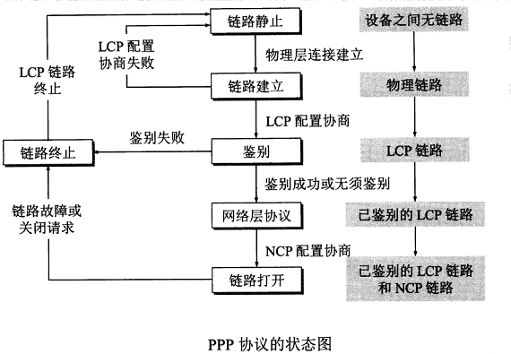

# 计算机网络（第 7 版）谢希仁 编著

## 第一章、概述

## 第二章、物理层

### 2.1、物理层的基本概念

传输媒体接口的一些特性：

1.   **机械特性**：指明接口所用**接线器的形状、尺寸、引脚数目和排列、固定和锁定装置等**。
2.   **电气特性**：指明在接口电缆的各条线上出现的**电压范围**。
3.   **功能特性**：指明某条线上出现的某一电平的电压的意义。
4.   **过程特性**：指明对于不同功能的各种可能事件的出现顺序。

计算机内部是并行传输、在通信线路上是串行传输，所以物理层还要完成传输方式的转换。

### 2.2、数据通信基本常识

#### 2.2.1、数据通信系统的模型

一个数据通信系统合一划分为三大部分：源系统（或者发送端、发送方）、传输系统（或传输网络）和目的系统（或接收端、接收方）。

-   **源点（source，源站、信源）**：源点设备产生要传输的数据，计算机产生的数字比特流。
-   **发送器**：通常源点产生的数字比特流需要通过发送器编码后才能够在传输系统中传输。典型的发送器就是调制器。
-   **接收器**：将传输系统传统过来的信号转换成能够被目的设备处理的信息。典型的接收器就是解调器。
-   **终点（destination，目的站、信宿）**：终点设备接受从接收器传输过来的数字比特流，然后把信息输出。

**消息（message）**：文字、语音、图像、视频等。通信的目的是传送消息。

**数据（data）**：是运送消息的实体。数据是使用特定方式标识的信息，通常是有意义的符号序列。

信号的分类：

1.   **模拟信号（连续信号）**：代表消息的参数的取值是连续的。
2.   **数字信号（离散信号）**：代表消息的参数的取值是离散的。

**码元**：在使用时间域（或者简称为时域）的波性标识数字信号时，代表不同离散数值的基本波性就成为码元。

二进制时只有两种码元：一种代表0，另一种代表1。

#### 2.2.2、有关通信的基本概念

通信的基本方式：

1.   **单向通信（单工通信）**：只有一个方向的通信。
2.   **双向交替通信（半双工通信）**：同时只能有一个方向的通信，**不能同时**发送或者接收。
3.   **双向同时通信（双全工通信）**：双方可以同时发送和接受信息。

>   单工通信只使用一条信道，而半双工和双全工需要两条信道。双全工效率最高。

来自信源的基带信号通常包含较多低频成分，甚至有直流成分，而信道并不能传输这些，所以必须对基带信号进行调制。

**调制（Modulation）**：将数字信号调制成模拟信号。

**基带调制**：仅对基带信号的波性进行变换。

**带通调制**：使用**载波（carrier）**，把基带信号的频率范围搬移到较高的频段，并转换成模拟信号。

常用编码方式：

1.   **不归零制**：正电平代表1，负电平代表0。
2.   **归零制**：正脉冲代表1，负脉冲代表0。
3.   **曼彻斯特编码**：位周期中心向上跳变代表0，位周期中心向下跳变代表1。
4.   **差分曼彻斯特编码**：位开始边界有跳变代表1，位开始边界没有跳变代表0。

基本带通调制方法：

1.   **调幅（AM, Amplitude Modulation）**：载波的振幅随基带数字信号而变化。
2.   **调频（FM, Frequency Modulation）**：载波的频率随基带数字信号而变化。
3.   **调相（PM, Phase Modulate）**：载波的初识相位随基带数字信号而变化。

**正交振幅调制（QAM，Quadrature Amplitude Modulation）**：混合调制方法，提高传输速率。

#### 2.2.3、信道的极限容量

虽然信号在信道中会失真，但是只要接收端能够识别出原来的信号，那么这种失真就对通信质量无影响。

**码元传输的速率越高，或者信号传输的距离越远，或者噪声干扰越大，或者传输媒体质量越差，在接收端的波性失真就越严重。**

1.   **奈氏准则**：在任何信道中，码元传输的速率是有上限的，传输速率超过此上限，就会出现严重的码间串扰的问题，使接收端对码元的判决成为不可能。
2.   **信噪比**：信号的平均功率和噪声的平均功率之比。记为 `S/N`，单位分贝（dB）。

$$
信噪比(dB) = 10 log_{10}{(S/N)} (dB)
$$

3.   **香农公式**：信道的带宽或信道中的信噪比越大，信息的极限传输速率就越高。

$$
C = W log_{2}{(1 + S/N)}
$$

>   C：信道的极限信息传输速率。

为了提高信息的传输速率，用编码的方法让**每一个码元携带更多比特的信息量。**

### 2.3、物理层下面的传输媒体

#### 2.3.1、导引型传输媒体

##### 1、**双绞线**

**定义**：也叫双纽线，最古老但又最常见的传输媒体。就是两根**互相绝缘，按规则绞合**的线。绞合可以减少相邻导线的电磁干扰。

为了提高抗干扰能力，在双绞线的外面再套一层金属丝编织成的屏蔽层，这就是**屏蔽双绞线（STP）**。

##### 2、**同轴电缆**

**定义**：由内导体铜质芯线（单股实心线或多股绞合线）、绝缘层、网状编织的外导体屏蔽层一级保护塑料外层锁组成。由于外导体屏蔽层的作用，具有更好地**抗干扰特性**，广泛用于较高速率的传输。

##### 3、**光缆**

**定义**：由非常透明的石英玻璃拉成细丝，主要由纤芯和包层构成双层通信圆柱体。

发射端使用发光二极管发出光脉冲，接收端用光电二极管做成检测器，还原电脉冲。

可以存在多条不同角度入射的光线在一条光纤中传输，这种就叫作**多模光纤**。如果只有细到只有一个光波传输，而不会产生反射，就叫作**单模光纤**。

**优点**：

1.   通信容量大。
2.   传输损耗小，适合远距离传输。
3.   抗雷电和电磁干扰性能好。
4.   无串音干扰，保密性好。
5.   体积小，重量轻。

#### 2.3.2、非导引型传输媒体

无线传输可以使用的频段很广，根据频率可以将通信进行划分：

低频LF：（30kHz - 300kHz，波长：1km - 10 km）

中频MF：（300kHz - 3MHz）

高频HF：（30MHz - 30MHz）

甚高频（V，Very）：（30MHz - 300MHz）

特高频（U，Ultra）：（300MHz - 3GHz）

超高频（S，Super）：（3GHz - 30GHz）

极高频（E，Extremely）：（30GHz - 300GHz）

### 2.4、信道复用技术

#### 2.4.1、频分复用、时分复用和统计时分复用

##### 1、频分复用：

用户在分配到一定的频带后，在通信过程中自始至终都占用这个频带。**频分复用的所有用户在同样的时间占用不同的带宽资源。**

##### 2、时分复用：

将时间划分为一段段等长的时分复用帧（TDM帧）每个用户在每个TDM帧中占用固定序号的时隙。

**时分复用的所有用户在不同的时间占用同样的带宽资源。**

```
|  A  |  B  |  C  |  D  |  A  |  B  |  C  |  D  |
|                         |                        |
| <---- TDM 帧 ----->  |<---- TDM 帧 ----->  |
```

在通信时，**复用器（multiplexer）**和**分用器（demultiplexer）**成对使用。

##### 3、统计时分复用

**STDM（Statistic TDM）**是一种改进的时分复用，它能明显提高信道的利用率。集中器（concentrator）常使用这种统计时分复用。

使用**STDM帧**来发送数据，每个帧时隙数小于用户数，每个用户往集中器中发送数据，STDM帧中放满了数据就发送出去。

**集中器能正常工作的前提时所有用户都是间歇地工作。**

#### 2.4.2、波分复用

其实就是光的频分复用。

#### 2.4.3、码分复用

CDM（Code Division Multiplexing），常用的时码分多址（CDMA，Code Division Multiple Access ）。**各用户使用经过特殊挑选的不同码型，因此各用户之间不会造成干扰。**

每一个比特时间划分为 m 个短的间隔，称为**码片（chip）**。使用CDMA的每个站都使用一个**唯一的 m bit 的码片序列（chip sequence），而且相互之间需要正交**，（相当于手机号）。如果一个站要发送 1，则发送它自己的**码片序列**，如果要发送 0，则发送它自己的**码片序列的反码**。

### 2.5、数字传输系统

早期数字传输系统存在的缺点：

1.   速率标准不统一
2.   不是同步传输（时钟频率有偏差）

为了解决上述问题，美国推出了一个数字传输标准，叫作**同步光纤网（SONET）**。

### 2.6、宽带接入技术

用户要连接到互联网，必须先连接到某个ISP。

#### 2.6.1、ADSL技术

非对称数字用户线ADSL（Asymmetric Digital Subscriber Line）技术是数字技术对现有的模拟电话用户线进行改造。

非对称指的时上传速度和下载速度不一样，下行速度远远大于上行速度。

#### 2.6.2、光纤同轴混合网（HFC网）

#### 2.6.3、FTTx技术

## 第三章、数据链路层

数据链路层主要有两种通信方式：

**点对点信道**：一对一，点对点通信方式。

**广播信道**：一对多的广播通信方式。

### 3.1、使用点对点信道的数据链路层

#### 3.1.1、数据链路和帧

**链路（link，物理链路）**：从一个结点到相邻结点的一段物理通路（有线或无线），而中间没有任何其他交换结点。

**数据链路（data link， 逻辑链路）**：除了必须有一条物理线路外，还必须有一些必要的通信协议来控制这些数据的传输。实现协议的软硬件加到链路上，就构成了数据链路。

通常用**网络适配器**（既有软件，也有硬件）来实现这些协议，包括数据链路层和物理层的功能。

**规程（procedure）**：早期通信协议的叫法，在数据链路层，这俩是同义词。

**帧**：点对点信道的数据链路层的协议数据单元。

**IP数据报（数据报、分组、包）**：网络层的协议数据单元。

通信步骤：

1.   A 的数据链路层将网络层交下来的 IP 数据报**添加首部和尾部封装程帧**。
2.   结点 A 把封装好的帧发送给结点 B 的数据链路层。
3.   若 B 的数据链路层收到的帧**无差错**，从帧中提取出 IP 数据报交给网络层；否则丢弃这个帧。

#### 3.1.2、三个基本问题

三个基本问题：**封装成帧**、**透明传输**和**差错检测**。

**1、封装成帧**

在一段数据的前后**分别添加首部和尾部**。在传输比特流时，数据链路层就能根据首部和尾部的标记识别出报文的开始和结束，这也是首部和尾部最重要的作用——**帧定界**。

**MTU（Maximum Transfer Unit）**：**最大传输单元**，数据链路层规定了传送的帧的数据部分长度上限。

当数据是由可打印的 ASCII 码组成的文本文件是，帧定界可以使用特殊的帧定界符。

>   ASCII 码由 7 bit 表示，一共由 128 个字符，其中包括 95 个可打印字符，33 个不可打印字符。

**控制字符 SOH（Start Of Header， 十六进制是 0X01）**放在一帧的最前面，表示帧的首部开始。另一个**控制字符EOT（End Of Transmission，十六进制是 0X04）**表示帧的结束。

**2、透明传输**

因为帧的开始和结束标记使用的专门的字符，所以在报文中间任何 8 bit的组合都**不允许出现和开始结束标记一样的编码**。

如果传输的内容是由键盘输入的，那么永远都不会出现开始结束标记，永远可以放在真中传输，这样的传输就是**透明传输**，也叫**无差错传输（原样传输）**。

如果传输的是二进制编码或者图像，那么就有可能出现开始和结束的字符，这样的传输就不是透明传输。

**透明**：表示一个实际存在的事物看起来却好像不存在一样，例如玻璃。在数据链路层透明传输意思就是，无论什么样的数据都能够无差错地原样通过这个数据链路层。

**转义字符**

为了解决报文中可能出现的控制字符，就需要对出现开始结束控制字符进行转义，在SOH和EOT前面插入一个**转义字符 “ESC”（十六进制是0X1B）**。接收端的数据链路层在上交网络层之前将转义字符 ESC 删去。这种方法称为**字节填充（byte stuffing）或字符填充（character stuffing）**。

如果转义字符也出现在数据中，就在转义字符前面再加一个转义字符。接收端收到两个转义字符就删除前面的一个。

**3、差错检测**

**比特差错**：在传输中，0 可能会变成 1，1 也有可能变成0。

**误码率 BER（Bit Error Rate）**：传输错误的比特数占总数的比率。

误码率和信噪比有很大关系，提高信噪比可以降低误码率。

比特差错是无法避免的，目前数据链路层广泛试用了**循环冗余检验 CRC（Cyclic Redundancy Check）**。

**检测原理**：在发送端将要发送的数据分组，每组 k 个比特。假设要发送的数据是M（k bit），就在数据的末尾添加一个 n 位的**冗余码**，所以一共要发送 （k + b）比特。

**计算过程**：首先在数据 M 末尾补上 n 个 0，用二进制的**模 2 运算**进行计算。得到的（k + n）位的数**除以**双方实现商定的长度位 （n + 1）位的除数 P得出的商是 Q，而**余数 R 是 n 位的**。

>   模 2 运算：加法和减法一样，不进位。1111 + 1010 = 0101。

计算出的 余数 R 作为**帧检测序列 FCS（Frame Check Sequence）**，添加到数据的末尾发送出去。FCS 就是冗余码。

**检测方法**：接收端把接受到的每一个帧都除以同样的除数 P（模 2 运算），然后检查得到余数 R。如果传输过程中没有差错，那么经过 CRC 检验后，得到的余数是 0。

如果出现差错，得到的余数还是 0 的**概率是非常非常小的**。

如果接收的帧是有差错的，那么数据链路层就会丢弃这个帧，换句话说，**凡是接收的帧，我们都能以非常接近 1 的概率认为这些帧在传输过程中无差错**。

**可靠传输**：依靠上面的差错检测，并不能做到可靠传输，因为差错并不是只有比特差错一种，还有可能是另一种差错，即**帧丢失、帧重复和帧失序**。

在过去，为了保证数据链路层上交的数据是可靠的，对于发送方发送的数据，数据链路层在 CRC 的基础上，增加了**帧编号、确认和重传机制**。数据链路层的发送方对于发送的每一个帧都**要求接受方在一定时间内给出确认**，否则就认为传输出现了差错，因而进行重传，直到收到确认为止。

现在网络质量大大提高，出现伤处差错的情况很少见，因此互联网采取了区别对待的情况：对于质量良好的网络，不要求数据链路层向上层提供可靠传输的服务，即不使用确认和重传机制，可靠传输由上层协议实现（例如 TCP 协议）；对于质量较差的网络，数据链路层向上提供可靠的传输服务，即使用确认和重传机制。

### 3.2、点对点协议 PPP

**点对点协议 PPP（Point-to-Point Protocol）**：是目前使用最广泛的数据链路层协议。

#### **3.2.1、PPP 协议的特点**

PPP 协议就是用户计算机和 ISP 进行通信时使用的数据链路层协议。

**1、PPP 协议应满足的需求**

1.   **简单**：对数据链路层的帧，不需要纠错，不需要序号，也不需要流量控制。**首要的要求就是”简单“**。
2.   **封装成帧**：必须使用特殊的字符作为**帧定界符**，便于接收端准确判断帧的开始和结束位置。
3.   **透明性**：如果数据中碰巧出现帧定界符的比特组合，就要采取有效的措施解决。
4.   **多种网络协议**：必须在同一物理链路上同时支持多种网络层协议。
5.   **多种类型链路**：必须能在多种类型的链路上运行。
6.   **差错检测（error detection）**：必须能对接收端收到的帧进行检测，并**立即丢弃有差错的帧**。
7.   **检测连接状态**：必须有一种机制能够及时（不超过几分钟）自动检测出链路是否处于正常状态。
8.   **最大传送单元**：必须对每一种点对点的链路**设置最大传送单元 MTU 的默认值**。
9.   **网络层地址协商**：必须提供一种机制使通信的两个网络层的实体能够通过协商或能够配置彼此的网络层地址。
10.   **数据压缩协商**：必须提供一种方法来协商使用数据压缩算法。但并不要求将数据压缩算法进行标准化。

>   在 TCP/IP 协议族中，可靠传输由运输层的 TCP 协议负责，因此 PPP 协议并不需要进行纠错，不需要设置序号，也不需要进行流量控制。
>
>   PPP 协议只支持点对点的链路通信，且只支持双全工通信。

**2、PPP 协议的组成**

1.   一个将 IP 数据报封装到串行链路的方法。
2.   一个用来建立、配置和测试数据链路连接的**链路控制协议 LCP（Link Control Protocol）**。
3.   一套**网络控制协议 NCP（Network Control Protocol）**，其中的每一个协议支持不同的网络层协议，如 IP、OSI 的网络层、DECnet、AppleTalk等。

#### 3.2.2、PPP 协议的帧格式

**1、各字段的意义**

PPP 的帧格式由首部和尾部组成，分别由 4 个字段和 2 个字段。

```
先发送
  | F  |  A | C  |  协议   |    信息部分    |   FCS  | F |
  | 7E | FF | 03 |        |    信息部分    |         | 7E|
  | <------ 首部 ------> | <-- IP 数据报 --> | <-尾部->|
```

**首部**

1.   **F（Flag）**：1 字节，标志字段，开始帧定界符，规定为 0X7E。和结束帧定界符一样，**表示帧的开始或结束**。
2.   **A（Address）**：1 字节，地址字段，规定为 0XFF。
3.   **C（Control）**：1 字节，控制字段，规定为 0X03。**A、C 两个字段实际上并没有携带 PPP 帧任何信息**。
4.   协议：2 字节。如果为 0X0021，信息部分就是 IP 数据报；如果是 0XC021，信息字段就是 PPP 链路控制协议 LCP 的数据；如果是 0X8021 ，就是网络层的控制数据。

**尾部**

1.   FCS：使用 CRC 的帧检验序列 FCS。
2.   F（Flag）：1字节，标志字段，同开始帧定界符。

**信息部分**：长度是可变的，不超过 1500 字节。

**2、字节填充**

当信息字段中出现和标志字段（0X7E）一样的比特组合时，就必须采取一些措施使这种形式上可标志字段一样的比特组合不出现在信息字段中。

当 PPP 使用异步传输时，把转义字符定为 0X7D（01111101），并使用**字节填充**。

1.   `0x7E` -> `0x7D,0x5E`
2.   `0x7D` -> `0x7D,0x5D`
3.   ASCII 码中的控制字符（小于 0x20 的字符），在前面加一个转义字符 0x7D，并改变编码。例如 `0x03` -> `0x7D,0x23`。

由于在发送段进行了字节填充，在链路上传输的字节数就超过了原来的字节数。在接收端收到数据之后，进行与发送端相反的操作，就恢复出了原来的信息。

**3、零比特填充**

PPP 协议在 SONET/SDH 链路时，使用同步传输而不是异步传输，这中情况下使用零比特填充实现透明传输。

>   同步传输：一连串的比特连续传送。
>
>   异步传输：逐个字符地传送。

实现方法

发送端：先扫描整个信息字段，只要发现有 5 个连续 1，就立即填入一个0。

接收端：先找到标志字段 F以确定一个帧的边界，然后扫描其中的比特流，当发现 5 个连续 1 时，就删除后面的一个 0。

#### 3.2.3、PPP 协议的工作状态

PPP 链路的初始化：当用户拨号接入 ISP 后，就建立了一条从用户隔热电脑到 ISP 的物理层连接。之后用户电脑向 ISP 发送一系列链路控制协议 LCP 分组（封装成多个 PPP 帧），以便建立 LCP 连接。这些分组及响应选择了将要使用的一些 PPP 参数。

接下来还要进行网络层的配置，网络控制协议 NCP 给新接入的用户电脑分配一个临时的 IP 地址。这样用户电脑就称为互联网上一个有 IP 地址的主机了。

当用户通信完毕时，NCP 释放网络层连接，收回分配出去的 IP 地址。接下来，LCP 协议释放数据链路层连接，最后释放的时物理层的连接。



PPP 链路的起始和终止状态永远是**链路静止**，这时用户电脑和 ISP 的路由器之间并不存在物理层的连接。

当用户电脑通过调制解调器呼叫路由器时，路由器就能检测到其发出的载波信号，双方建立了物理连接后，PPP 就进入了**链路建立（Link Establish）**状态，目的是建立链路层的 LCP 连接。

这时 LCP 开始协商一些配置选项，即发送 **LCP 的配置请求帧（Configure-Request）**。这时一个 PPP 帧，其协议字段是 LCP 对应的代码，信息字段包含特定的配置请求。另一端可以发送以下几种响应的一种：

1.   **配置确认帧（Configure-Ack）**：所有选项都接受。
2.   **配置否认帧（Configure-Nak）**：所有选项都理解，但不能接受。
3.   **配置拒绝帧（Configure-Reject）**：选项有些无法识别或不能接受，需要协商。

LCP 配置选项包括：链路上的最大帧长、所使用的鉴别协议（authentication protocol）（如果有），以及不适用 PPP 帧中的地址和控制字段（因为是固定的，且没有任何意义）。

协商结束后双方就建立了 LCP 链路，接着就进入了**鉴别（Authenticate）**状态。这一状态中，只允许传送 LCP 协议的分组、鉴别协议的分组以及监测链路质量的分组。若鉴别失败，则转到**链路终止（Link Terminate）**状态。若鉴别成功则进入**网络层协议（Network-Layer Protocol）**状态。

>   鉴别协议：可以使用 **口令鉴别协议 PAP（Password Authentication Protocol）**，如果为了更好的安全性，可以使用更复杂的 握手鉴别协议（Challenge-Handshake Authentication Protocol）。
>
>   鉴别由发起通信的一方发送身份识别表示符和口令，系统允许用户重试若干次。

在**网络层协议**状态，PPP 链路的两端的网络控制协议 NCP 根据网络层的不同协议互相交换网络层特定的网络控制分组。

>   因为现在的路由器支持多种网络层协议，所以这个步骤很重要。虽然两端使用不同的网络测协议，但是仍然可以使用同一个 PPP 协议进行通信。
>
>   如果 PPP 链路上运行的是 IP 协议，则 PPP 链路的每一端配置 IP 协议模块（如分配 IP 地址）时就要使用 NCP 中支持 IP 的协议——IP 控制协议 IPCP（IP Control Protocol）。IPCP 协议也封装成 PPP 帧在链路上传送，其协议字段为 0x8021。
>
>   在低速链路上运行时，双方还可以协商使用压缩的 TCP 和 IP 首部，减少在链路上发送的比特数。

当网络层配置完成后，链路就进入可进行数据通信的**链路打开（Link Open）**状态。这时，链路的两个 PPP 端点可以互相发送分组，还可以发送**回送请求 LCP 分组（Echo-Request）**和**回送回答 LCP 分组（Echo-Reply）**，以检查链路的状态。

数据传输结束后，可以有链路的一端发出**终止请求 LCP 分组（Terminate-Request）**请求终止链路连接，在收到对方发来的**终止确认 LCP 分组（Terminate-Ack）**后，转到**链路终止**状态，如果链路出现故障，也会从**链路打开**转到**链路终止**。当调制解调其的载波停止后，则回到**链路静止**状态。

### 3.3、使用广播信道的数据链路层

#### 3.3.1、局域网的数据链路层

局域网的主要特点：**网络为一个单位所拥有，且地理范围和站点数据均有限**。

局域网的优点：

1.   具有广播功能。
2.   便于系统的扩展和逐渐演变，各设备的位置可灵活调整。
3.   提高了系统的可靠性（reliability）、可用性（availability）和生存性（survivability）。

局域网的分类：

1.   星形网
2.   环形网
3.   总线网

局域网主要使用双绞线作为传输媒体，因为便宜且传输速率也不错（10 Mbit/s ~ 10 Gbit/s）。当数据驴很高时，往往需要使用光纤。

局域网包含物理层和数据链路层，因为它包含和很多数据链路层的内容，所以在这里说明。

共享信道的划分方法：

1.   **静态划分信道**：就是使用各种信道复用技术。但是这种方法的代价比较高，不适合局域网。
2.   **动态媒体接入**：又称**多点接入（multiple access）**，特点是不把信道固定分给用户使用。又分为两类：
     1.   **随机接入**：所有用户随机发送信息，如果有两个用户同时发送就会发生**碰撞**（也叫**冲突**），导致所有人发送失败。所以必须要有解决碰撞的网络协议。
     2.   **受控接入**：用户必须服从一定的控制。典型代表有分散控制的令牌环局域网和集中控制的多点线路**探询（polling）**，或者称为**轮询**。

**1、以太网的两个标准**

DIX Ethernet V2：美国施乐公司和DEC、因特尔公司联合提出的第二版规约。

IEEE 802.3：与上面的差别不大。为了适应更多局域网标准，把局域网的数据链路层拆成两个子层，逻辑链路控制 LLC（Logic Link Control）和 媒体接入控制 MAC（media Access Control）。

随着互联网的发展，以太网称为局域网的代名词，互联网发展成 TCP/IP 体系， IEEE 802.3 协议的 LLC 子层的作用已经消失了，现在适配器也没有 LLC 协议。

**2、适配器的作用**

计算机与外接局域网的连接是通过通信**适配器（adapter）**进行的。原本是插在电脑主板上的一块网络接口板，也叫**网络接口卡 NIC（Network Interface Card）**或者简称为**网卡**。

适配器包括处理器和存储器（RAM 和 ROM），与外部通过双绞线连接，与内部通过 I/O 总线方式传输。外部传输是串行的，内部传输是并行的，所以适配器的作用就是做串行和并行传输的相互转换。主板插上适配器后，驱动程序会告诉适配器在什么位置把多长的数据发送到局域网，或者在存储的什么位置把从局域网传输的数据存储下来，还要实现以太网协议。

适配器使用字迹的处理器，当收到错误的帧时直接丢掉，当收到正确的帧时，通过中断通知计算机，交付协议栈中的网络层。同样，发送时，网络层将 IP 数据把发送给适配器组装成帧。

适配器的硬件地址存储在 ROM 中，而计算机的 IP 地址则存储在计算机的存储器中。

#### 3.3.2、CSMA/CD 协议

**CSMA/CD：载波监听多点接入/碰撞检测（Carrier Sense Multiple Access with Collision Detection）**

最早的以太网是总线形，一台主机通过广播发送给局域网的其他主机，其他主机通过对比数据中的硬件地址来判断是否是发给字节的，如果不是就丢弃。

为了通信的简便，以太网采取了下面的措施：

1.   **无连接**的方式：不编号，也不需要对方发送确认。所以是尽最大努力交付，即不可靠交付。
2.   数据使用 **曼彻斯特（Manchester）**编码。

CSMA/CD 的要点：

1.   **多点接入**：说明是总线形网络。
2.   **载波监听**：检测信道，不管是发送前还是在发送中，每个站都必须不停地检测信道。如果有主机在发送，自己就暂时不发送。目的是及时发现本站与其他站的碰撞，这就是碰撞检测。
3.   **碰撞检测**：**边发送边监听**。适配器边发送边检测信道上的电压，如果电压变化幅度超过一定的门限值，就认为有至少两个站在同时发送数据，发生了冲突，所以也叫**冲突检测**。发生冲突后，立即停止发送，然后等待随机时间后，再次发送。

碰撞传递

当有两个站发送消息，在线路上发生了碰撞，当对方的消息到达自己站时才能检测到碰撞，检测到碰撞后立即停止发送。

为什么发生发送前检测到没有在发送，还是会发生碰撞呢，原因是其他站发送的数据还没到本站，没有检测出；反之亦然。

那么在本站开始发送数据后，最长多长时间能够检测到冲突呢，时间是 2t，t 为数据传送局域网最大线路的时间，2t 就是往返时间。

这段时间被称为**争用期**，因为这段时间**遇到碰撞是不确定的**，也叫**碰撞窗口**。只有经过争用期还没有检测到碰撞的，才能肯定这次发送不会发生碰撞。

碰撞延迟发送算法：**截断二进制指数退避**

当发生碰撞后，发生碰撞的站不是等待信道空闲立即发送，而是等待一段随机时间。

截断二进制指数退避：

1.   协议规定基本退避时间为争用期 2t，具体的时间是 51.2 微秒。
2.   从整数集合 [0, 1, ..., (2 ^ k - 1)] 中随机选取一个数，记为 r。重传应推后的时间就是 r 倍的争用期。

$$
k = Min[重传次数, 10]
$$

3.   当重传16次仍不能成功，则丢弃该镇，并向高层报告。

适配器每次发送一个帧都要执行CSMA/CD 协议，并且适配器对于发生的碰撞没有记忆。因此有可能新来的帧正好排到前面，抢到信道的发送权。

争用期的时间正好够发送 64 字节数据，所以，如果发送成功，帧的大小一定是大于 64 字节的；反过来，**站点收到小于64字节的帧都应该丢弃**。

**强化碰撞**：当发生碰撞后，除了立即停止发送数据，还要发送一个32比特或48比特的人为干扰信号，让所有用户都知道发生了碰撞。

**帧间最小间隔**：规定帧间最小间隔时间为 9.6 微秒，相当于 96 比特时间，为了使收到帧的站点有时间处理接收缓存。

总结：

1.   准备发送：适配器从网络层得到一个分组，加上以太网的首部和尾部，组成以太网帧，放入适配器缓存。发送前检测信道。
2.   检测信道：一直检测信道，直到信道空闲，等待信道空闲 96 比特时间后，发送这个帧。
3.   边发送边监听。
     1.   发送成功：在争用期内一直没有检测到碰撞，一定能发送成功。
     2.   发送失败：争用期内发生碰撞，停止发送，并发送人为干扰信号。执行指数退避算法，等待一定时间后，回到第 2 步。如果 16 次还不能成功，停止重传，并报告上层。

以太网每发送完一帧，一定要把已发送的帧暂时保留一下，以防争用期发生碰撞。

#### 3.3.3、使用集线器的星形拓扑

星形中心使用一台集线器（hub）。集线器的特点：

1.   逻辑上是总线网，各站共享逻辑上的总线，也是使用 CSMA/CD 协议。同一时刻最多只允许有一个站发送数据。
2.   一个集线器有许多接口，像一个多接口的转发器。
3.   集线器工作在物理层，仅简单地转发比特，不进行碰撞检测。
4.   采用专门芯片，进行自适应串音回波抵消。消除强信号的干扰，发送前对每个比特进行再生整形并重新定时。

#### 3.3.4、以太网的信道利用率

略

#### 3.3.5、以太网的 MAC 层

**1、MAC 层的硬件地址**

硬件地址，也叫物理地址、MAC 地址（因为用在 MAC 帧中）。

**“名字指出我们要找的那个资源，地址指出那个资源在何处，路由告诉我们如何到达该处。”**

**严格地讲，名字应当与系统的所在地无关**。IEEE 802 规定了局域网使用一种 **48 位**的全球地址，是**固化**在局域网每一台**计算机 ROM** 中的地址。因此：

1.   适配器决定了计算机的物理地址，更换了适配器就更换了计算机的物理地址。
2.   计算机的物理地址与所连的局域网，地理位置无关。

**严格地讲，局域网的“地址”应当是每一个站的“名字”或标识符**。而有些路由器、主机有多个适配器，那么就有多个物理地址，更严格地说，地址应当是某个接口的标识符。

IEEE 802 规定地址应使用 6 字节（48位）或者 2 字节（12位）的，但是目前实际上用的是 6 字节的。

IEEE 的**注册管理机构 RA （Registration Authority）** 是局域网全球地址的法定管理机构。6 字节地址的前 3 字节必须向其购买，这 3 个字节叫 **组织唯一标识符OUI（Organization Unique Identifier）**，也叫**公司标识符**。后三位由公司自己分配，只要保证没有重复的地址即可，这 3 位叫 **扩展的唯一标识符（Extend Unique Identifier）**。

IEEE 规定第一个字节的最低位为 I/G 位（Individual/Group）。当 I/G 位为 0 时，表示**单个站地址**；当 I/G 位 为 1 时，表示**组地址**，用来**多播**。

>   地址的两种记法：
>
>   1.   每个字节的最低位写在左边，IEEE就是这样记得。
>   2.   每个字节的最高位写在左边。

考虑到有人不想买，IEEE 规定第一字节的最低第二位为 **G/L（Global/Local） 位**，当 G/L 位为 0 时，表示全球管理；当 G/L 位为 1 时，表示本地管理。所有 2 字节都是本地管理。

适配器的过滤功能：适配器根据 MAC 地址过滤是否是发往本站的帧。

1.   **单播（unicast）**帧：一对一。  目的地址与本站相同。
2.   **广播（broadcast）**帧：一对全体。发给本局域网的所有人，地址全 1.
3.   **多播（multicast）**帧：一对多。发给本局域网的部分站。

所有的适配器都至少支持两种帧，即单播和广播。有的支持多播。

**混杂方式**

适配器还有一种**混杂方式（Promiscuous mode）**，不管什么帧都收下来。

缺点：会被黑客窃取数据。

优点：方便网络维护管理人员监视，分析网上的流量。嗅探器也使用这种适配器，方便人们学习网络协议的原理。

**2、MAC 帧的格式**

以太网有两种标准，一种是DIX Ethernet V2，一种是 IEEE 802.3，用的最多是 V2 版本。

V2 的 MAC 帧由 5 个字段构成，64 ~ 1518字节。

1.   目的地址，6 字节。
2.   源地址，6 字节。
3.   上层协议类型，2 字节。
4.   数据部分。46 ~ 1500 字节（因为 MAC 帧至少 64 字节，除去数据部分有 18 字节）。
5.   帧检验序列 FCS（CRC 校验），4 字节。

物理层在发送时还要再在头部添加 8 字节（硬件产生），目的是同步适配器的时钟，防止整个帧废掉。

这 8 个字节由 2 个字段构成：

1.   前同步码，7 字节。1、0交替码，目的是使适配器的时钟与发送段同步。
2.   帧开始定界符，1 字节，定义为 10101011。

>   以太网不需要使用帧结束定界符，也不需要字节插入保证透明传输。

无效的 MAC 帧（满足下列任意一种情况）：

1.   帧长度不是整数字节。
2.   FCS 检验出差错。
3.   数据长度不在 46 字节和 1500 字节之间。

无效的帧直接丢弃，以太网不负责重传丢弃的帧。

## 第四章 网络层

### 4.1、网络层提供的两种服务

电信网的经验认为：电信网使用一种是**面向连接**的，即通信前必须建立连接（分组交换中是建立一条**虚电路 VC（Virtual Circuit）**），预留双方通信的资源，然后沿着虚电路发送分组，这样就不需要填写完整的目的主机地址，只需要虚电路的编号。

互联网与电信网的设计完全不同，**网络层只向上提供简单灵活的、无连接的、尽最大努力交付的数据报服务**。

>   数据报（datagram）：分组（packet），它们是同义词。

网络层不提供服务质量的承诺，分组可能出错、丢失、重复和失序，也不保证交付的时限。

### 4.2、网际协议 IP

网际协议是 TCP/IP 协议族最重要的两个协议之一，这里的 IP 指的是 IPv4，即 IP 的第 4 个版本，还有 IPv1~6，但是 1、2、3、5都没用过。

IP 配套的协议：

1.   **地址解析协议 ARP（Address Resolution Protocol）**
2.   **网际控制报文协议 ICMP（Internet Control Message Protocol）**
3.   **网际组管理协议 ICMP（Internet Group Management Protocol）**

因为这些协议，网络层也被叫作**网际层（internet layer）** 或者 **IP 层**。

#### 4.2.1、虚拟互连网络

**没有一种单一的网络能够适应所有用户的需求。**

将网络连接起来的**中间设备**：

1.   物理层：**转发器（repeater）**。
2.   数据链路层：**网桥**或**桥接器（bridge）**。
3.   网络层：**路由器（router）**。
4.   网络层以上：**网关（gateway）**。

现在讨论网络互连时，都是指使用路由其进行网络互连和路由选择。


## **第五章、运输层**

### 5.1、运输层概述

#### 5.1.1、进程之间通信

**运输层向它上面的应用层提供通信服务，它数据面向通信部分的最高层，同时也是用户功能的最底层。**

端到端的通信不是指主机与主机之间的通信，准确来说，是**主机进程之间的通信**，而通信的真正端点就是主机中的进程。

在一台主机中，经常有多个应用进程和其他主机的多个进程之间进行通信，所以运输层需要一个很重要的功能，就是**复用（multiplexing）和分用（demultiplexing）**。

运输层提供应用进程间的逻辑通信。**逻辑通信**的意思是好像通信是沿着水平方向进程的，实际上是依赖底层的协议实现的，他们之间并没有直接的物理连接。

运输层需要对收到的报文进行差错检测，而 IP 数据报只检验首部。

根据不同的需求，运输层提供了两种运输协议，即**面向连接的TCP**和**无连接的UDP**。

另外，**运输层向高层屏蔽了下面的网络核心的细节他是应用进程看见的就是好像再两个运输层实体之间有一条端到端的逻辑通信信道**。

#### 5.1.2、运输层的两个主要协议

1.   **用户数据报协议UDP（User Datagram Protocol）**
2.   **传输控制协议TCP（Transmission Control Protocol）**

它们对应的**运输协议数据单元TPDU（Transport Protocol Data Unit）**为**UDP用户数据报**和**TCP报文段（segment）**。

#### 5.1.3、运输层的端口

**复用**：应用层所有的应用进程都可以通过运输层再传送到IP层。

**分用**：运输层从IP层收到发送给各应用进程的数据后，必须分别交付到指明的各应用进程。

**端口（port）**：协议端口号（protocol port number），是用来标志进程的，是**应用层的各种协议进程与运输实体进程层间交互的一种地址**。

TCP/IP 使用 **16 位端口号**来标志一个端口，端口号**只具有本地意义**。范围 `0 - 65535`。

**端口号的划分**：

1.   **服务器端使用的端口号**：
     1.   **熟知端口号（well-known port number）/系统端口号**：`0 - 1023`，一些比较重要的系统服务进程。
     2.   **等级端口号**：`1024 - 49151`，也即 $[2^{10}, \frac{3}{4}\times2^{16} - 1]$
2.   **客户端使用的端口号**：`49152 - 65535`，也即 $[\frac{3}{4}\times2^{16}, 2^{16} - 1]$，只有再客户进程运行时才动态选择，所以又叫短暂端口号。

熟知端口号：

| 应用进程     | 熟知端口号 |
| ------------ | ---------- |
| FTP          | 21         |
| SSH          | 22         |
| TELNET       | 23         |
| SMTP         | 25         |
| DNS          | 53         |
| TFTP         | 69         |
| HTTP         | 80         |
| SNMP         | 161        |
| SNMP（trap） | 162        |
| HTTPS        | 443        |

### 5.2、UDP 用户数据报协议

#### 5.2.1、UDP 概述

**主要特点**：

1.   **UDP是无连接的**，发送前不需要建立连接。
2.   UDP 使用**尽最大努力交付**，即不保证可靠交付，因为主机不需要维持复杂的连接状态表。
3.   UDP 是**面向报文的**。对应用层交下来的报文，加个头部就发了，保留这些报文的边界，不做其他处理。
4.   **UDP 没有拥塞控制，网络拥塞并不会降低发送速率**。
5.   **UDP 支持一对一、一对多、多对一和多对多的交互通信**。
6.   **UDP 的首部开销小，只需要 8 字节**。

#### 5.2.2、UDP 的首部格式

1.   **源端口**：16 位，需要回复时使用，否则可以全为 0。
2.   **目的端口**：16 位，交付报文时必须使用。
3.   **长度**：16 位，UDP用户数据报的长度，最小为 8（只有首部）。
4.   **检验和**：16 位，检测 UDP 用户数据报在传输中是否有错，如果有就丢弃。

如果目的端口不正确，就丢弃报文，并由**网际控制报文协议 ICMP 发送“端口不可达”差错报文给发送方**。

UDP 并不需要使用套接字来建立连接。

**检验和计算**：

在计算前，首先要在报文前面加上 **12 字节的伪首部**，这个伪首部既不向下传送，也不向上递交，仅作为计算。

首先将检验和部分全部填 0 ，把伪首部，首部，数据看成是由许多 16 位的字串接起来的，如果数据部分不是偶数个这样的部分，就在末尾添 0（这部分也是不发送的）。然后按二进制反码计算这些16 位字的和，将此和的二进制反码填到检验和。

在接收方，如果收到的报文是正确的，那么检验和应该全为1，否则就是错的，接收方应该丢弃或者上交，但应该指出是错误的。

**伪首部的结构**：

1.   **源 IP 地址**：32位
2.   **目的 IP 地址**：32位
3.   **0填充**：8位
4.   **协议类型**：8位，UDP是17，TCP是6。
5.   **UDP报文长度**：16位。

### 5.3、传输控制协议 TCP 概述

#### 5.3.1、TCP 的主要特点

1.   **TCP 是面向连接的运输层协议。**必须先建立连接，再传送数据，最后断开连接。
2.   每一条TCP 连接只能有两个端点（endpoint），每一条 TCP 连接只能是**点对点**的。
3.   TCP 提供**可靠交付**的服务。无差错、不丢失、不重复、按序到达。
4.   TCP 提供**双全工通信**。
5.   **面向字节流**。TCP中的**“流”（stream）指的是流入和流出进程的字节序列**。TCP 把应用程序交下来的数据仅仅看成是一连串的无结构的字节流。TCP 并不知道所传送的字节流的含义。

一个 TCP 报文段通常包含上千个字节。TCP 连接是一条虚连接。

**虚连接（逻辑连接）**：并不是一条真正的物理连接，而是要依靠底层的协议实现，所以是虚连接。

#### 5.3.2、TCP 的连接

TCP 把连接作为最基本的抽象。前面提到的端点叫作**套接字（socket）或插口**，即**端口号拼接到IP地址**。
$$
套接字 socket = （IP地址：端口号）
$$
**每一条连接唯一地被通信两端的两个端点所确定**。即：
$$
TCP 连接 ::= \{socket1, socket2\} = \{(IP1:port1), (IP2, port2)\}
$$

### 5.4、可靠传输的工作原理

#### 5.4.1、停止等待协议

假设有一个端点发送数据，另一个端点接受数据，分别是A和B。A每次发送完一个分组后，就要等待B发来的确认。

有以下几种情况：

**1、无差错情况**：正常进行

**2、出现差错**

**超时重传**：A 只要超过了一段时间仍然没有收到确认，就认为刚才发送的分组丢失了，因而重传刚才发过的分组。

要设置一个超时计时器，每次发送都要设置计时器，如果在规定时间内收到确认就撤销。

细节问题：

1.   A 必须**暂时保留**没收到确认的分组。
2.   分组和确认分组都必须进行**编号**
3.   超时计时器的**重传时间**应当比平均往返时间长一些。

**3、确认丢失和确认迟到**

**确认丢失**：如果B给A发送的确认报文丢失了，A就会重传分组，B这时收到重复分组，**丢掉分组，重新发送确认**。

**确认迟到**：如果B发给A的确认报文遇到拥塞，超过了重传计时器的时间，A也会重发分组，B收到重复的分组也是**丢掉分组，重新发送确认**，A就会收到两份确认，**对于第二份确认，A什么也不会做**。

依靠上面的机制，就可以在不可靠的网络上提供可靠通信。而这种可靠传输协议常称为**自动重传请求ARQ（Automatic Repeat reQuest）**。

**4、信道利用率**

如果像上面说的那样，A发送一个分组，就等待一个确认分组，然后才能发送，那么信道的利用驴就会很低。

为了提高传输效率，发送方可以不使用停止等待协议，而是采用**流水线传输，发送方可以连续发送多个分组**。

#### 5.4.2、连续ARQ协议

发送方维持一个**发送窗口**，位于发送窗口内的所有分组都可以发送，不必等待确认。

发送方每收到一个确认就把发送窗口向前滑动一个分组的位置。

接收方一般采取累计确认的方式，对于收到的分组，**对按序到达的最后一个分组发送确认**。

### 5.5、TCP 的报文段的首部格式

**TCP 传送的数据单元是报文段**。一个TCP报文段分为**首部和数据**两部分。TCP 的**前 20 字节是固定的**，后面 4n 字节根据需要增加。

1.   **源端口和目的端口**：各占 2 字节。
2.   **序号（seq）**：占 4 字节，序号循环使用，溢出模后再开始（mod $2^{32}$）。每一个字节都按序号编号，序号指的是本报文数据开始的序号，如果一段报文序号为301，数据长度为100，下个报文的序号为401。
3.   **确认号（ack）**：占 4 字节，**期望收到的下一个报文段的第一个数据字节的序号**。
4.   **数据偏移**：占 4 位，指出报文数据起始处距离报文起始处的长度，**其实就是头部的长度，单位是 4 字节**。
5.   **保留**：6 位
6.   **紧急URG（urgent）**：1 位，URG = 1时有效，要插到最前面发送，配合紧急指针使用。
7.   **确认ACK（acknowledgment）**：1 位，当 ACK = 1 时，ack 才有效。所以，连接建立后，所有的报文都是 ACK = 1
8.   **推送PSH（push）**：1 位，设置为 PSH = 1后，发送方立即创建报文发送过去，接收方收到后，立即交付应用进程。
9.   **复位RST（reset）**：1 位，RST = 1时，说明连接出现了严重差错，必须释放再重新建立连接。也可以用于拒绝连接。
10.   **同步SYN（synchronization）**：1 位，连接建立时用来同步序号。SYN = 1，ACK = 0 表示请求建立连接，对方回复 SYN = 1,ACK = 1 表示同意。
11.   **终止FIN（finis）**：1位，FIN = 1 表示发送方的数据已经发送完毕，要求释放连接。
12.   **窗口（rwnd，window）**：占 2 字节。表示发送方的接受窗口，告诉对方，我还有多少空间可以接受数据（字节位单位）。
13.   **检验和**：2 字节，检验范围包括首部和数据，计算时，和UDP一样，需要在报文段前面加上12字节的伪首部。
14.   **紧急指针**：2 字节，只有 URG = 1 时才有意义，指出**紧急数据的字节数**。

上面 20 字节时固定的。

15.   选项：长度可变，最长40字节，最后填充只是为了让头部是4字节的整数倍。

**MSS（Maximum Segment Size）**：每一个 TCP 报文段中**数据字段的最大长度**。

### 5.6、TCP 可靠传输的实现

为了方便描述，假定数据传输只有一个方向。A 发送数据，B 发送确认。

#### 5.6.1、以字节为单位的滑动窗口

**1、发送窗口**

假如 A 收到了 B 发来的确认报文，报文内容是：`ack = 31, rwnd = 20`，这说明：B 已经收到了序号为 30 之前的报文了，期待发送的是序号为 31 的报文，窗口大小是 20，也就是 A 能发送序号为 31 - 50 的报文，这个范围就是 A 的**发送窗口**。

发送窗口里是允许发送且不需要确认的报文，这些报文在**没有收到确认之前都要保留**，以防超时重发。

收到确认报文后，确认序号前的报文就都可以释放了，然后 A 的发送窗口就可以向前移动，但是不能超过 B 的窗口值。

接收方也有一个接收窗口，接收窗口和发送窗口是一样的，接收方只对**按序到达的最后一个报文**发送确认。

例如：接收方发送了 `ack = 31, rwnd = 20`，此时接收窗口就是 31 - 50，31 之前的已经交付给主机并释放掉了。这是 A 发来了序号为 32， 33，的报文，B 不能发送 `ack = 34` 的报文，只能发送 `ack = 31` 的报文，因为他们不是按序到达的。如果 A 又发来了序号为 31，37， 38， 40的报文，B 可以发送 `ack = 34` 的报文。当 A 收到这个确认报文后就可以将发送窗口向前移动 3 个位置了。

```
|28|29|30|31|32|33|34|35|36|37|38|39|40|41|42|43|44|45|46|47|48|49|50|51|52|53|54|55|
            ^                                       ^                           ^
            |p1 <------- 已发未确认 ----------> |p2 <---- 允许但未发 ---->|p3
            |   <--------------------- 发送窗口 ------------------->    |
```

A 在发送时，P2指针会一直向前移动，直到与 p3 重合，但不会超过 p3。如果 p2、p3 重合，就必须停止发送，在超时计时器到时间后，就要重新发送未确认的报文，然后重置超时计时器，如此循环，直到收到 B 的确认报文。

**2、发送缓存和接收缓存**

发送方的应用程序把字节流写入 TCP 的发送缓存，接收方的应用进程从接收缓存中读取字节流。

关于发送缓存和接收缓存：

1.   它们的空间都是有限的，且是循环使用的。
2.   实际缓存或这窗口的字节数都是很大的。

**3、发送缓存**

1.   存放应用程序传送给发送方 TCP 的准备发送的数据：
2.   存放 TCP 已经发送但是尚未收到确认的数据。1 包含 2

发送窗口是发送缓存的一部分。已经确认的数据应当从缓存中删除。应用程序不应当发送过快，否则会没有空间存放数据。

**4、接收缓存**

1.   存放收到的数据
2.   存放未被应用程序读取的数据（按序到达的部分）。

如果收到的分组被检测到有差错就要丢弃。

如果应用程序来不及读取到达的数据，那么缓存最终就会被填满，接收窗口就会减小到0；反之，缓存空间就会变大，接收窗口也会变大，但是不会超过缓存。

**5、注意**

1.   虽然发送窗口是由接收窗口设置的，但是统一时刻，这两个窗口是可能不一样的，因为网络传输有延迟。
2.   对于不按序到达的数据，没有明确处理方式，接收方可以完全丢弃，但是浪费资源，一般是临时存储到接收窗口中，然后**按序上交到应用程序**。
3.   TCP 要求接收方必须有累积确认的功能，这样可以减少开销。接收方也可以在合适的时候发送确认，也可以在发送数据时**捎带确认信息**。
4.   确认推迟的时间不得超过 0.5 秒。如果收到一连串最大长度的报文端，必须每隔一段时间发送一个确认。
5.   捎带确认信息的情况不常见，因为很少有双向发送的情况。

#### 5.6.2、超时重传时间的选择

超时重传时间对网络的影响：时间太短，引起不必要的重传，增大网络开销；时间太长，网络利用率减小，传输效率降低。

**1、超时重传时间**

**报文段的往返时间 RTT**：发送一个报文，记录它的发送时间，和收到相应确认报文的接收时间。这个时间差就是报文段的往返时间 RTT。

TCP 保留了一个 RTT 的**加权平均返回时间 RTTs（S表示Smoothed，因为加权使它更平滑）**，每次测到新的 RTT 样本时，就计算一下新的 RTTs。
$$
新的 RTT_s = (1 - \alpha) \times (旧的 RTT_s) + \alpha \times (新的 RTT 样本)
$$
$0 \le \alpha \lt 1$，当 $\alpha$ 很接近 0，新的 RTTs 和旧的 RTTs 变化不大，（RTT 值更新较慢）；当 $\alpha$ 接近 1，RTTs 受 RTT 的影响较大，（RTT 值更新较快）。官方建议的 $\alpha$ 的值是 $\frac{1}{8}$，也就是 0.125。

**超时重传时间 RTO（RetransmissionTime-Out）**:
$$
RTO = RTT_s + 4 \times RTT_D
$$
$RTT_D$ 是 RTT 的偏差的加权平均值，它与 $RTT_s$ 和新的 RTT 样本之差有关。建议使用下面的公式计算：
$$
新的 RTT_D = (1 - \beta) \times (旧的 RTT_D) + \beta \times \lvert RTT_s - 新的 RTT 样本 \rvert
$$
$\beta$ 是一个小于 1 的系数，它是推荐值是 $\frac{1}{4}$，也就是 0.25。

**2、重传确认时间**

如果确认报文丢失，超时后重传计算的超时重传时间会明显增大。如果从重传后开始计算时间，碰到确认延迟的情况，刚重传就收到了确认报文，超时重传时间就会明显减小，这样又会导致更多的报文重传。

因此，Karn 提出一个算法：在计算加权平均 RTTs 时，**只要报文段重传了，就不采用其往返时间样本**。这样计算出的加权平均 RTTs 和 RTO 就比较准确。

但是，这样又会出现新的问题，当网络延时突然增大，规定时间内收不到确认报文，刚刚发出的报文就需要重新发送，然而这些重发的报文是不计入往返时间样本的，这就导致 RTTs 和 RTO 就无法更新。

所以要对上面的算法修正：每次重传，就将超时重传时间 RTO 增大为原来的 2 倍。

#### 5.6.3、选择确认 SACK

当接收方收到了报文无差错，只是没有按序号，接收方是不能发送确认报文的，发送方能否只重发按序到达中缺少的那部分报文？答案是可以。

例如：接收方收到了几段不连续的报文

```
|1--------1000|         |1501--------3000|       |3501--------4500|
|                |         |L1                |R1     |L2                 |R2
# 边界信息
L1 = 1501, R1 = 3001
L2 = 3501, R2 = 4501
```

如果要准确告诉对方这些信息，就要使用**选择确认SACK描述这些信息**。如果使用这个功能，双方一开始就要约定好使用这个选项，原来的 ACK 功能不变。因为 TCP 的首部选项最多只能有 40 字节，所以 SACK 应该按如下安排：

1.   SACK：1 个字节，指明使用SACK。

2.   选项长度：1 个字节，指明选项的长度。

3.   边界信息：一个字节块有 2 个边界，一个边界需要 4 个字节，所以最多可以有 4 个字节块的边界信息。

### 5.7、TCP 的流量控制

#### **5.7.1、利用滑动窗口实现流量控制**

**1、接收窗口**

**流量控制（flow control）**：就是让发送方的发送速率不要太快，要让接收方来的及接收。

>   区别于拥塞控制：流量控制是点对点的，发送和接收双方的传送速率控制；而拥塞控制是设计到整个网络的，是限制发送速率，防止短时间有大量数据传送进网络，避免整个网络发生拥塞。

假设 A 向 B 发送数据，在连接建立时，B 发送给 A 的确认报文中包含了一个接收窗口的大小 `rwnd = 400`，这个值告诉 A 我还有多少字节空间可以接收数据。因此，**发送方 的发送窗口不能超过接收方给出的接收窗口的数值**。

>   1.   接收窗口的单位是字节。
>   2.   只有 ACK = 1 的确认报文才有效。

当接收窗口的值为 0 时，发送方就不允许发送了，发送方会一直暂停发送，直到接收方发来接收窗口不为 0 的报文。

**2、持续计时器 persistence timer**

当发送方收到了零窗口报文后就停止发送了，过了一段时间后，接收方有空间接收报文，就发送了一个非零窗口报文，恰巧这个报文丢失了，那么就会发生死锁，双方会一直等待。

为了解决上面的问题，TCP 设置了一个**持续计时器（persistence timer）**，只要发送方收到了接收方发送过来的零窗口报文，就会启动这个计时器，计时器到期后，发送方就会发送一个探测报文段（仅有 1 字节数据）。接收方收到这个报文会给出一个确认报文，如果窗口值不为零，那么发送方就可以发送数据了；如果仍然为零，那么发送方在接收到这个报文时就会重设持续计时器。

#### 5.7.2、TCP 的传输效率

**1、TCP 报文发送时机**

**最大报文段长度MSS（Maximum Segment Size）**:TCP 维持的一个变量。

应用进程将数据传送到 TCP 的发送缓存后，TCP 有三种机制控制发送时机：

1.   只要缓存中存放的数据达到 MSS 字节时，就组装成一个报文发送出去。
2.   由发送方的应用程序指明要求发送报文段，即 TCP支持**推送（push）**操作。
3.   发送方的一个计时器期限到了，这时就把已有的缓存数据装入报文段（长度不超过 MSS）发送出去。

**2、Nagle 算法**

若发送方的应用程序把要发送的数据逐个字节地发送到 TCP 的发送缓存中，那么发送方就把第一个字节先发送出去，把剩下的字节缓存起来。当发送方收到第一个字节的确认后，再把剩下的缓存中的数据组装成一个报文发送出去，接着对随后到达的数据进行缓存，同时等待确认，发送下一个报文。当数据到达较快而网络速率较慢时，用这样的方法可明显减少所用的网络带宽。

当到达的数据已达到发送窗口的一般或已达到报文段的最大长度时，就立即发送一个报文段，这样做，就可以有效地提高网络的吞吐量。

**3、糊涂窗口综合征（silly window syndrome）**

TCP 的接收窗口已满，而交互式的进程一次只从接收缓存读取 1 个字节，然后发送确认，把窗口值设置为1；发送方再发送一个 1 字节的报文，这样会使网络的效率变得很低。（20字节IP数据报头部，20字节TCP数据报头部，只携带1字节数据，而且确认报文也是如此，40字节头部，不包含数据）

解决方法：接收方等待一段时间，等到接收缓存有空间容纳一个最大长度的报文段，或者等到接收方的缓存有一半空闲，这个时候就可以向发送方发送确认报文，告知自己的接收窗口大小。此外，发送方也不要发送太小的报文段，等累积到足够大的报文段或者达到发送缓存的一半大小再发送。

### 5.8、TCP 的拥塞控制

#### 5.8.1、拥塞控制的一般原理

**1、拥塞的定义**

**拥塞（congestion）**：网络中某一资源的需求超过了该资源所能提供的可用部分，网络性能就要变坏。

拥塞是一个复杂的问题，它并不是增加某一个资源就能解决的。

**2、造成拥塞的因素**

1.   某个节点的缓存容量不足，无法暂存分组，只得丢弃分组。
2.   节点的处理机的处理速度太慢。
3.   输出链路的容量不足。

只提高上面某一项资源是不足以解决拥塞问题的。例如只增大缓存容量，到达节点的分组会逐渐增多，不过不增大处理速度和输出容量，缓存迟早会占满。另外两项同理。

拥塞还有一个特点，就是常常会趋于恶化。例如，某个分组因拥塞而被丢弃，那么发送方就会重传这一分组，可能还会重传多次。

**3、拥塞控制**

**拥塞控制**：防止过多的主矩注入到网络中，这样可以是网络中的路由器或链接不致过载。即网络能够承受现有的网络负荷。

>   拥塞控制和流量控制的区别：
>
>   流量控制是端到端的通信量的控制，只涉及发送和接收两方的主机。
>
>   拥塞控制是一个全局性的过程，涉及到网络中所有的主机，路由器等与拥塞有关的因素。

**4、负载与吞吐量的关系**

**提供的负载（offered load）**：单位时间内输入给网络的分组的数量。

**吞吐量（throughput）**：单位时间内从网络输出分组的数量。

理想状态下，在某一限度内，吞吐量和负载是相等的，当超过一定限度，吞吐量就会达到饱和，不再变化。

实际上，不设置拥塞控制的情况下，在网络还未到达所说的限度时，就已经开始拥塞，即输入的负载大于输出的吞吐量。当吞吐量明显小于理想的吞吐量时，网络就进入了**轻度拥塞状态**。当提供的负载达到某一数值时，吞吐量不增反降，网络就进入到了**拥塞状态**。当负载继续增大，直到吞吐量下降到零，网络就进入到了**死锁状态**。

在有拥塞控制的网络中，吞吐量会随着提供的负载增大而增大，但永远不会到达理想的吞吐量。

**5、拥塞控制的设计**

拥塞控制有两种方法，**开环控制**和**闭环控制**。

**开环控制**：实现将所有的拥塞的因素都考虑到，避免发生拥塞，一旦整个系统运行，就不再中途修改。

**闭环控制**：基于反馈环路的概念，主要有以下几种措施：

1.   监测网络系统，以便检测拥塞何时，何处发生。
2.   把拥塞发生的信息传送到可采取行动的地方。
3.   调整网络系统的运行以解决出现的问题。

为了监测网络拥塞，需要选择一些指标，例如丢弃分组的百分比，平均分组时延，平均队列长度，超时重传的分组数等等。

一般会将拥塞的信息传送到产生分组的源站，但这会加剧拥塞，另一种方式是在转发分组保留一个字段或比特，表示是否产生拥塞。还可以由一些主机和路由周期性地发出探测分组，询问是否发生拥塞。

#### 5.8.2、TCP 的拥塞控制方法

TCP 使用四种拥塞控制算法：**慢开始（slow-start）**，**拥塞避免(congestion avoidance)**，**快重传（fast retransmit）**，**快恢复（fast recovery）**。

现在假设：数据传输是单方面的，接收方有充足空间接收数据，发送窗口由拥塞程度决定。

**1、慢开始和拥塞避免**

**拥塞窗口cwnd（congestion window）**：发送方维持的一个状态变量，取决于网络的拥塞程度，并动态变化。因为接收方的空间无限大，所以就**让发送方的发送窗口等于拥塞窗口**。

如何判断网络是否发生拥塞？**依据就是出现超时**。

**慢开始**：刚开始发送的时候，并不知道网络的状况，为了防止数据输入过多而发生拥塞，就先试探一下，即**由小到大逐渐增大发送窗口**，也即**由小到大逐渐增大拥塞窗口的数值**。

>   1.   **SMSS（Sender Maximum Segment Size）**：发送方最大发送报文段。
>
>   2.   拥塞窗口的单位是字节，这里为了方面说明，将 SMSS 作为拥塞窗口的单位

在刚开始发送时，把初始拥塞窗口设置为 1 至 2 个 SMSS。新规定是不超过 2 - 4 个 SMSS。

1.   若 SMSS > 2190 字节：不得超过 2 个 SMSS。
2.   若 SMSS > 1095 字节：不得超过 3 个 SMSS。
3.   若 SMSS <= 1095 字节：不得超过 4 个 SMSS。

每收到一个**对新的报文段的确认**后，就可以把拥塞窗口增加最多一个 SMSS 的数值。
$$
拥塞窗口 cwnd 每次的增加量 = min(N, SMSS)
$$
N 是原先未被确认、但现在被刚收到的确认报文所确认的字节数。

每经过一个传输轮次，拥塞窗口 cwnd 就加倍。

```
         发送方                           接收方
cwnd = 1   |                               |
           | ----------------------------> | 传输 1 个报文
           | <---------------------------- | 轮次1
cwnd = 2   |
           | ----------------------------> | 传输 2 个报文
           | <---------------------------- | 轮次2
cwnd = 4   |
           | ----------------------------> | 传输 4 个报文
           | <---------------------------- | 轮次3
cwnd = 8
```

**慢开始门限（ssthresh）**：为了防止拥塞窗口增长过大而引起网络拥塞，需要设置一个慢开始门限。

1.   cwnd < ssthresh：使用慢开始算法。
2.   cwnd > ssthresh：停止使用慢开始算法，使用拥塞避免算法。
3.   cwnd = ssthresh：即可使用慢开始算法，也可使用拥塞避免算法。

**2、拥塞避免**

拥塞避免是让拥塞窗口缓慢增大，每经过一个往返时间 RTT 就把发送方的拥塞窗口加 1（**加法增大**）。

当网络中出现超时，发送方判断为网络拥塞。于是调整门限值 `ssthresh = cwnd / 2`，同时设置拥塞窗口 `cwnd = 1`，进入慢开始阶段。

**3、快重传**

当发送方连续收到 3 个来自同一报文的确认时，说明不是网络发生了拥塞，而是自己发送的报文丢失了，需要尽快重传。

快重传要求**接收方要立即发送确认**，即使收到的报文是失序的，不能等到发送数据时捎带确认。

**4、快恢复**

当发送方收到了上面情况的报文，发送方就知道只是丢失了个别的报文，于是就执行快恢复算法。调整门限值 `ssthresh = cwnd / 2`，同时设置 `cwnd = ssthresh`，并开始拥塞避免算法。

从上面可以看出，拥塞避免阶段拥塞窗口值是线性增长，也叫**加法增大AI（additive Increase）**。而一旦超时或者收到 3 个重复确认就要降低门限值为原来的一半，并大大减小拥塞窗口的值，这也叫**乘法减小MD（Multiplication Decrease）**。

上面的算法是假设接收方有足够的空间接收报文段，只考虑了拥塞窗口。现实情况下，**发送方的发送窗口也不能超过接收方给出的接收窗口值 rwnd**。所以：
$$
发送窗口的上限值 = Min[rwnd, cwnd]
$$

#### 5.8.3、主动队列管理 AQM

网络层采取的策略与 TCP 拥塞控制的关系：如果网络中某一个路由器的处理时间特别长，导致这个啊勃文超时重传，TCP 就认为网络中发生了拥塞，实际上并没有。

**尾部丢弃策略（tail-drop policy）**：路由器按照先进先出的规则处理收到的分组，如果队列已经满了，那么排在队列尾部的分组就会被丢弃。

如果采用尾部丢弃策略，丢弃尾部往往会导致一连串分组的丢失，发送方的 TCP 就会进入慢开始状态。如果尾部丢弃一下导致很多 TCP 连接进入慢开始状态，这种情况被称为全局同步（global synchronization）。网络恢复后，通信量会突然大增。

为了避免全局同步现象，提出了 **主动队列管理AQM（active Queue Management）**。在队列出现某种拥塞征兆时就主动丢弃到达的分组。实现方法有很多，流行的是**随机早期检测RED（Random Early Detection）**。

实现 RED 要维持两个变量：队列长度最小门限和最大门限。当分组到达时：

1.   若平均队列长度小于最小门限，新到的分组入队。
2.   若平均队列长度大于最大门限，新到的分组丢弃。
3.   若平均队列长度在最小门限和最大门限之间，按照某一丢弃概率 p 丢弃。（随机性）

最难处理的就是概率 p 的选择，对于每个分组都要计算丢弃概率 p。

事实证明 RED 效果不太理想，但是 AQM 是必要的，代替 RED 的算法都正在实验中。

### 5.9、TCP 的运输连接管理

TCP 是面向连接的协议，连接建立和连接释放是每次面向连接通信必不可少的过程。运输连接有三个阶段：连接建立、数据传输和连接释放。TCP 连接建立要解决以下三个问题：

1.   要是每一方能够确知对方的存在。
2.   允许双方协商一些参数。
3.   能够对运输实体资源进行分配。

TCP 连接采用客户服务器方式。主动发起连接建立的应用进程叫作**客户（client）**，而被动等待连接建立的应用进程叫作**服务器（server）**。

#### 5.9.1、TCP 连接的建立（三次握手）

TCP 建立连接的过程叫作握手，握手需要在客户和服务器之间交换三个 TCP 报文段。

```
   A   |                                                              |   B
Client| ---------------- SYN = 1, seq = x ----------------> | Server
       |                                                              |
       | <------- SYN = 1, ACK = 1, seq = y, ack = x + 1 ----- |
       |                                                              |
       | -------- ACK = 1, seq = x + 1, ack = y + 1 --------> |
```

上述过程中，A 主动打开连接，B 被动打开连接。

**1、连接建立之前**

B 的 TCP 服务器进程先创建**传输控制块 TCB**，准备接受客户进程的连接请求，然后服务器进程就处于 `LISTEN` 状态。

>   传输控制块 TCB：存储了每一个连接中的重要信息。

A 的 TCP 客户进程也是首先创建**传输控制模块 TCB**。然后就可以发送 TCP 连接建立请求。

**2、连接建立过程**

第一次握手：A 发送一个连接请求报文 `SYN = 1, seq = x`。TCP 规定：SYN 报文段不能携带数据，但是要消耗一个序号。发送完成后，A 进入 `SYN-SNET` 状态（同步已发送）。

第二次握手：B 收到请求报文后，如果同意请求，就发送一个确认报文 `SYN = 1, ACK = 1, seq = y, ack = x + 1`。这个报文也属于 SYN 报文，也不能携带数据，确认号 `ack = seq + 1`，也要选择一个自己的确认号。发送完确认报文后，B 进入 `SYN-RCVD` 状态（同步收到）。

第三次握手：A 收到 B 的确认报文后，也需要给出确认 `ACK = 1, seq = x + 1, ack = y + 1`。ACK 报文可以携带数据，如果不携带数据，则不消耗序号。这时 A 进入`ESTABLISHED` 状态（连接确认）。

B 收到 A 的确认后，也进入 `ESTABLISHED` 状态.

>   B 发送给 A 的确认报文可以分为两次发送，这样就是**四次握手**，但本质上没有区别。
>
>   两次报文分别是：`ACK = 1， ack = x + 1` 和 `SYN = 1, seq = y`。

**3、为何要第三次握手？**

假设 A 发送了一次连接请求，这个请求不幸丢失了，那么 A 就会再次发送请求，B 收到后给出确认，之后正常进行，没有什么问题。但是，如果 A 的第一次连接在网络中长时间滞流，滞留到 A 的第二次连接已经完成数据传送，并且释放掉了，这时第一次的连接请求才来到 B。如果不采用第三次握手，B 给出确认就建立了连接，但是 A 并没有要建立连接，B 就一直等待数据传送，白白浪费了资源。如果采用第三次握手，A 不会向 B 的第二次连接请求确认发出确认。

#### 5.9.2、TCP 的连接释放（四次挥手）

```
   A    |                                                      |   B
Client | ------------- FIN = 1, seq = u -------------> | Server
        |                                                       |
        | <------- ACK = 1, seq = v, ack = u + 1 ------- |立即发送
        |                                                       |
        | <--- FIN = 1, ACK = 1, seq = w, ack = u + 1 --- |
        |                                                       |
        | ------- ACK = 1, seq = u + 1, ack = w + 1 ----> |CLOSED
        |                                                        |
```

在连接释放之前，A、B 都处于连接建立状态。

**1、释放连接过程**

**第一次挥手**：A 发送请求释放连接报文 `FIN = 1, seq = u`。此时 A 进入 `FIN-WAIT-1` 状态（终止等待1），也不再发送数据。

**第二次挥手**：B 收到 A 的连接释放报文段后立即发出确认 `ACK = 1, seq = v, ack = u + 1`。报文的序号 v 是前面已传送过数据的最后一个字节的序号加 1。此时 B 进入`CLOSE-WAIT` 状态（关闭等待），B 仍然可以向 A 发送数据，TCP 处于**半关闭（half-close）**状态。

A 收到确认报文后，进入 `FIN-WAIT-2` 状态（终止等待2）。

**第三次挥手**：B 确定没有数据要向 A 发送了，应用进程就通知 TCP 释放连接。这时 B 发出连接释放报文 `FIN = 1, ACK = 1, seq = w, ack = u + 1`。报文确认号必须还是上次的 `ack = u + 1`，这时 B 进入 `LAST-ACK` 状态（最后确认）。

**第四次挥手**：A 在收到 B 的连接释放报文后，必须对此发出确认 `ACK = 1, seq = u + 1, ack = w + 1`。然后进入 `TIME-WAIT` 状态（时间等待）。TCP 连接现在还没有释放，必须经过**时间等待计时器（TIME-WAIT timer）**设置的时间 2MSL 后，A 才进入 `CLOSED` 状态。

**MSL（Maximum Segment Lifetime）**：最长报文段寿命，RFC 793 建议设为 2 分钟。

所以 A 要经过 4 分钟才能进入 `CLOSED` 状态，当 A 撤销相应的传输控制块 TCB 后，就结束了这次的 TCP 连接。

**2、为什么 `TIME-WAIT` 状态要等待 2MSL？**

第一，为了保证 A 发送的最后一个 ACK 报文能够到达 B。如果 最后一个 ACK 报文丢了，B 就会重发第三次握手的报文，A 收到报文后再次发送 ACK 报文，并重设 2MSL 计时器。如果不设置这个计时器，A 就无法收到重发的报文，也就不会重发确认报文，B 最终无法正常进入 `CLOSED` 状态。

>   B 一旦收到 A 的确认报文就进入了 `CLOSED` 状态，并且撤销相应的传输控制块 TCB。

第二，防止已失效的报文出现在本连接中。A 发送完最后一个 ACK 报文后，再经过 2MSL 的时间，就可以使本连接中出现的所有报文都从网络中消失。

**3、保活计时器 keepalive timer**

为什么设置这个计时器呢？防止在连接建立后，客户端突然噶了，服务器就不能收到客户发来的数据，于是白白等待下去。

服务器每次收到客户发来的数据，就会重置一下保活计时器。保活计时器的时间通常设置为 2 小时，2 小时过后，服务器还是没有收到客户端的数据，就发送一个探测报文，之后每个 75 秒发送一次，一共连发 10 次，10 次之后还是没有回应，就任务客户端噶了，于是关闭这个连接。

>   等了两个小时，还要每隔 75 秒发送一次消息，还连发 10 次，真的“他温我哭”。

## 第六章 应用层

### 6.1、域名系统 DNS

### 6.2、文件传送协议

#### 6.2.1、FTP 概述

使用最广泛的文件传输协议。FTP和 TFTP都是文件共享协议中的一大类，即复制整个文件。若要存取一个文件，必须先获取一个本地的文件副本。若要修改文件，只能对文件的副本进行修改，然后再将修改后的文件副本传回到原节点。

另一大类是联机访问（on-line access）。联机访问意味着允许多个程序同时对一个文件进行存取，它是由操作系统提供对远地共享文件访问的服务，就如同对本地文件的访问一样。这就使用户可以用远地文件作为输入和输出来运行任何应用程序，而操作系统中的文件系统则提供对共享文件的透明存取。

透明存取的优点是：将来用于处理本地文件的应用程序用来处理远地文件时，不需要对改应用程序作明显的改动。

#### 6.2.2、FTP 的基本工作原理

FTP 只提供文件传送的基本服务，**使用 TCP 可靠的运输服务**。

FTP 的主要功能是减少或消除在不同操作系统下处理文件的不兼容性。

一个 FTP 服务进程可以为多个客户提供服务。FTP 的服务器进程有两大部分组成：**一个主进程，负责接受新的请求；若干个从属进程，负责处理单个请求。**

**主进程的工作步骤**：

1.   打开21端口
2.   等待用户连接
3.   启动从属进程处理请求。从属进程处理完毕后终止，工作中可能会开启其他子进程。
4.   回到等待状态，继续接受请求。主从进程处理是并发的。

**FTP 的工作情况**：

工作时有两个从属进程：**控制进程**和**数据传送进程**。这两个是**并行的 TCP 连接**：**控制连接**和**数据连接**。请求和控制信息通过控制连接；数据传送通过数据连接。

#### 6.2.3、简单文件传送协议 TFTP

TFTP（Trivial File Transfer Protocol），**使用UDP协议**实现的很小的易于实现的文件传送协议。

**优点**：

1.   可用于UDP环境
2.   代码所占内存小

**主要特点**：

1.   每次传送的数据报文中有512字节数据，最后一次可以不足512.
2.   报文按序号编号，从1开始
3.   支持ASCII码或者二进制传送
4.   可对文件进行读写。
5.   首部简单。

**工作步骤**：

客户端向服务端（端口69）发送一个读或者写的请求报文，服务端另开一个端口给客户端通信。如果最后一个报文的数据部分正好是512字节，则还需要发送一个无数据部分的报文，作为结束标志；如果不足512字节，就不用发送了，因为不足512已经是结束标志了。

**差错改正措施**：

服务端每次发完一个文件块之后，都会等待一个确认的报文，报文指明所确认的编号。如果在规定时间内收不到确认报文，就会重发数据PDU；如果客户端在发完确认报文后，在规定时间内没有收到下一个文件块，也要重新发送确认报文。

>   发送方：收不到确认报文，重发文件块
>
>   接收方：收不到下一个文件块，重发确认报文

### 6.3、远程终端协议 TELNET

TELNET 是一个简单的远程终端协议，它是通过 **TCP** 远程登录远地主机。TELNET 将用户的键盘输入传送到远程主机，再将远程主机的输出传送到本地，输出到屏幕。让用户感觉键盘和显示器好像连接在远程主机上，也称**终端仿真协议**。

工作方式类似FTP，服务器中的主进程等待新的请求，并产生从属进程来处理每一个连接。

为了统一不同操作系统命令的差异，TELNET定义了数据和命令应该如何通过互联网，这就是**网络虚拟终端NVT（Network Virtual Terminal）**。发送数据前，将命令转化为NVT格式，另一方接收后，将NVT格式转换位本地系统所需的格式。

NVT的格式定义很简单，所有的通信都使用8位一个字节，使用7位ASCII码传送数据，最高位为1时用作控制命令。

### 6.4、万维网 WWW

#### 6.4.1、万维网概述

**万维网WWW（World Wide Web）**并非某种特殊的计算机网络。**万维网是一个大规模的联机式的信息储藏所**，英文简称位Web。使用万维网的连接可以很方便地从互联网的一个站点访问另一个站点。

万维网中存放着很多文档，这些文档有写特殊的格式，可以以不同的方式显示，例如加粗，下划线，鼠标悬停改变形状等。也有可以点击的链接，获取其他主机存放的文档。万维网的出现使普通大众也可以利用信息资源。

万维网是一个分布式的**超媒体（hypermedia）**系统，它是**超文本（hypertext）**系统的扩充。

**超文本（hypertext）**：包含指向其他文档的链接的文本。它是万维网的基础。

客户服务器方式工作：**客户程序向服务器程序发出请求，服务器程序向客户程序送回客户所要的万维网文档。**

在程序主窗口上显示的万维网文档成为**页面（page）**。

**统一资源定位符URL（Uniform Resource Locator）**：标志万维网上的各种文档，并且在整个万维网中是唯一的。

**超文本传送协议HTTP（HyperText Transfer Protocol）**：万维网客户和服务程序之间交互的协议，使用TCP连接进行可靠传输。

**超文本标记语言（HyperText Markup Language）**：可以很方便地从本页面链接到某处的任何一个万维网页面。

#### 6.4.2、统一资源定位符 URL

**1、URL 的格式**

```
<协议>://<主机>:<端口>/<路径>
```

1.   协议：指出获取文档的方式，目前有HTTP，HTTPS，FTP。
2.   主机：主机在互联网上的域名。
3.   端口：可省略。
4.   路径：可省略。

有时候可以把 `http://` 省略，甚至 `www.` 也可以省略，只使用一个域名访问。因为浏览器会自动把我们省略的东西补上。

**2、使用 HTTP 的 URL**

HTTP 协议的 URL 的一般形式：

```
http://<主机>:<端口>/<路径>
```

HTTP 默认呢端口号是 80，通常省略。如果路径也省略，就进入了某个**主页（home page）**。

关于主页：

1.   一个 WWW 服务器的最高级别的页面。
2.   某组织或部门的一个定指的页面或目录。
3.   某人自己设计的描述本人的 WWW 页面。

>   1.   URL 的 <协议> 和 <主机> 不区分大小写。
>   2.   <路径> 大多区分大小写。

#### 6.4.3、超文本传送协议 HTTP

**1、HTTP 的操作过程**

